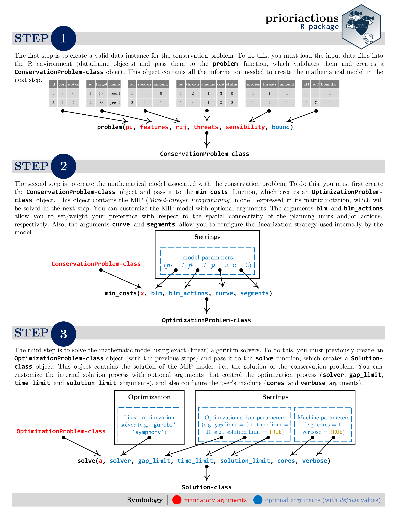

<!-- README.md is generated from README.Rmd. Please edit that file -->

# Multi-action conservation planning in R 

<!-- badges: start -->


[](https://www.tidyverse.org/lifecycle/#maturing)
<!-- badges: end -->

**This project was financed by the National Agency of Research and
Development, ANID, Chile, through the grant FONDECYT N.1180670 and
through the Complex Engineering Systems Institute PIA/BASAL AFB180003.
Also it has received funding from the European Union’s H2020 research
and innovation program under the Marie Sklodowska-Curie grant agreement
N.691149 (SuFoRun).**

The *prioriactions R* package uses a mixed integer mathematical
programming (MIP) approach for building and solving multi-action
conservation planning problems, where the goal is to find an optimal
combination of management actions that abate threats, in an efficient
way while accounting for connectivity. Furthermore, the flexibility of
the package interface allows implementing an extended version of the
base model for minimizing fragmentation between different actions. These
models were called as MAMP and MAMP-E by Salgado-Rojas *et al.* (2020),
where you can get a detailed description of how both problems were
mathematically modeled.

Once built a multi-action conservation problem, the next step is to
solve it. For this, the package has a variety of commercial and
open-source exact algorithm solvers that guarantee to find optimal
solutions. The models implemented here have three advantages over their
heuristic counterparts: shorter execution times, higher solutions
quality, and a solution quality guarantee.

## Installation

The latest development version can be installed from
[GitHub](https://github.com/prioriactions/prioriactions/) using the
following code.

``` r
if (!require(devtools)) install.packages("devtools")
devtools::install_github("prioriactions/prioriactions")
```

## Usage

The *prioriactions R* package works in three main stages. It starts with
the `problem()` function that receives a set of data to create a valid
data instance for the conservation problem. Then, the `min_costs()`
function receives this data to create the mathematical model associated
with this problem, which will finally be solved using the `solver()`
function. A detailed description of these steps is illustrated below.

<center>



</center>

## Example

Quick guide to create and solve a multi-action conservation planning
problem, following the three-step methodology already described.

### Step 1

Load the “prioriactions” package into the R environment (remember to
install it before using it).

``` r
library(prioriactions)
```

Load the necessary input data into the R environment.

``` r
data(example_pu_data, example_features_data, example_rij_data,
     example_threats_data, example_sensibility_data, example_bound_data)
```

Create a “data instance” that stores and validates all input data.

``` r
problem_data <- problem(
                pu = example_pu_data, features = example_features_data, rij = example_rij_data,
                threats = example_threats_data, sensibility = example_sensibility_data,
                bound = example_bound_data
)
#> Warning: The following pu's do not contain species: 59 97 109 118 121 122 123
#> 127 129 134 136 139 141 142 146 166 167 185 194 195 196 198 211 230
#> Correctly loaded inputs

problem_data
#> Conservation Problem
#>   planning units: data.frame (240 units)
#>   unit costs:     min: 3, max: 5
#>   features:       scl_ja, nem_er, thr_sc, ... (10 features)
#>   threats:        1, 2, 3, 4 (4 threats)
#>   threat costs:   min: 3, max: 5
```

### Step 2

Create an “optimization model” using the previously loaded “data
instance”.

``` r
problem_model <- min_costs(x = problem_data, blm = 1, blm_actions = 1)
problem_model
#> Optimization Problem
#>   model sense: minimization
#>   dimensions:  18004, 11740, 0.658 Mb (nrow, ncol, size)
#>   variables:   11740
#>   building time: 0.12 sec
```

### Step 3

Solve the “optimization model” using the available solvers.

``` r
model_solution <- solve(a = problem_model, solver = "gurobi", verbose = FALSE)
model_solution
#> Solution overview
#>   objective value: 1755.42968110999
#>   gap:  0%
#>   status:  Optimal solution (according to gap tolerance: 0%)
#>   runtime: 0.74 sec
```

Finally, report and interpret the solution to the problem you are
working on.

Report the total cost of the conservation plan.

``` r
solution_report01 <- model_solution$getObjetiveValue()
solution_report01
#> [1] 1755.43
```

Report the planning units suggested to be included (value 1) and not
included (value 0) within the conservation plan.

``` r
solution_report02 <- model_solution$getSolutionUnits()
head(solution_report02)
#>   id cost status solution
#> 1  1    3      0        0
#> 2  2    4      0        1
#> 3  3    3      0        1
#> 4  4    3      0        0
#> 5  5    3      0        1
#> 6  6    3      0        1
```

Report the conservation actions that are suggested to be carried out
(value 1) and not carried out (value 0) within the conservation plan.

``` r
solution_report03 <- model_solution$getSolutionActions()
head(solution_report03)
#>   id solution_threat_1 solution_threat_2 solution_threat_3 solution_threat_4
#> 1  1                 0                 0                 0                 0
#> 2  2                 0                 1                 1                 1
#> 3  3                 0                 1                 0                 1
#> 4  4                 0                 0                 0                 0
#> 5  5                 0                 1                 0                 1
#> 6  6                 0                 1                 0                 1
```

## References

  - Salgado-Rojas J, Álvarez-Miranda E, Hermoso V, Garcia-Gonzalo J,
    Weintraub A. *A mixed integer programming approach for multi-action
    planning for threat management*. Ecological Modelling 2020;
    418:108901.  
    (DOI: <https://doi.org/10.1016/j.ecolmodel.2019.108901>) .
