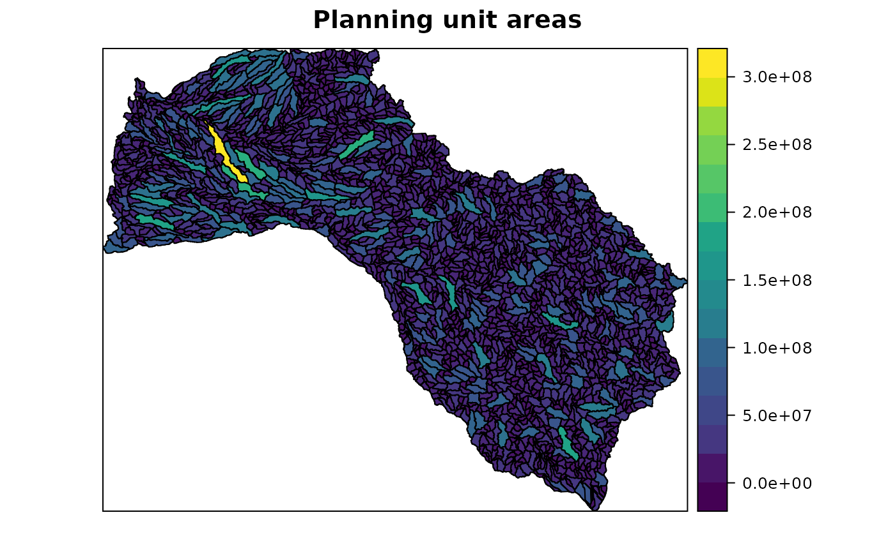
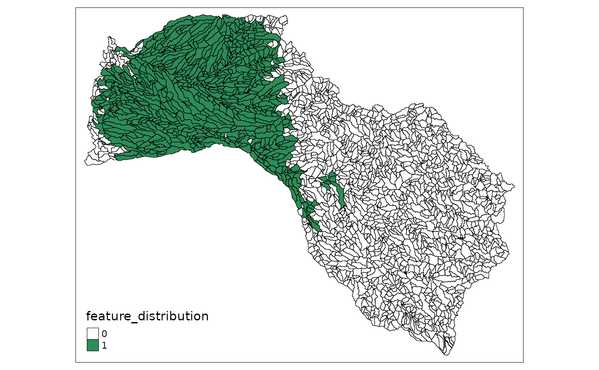
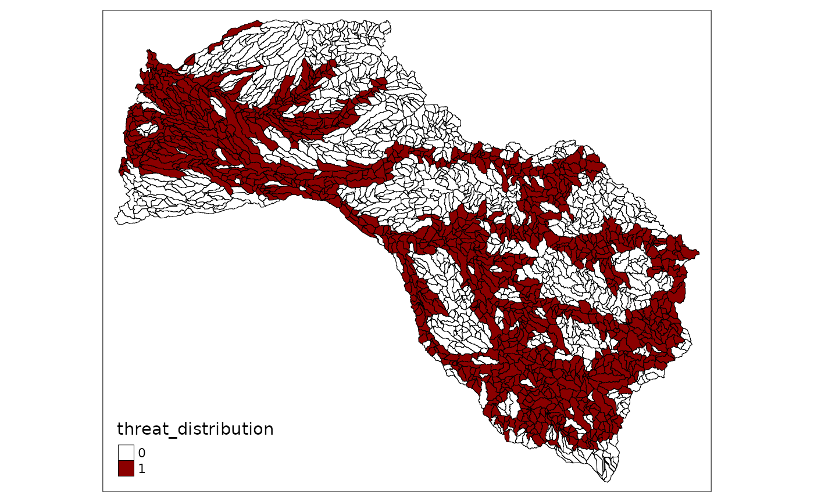
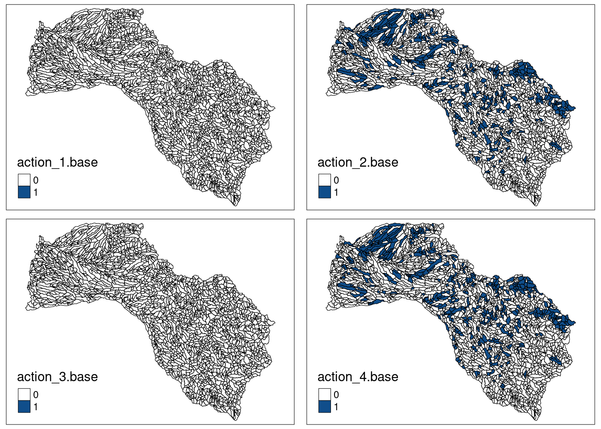
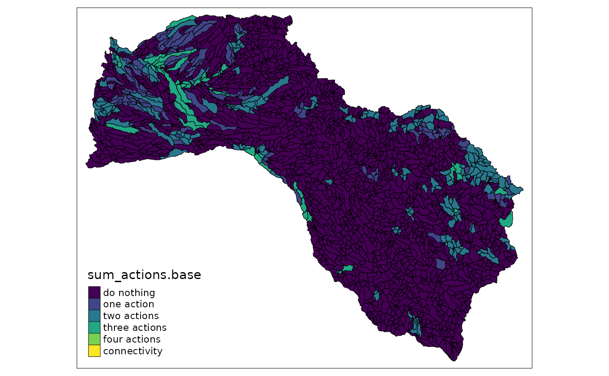
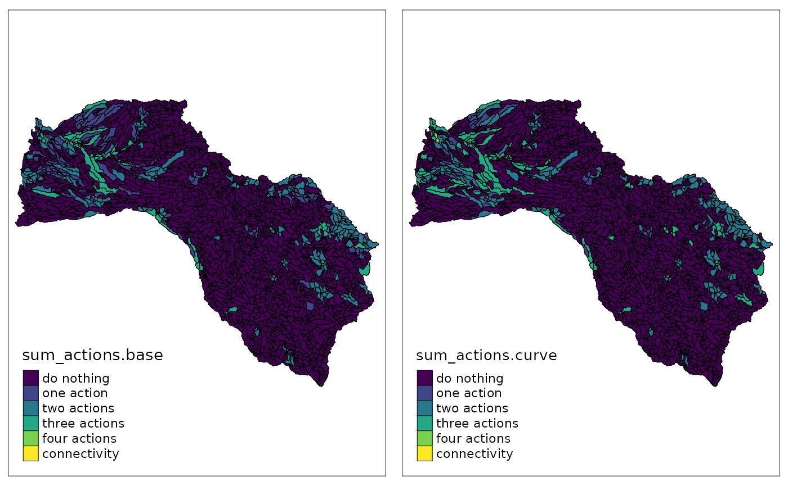
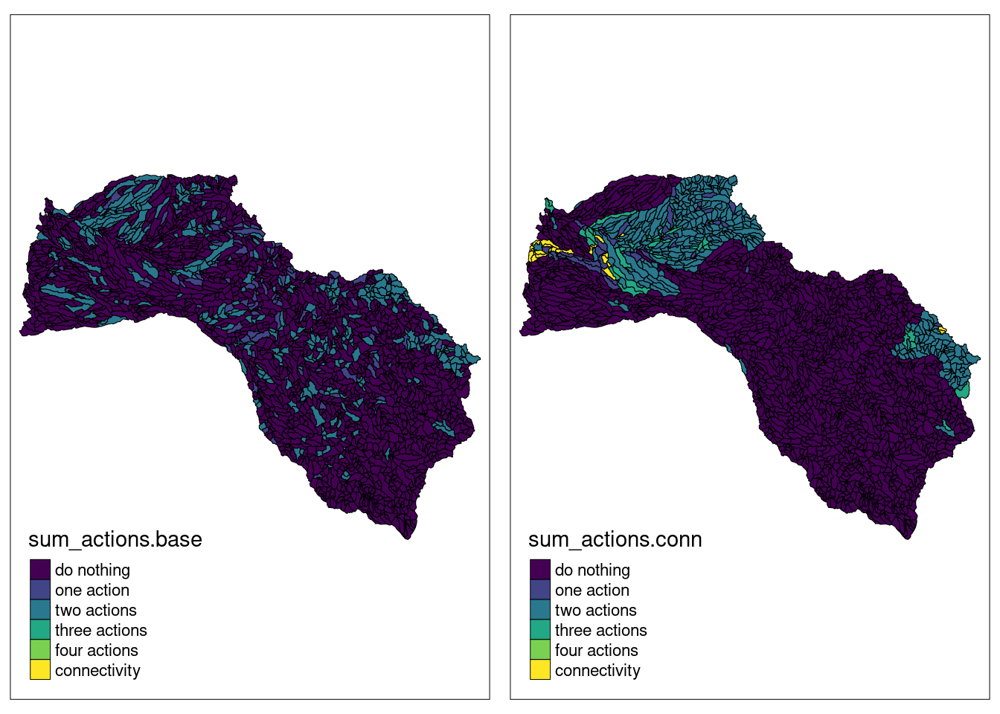
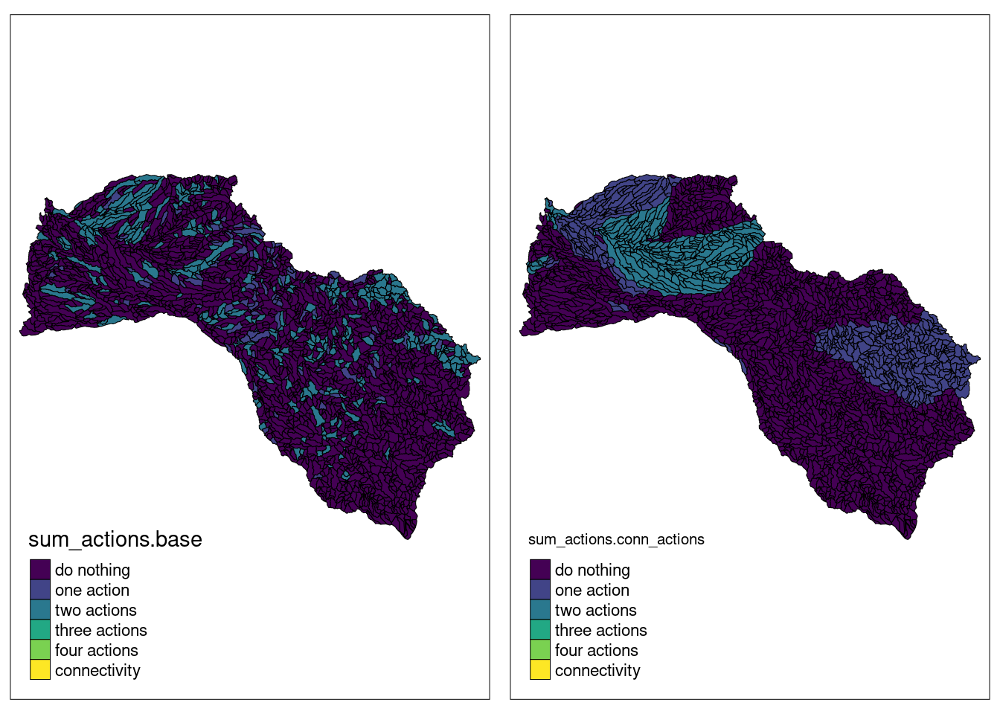

In this vignette, the `prioriactions` package is introduced in a real context, demonstrating part of its capabilities in order to familiarize the reader with it. The vignette is divided into **three** parts: the first shows a **base case**; which consists of prioritizing management actions while minimizing costs and, in turn, achieves certain recovery targets; the second part incorporates other **curves** in the calculation of benefits, while the third adds **spatial requirements** using the *blm* and *blm_actions* parameters.

The Mitchell River is a river located in Northern Queensland, Australia. The headwaters of the Mitchell River are in the Atherton Tableland about 50 kilometres (31 mi) northwest of Cairns, and flows about 750 kilometres (470 mi) northwest across Cape York Peninsula from Mareeba to the Gulf of Carpentaria. We will use this case study to present some functionalities of the `prioriactions` package.

We started loading libraries:


```r
# load packages
library(prioriactions)
library(raster) #To plot of shapefiles
library(tmap) #To create cool maps
library(scales) #To standardize the value of amount
library(reshape2) #To use the melt function
library(sp) #To use the spplot function
library(viridis) #To use viridis pallete
```

## 1) Preparing and analyzing input data

We divided the whole catchment (71,630 $km^2$) into 2316 sites (i.e., sub-catchments), each one included the portion of river length between two consecutive river connections and the surrounding land draining into this river stretch. We sourced the distribution of 45 fish species in the Mitchell river catchment as our conservation features [@cattarino2015]. Also, we considered four major threats to freshwater fish species in the catchment: water buffalo (Bubalis bubalis), cane toad (Bufo marinus), river flow alteration (caused by infrastructure for water extractions and levee banks) and grazing land use . All input files will be loaded directly into the `prioriactions` package as follows:


```r
path <- system.file("extdata/mitchell_vignette_data/", 
                    package = "prioriactions")

pu_data <- data.table::fread(file = paste0(path,
                                    "/pu_mitchell.csv"), 
                             data.table = FALSE)
features_data <- data.table::fread(file = paste0(path,
                                          "/features_mitchell.csv"), 
                                   data.table = FALSE)
dist_features_data <- data.table::fread(file = paste0(path,
                                               "/dist_features_mitchell.csv"), 
                                        data.table = FALSE)
threats_data <- data.table::fread(file = paste0(path,
                                         "/threats_mitchell.csv"), 
                                  data.table = FALSE)
dist_threats_data <- data.table::fread(file = paste0(path,
                                              "/dist_threats_mitchell.csv"), 
                                       data.table = FALSE)
bound_data <- data.table::fread(file = paste0(path,
                                       "/boundary_mitchell.csv"), 
                                data.table = FALSE)
sensitivity_data <- data.table::fread(file = paste0(path,
                                             "/sensibility_mitchell.csv"), 
                                      data.table = FALSE)
```

We load the shapefile of the case study, which is also included as part of the package installation:


```r
# read shapefile
shp_mitchell = raster::shapefile("data/Fish_Mitchell.shp")

sp::spplot(shp_mitchell, 
           zcol = "Shape_Area", 
           names.attr = "Area",
           main = "Planning unit areas", 
           col.regions = viridis::viridis(20))
```



After loading the instance's data, we can plot different distributions of features or threats on the shapefile loaded. To do it, we can assign the values from tabular input to any of the fields in the shapefile containing the distribution of native species and threats:


```r
# load amount of dist_features data
dist_features <- reshape2::dcast(dist_features_data, 
                                 pu~feature,
                                 value.var = "amount", 
                                 fill = 0)

# assign the distribution of first feature to feature_distribution field 
# in the shapefile
shp_mitchell$feature_distribution <- dist_features[, 2]

# plot distribution with tmap library
tmap::tm_shape(shp_mitchell) +
  tmap::tm_fill("feature_distribution", 
                pal = c("white", "seagreen"), 
                labels = c("0", "1"), 
                breaks = c(0,1,2)) +
  tmap::tm_borders(col="black", 
                   lwd = 0.5)
```



Likewise, we can plot the distributions of any threats by applying the following instructions:


```r
# load amount of dist_threats data
dist_threats <- reshape2::dcast(dist_threats_data, 
                                pu~threat,
                                value.var = "amount", 
                                fill = 0)

# assign the distribution of third threat to feature_distribution field 
# in the shapefile
shp_mitchell$threat_distribution <- dist_threats[, 4]

# plot distribution with tmap library
tmap::tm_shape(shp_mitchell) +
  tmap::tm_fill("threat_distribution", 
                pal = c("white", "red4"), 
                labels = c("0", "1"), 
                breaks = c(0,1,2)) +
  tmap::tm_borders(col="black", 
                   lwd = 0.5)
```



To solve all the models, the solver will be configured with a stop criterion of 5% of *gap* (`gap_limit = 0.05`), which means that the solver will end its execution when it finds a solution whose *gap* is at least 5%, indicating 0% that this solution is optimal. Similarly, there are other stopping criteria such as the time (`time_limit`), all available in the `solve()` reference. There is also the option of not using any stopping criteria that will make the solver run until it finds an optimal solution; however, this could take a long time period.

In Section 2, we present the results obtained when solving the base model for the case study. Likewise, in Section 3 we report the results obtained when incorporating the different curves in the benefit calculation. And finally, in Section 4 we present the results obtained when incorporating the connectivity requirements to the model.

## 2) Base model

First, our base model considers the prioritization of management actions to abate a particular threat using previously loaded data. Note that for both features and threats we have presence/absence values (binary values). Some of the characteristics of the base model are the following:

1) We use `minimiCosts` type of model to minimize costs for reaching 15% of the maximum recovery benefit per feature as target.
2) The model does not consider spatial requirements (*blm* and *blm_actions* parameters are equal to 0).
3) There is no need of solving all threats impacting a particular species in a given planning unit to achieve secure the persistence of the species in that planning unit (i.e., the *curve* parameter is equal to 1).

To proceed we follow the **three-step scheme** described in the `prioriactions` package: 1) data validation, 2) model creation and 3) model optimization. 


```r
# step 1: data validation
input_data <- inputData(pu = pu_data, 
              features = features_data, 
              dist_features = dist_features_data,
              threats = threats_data, 
              dist_threats = dist_threats_data, 
              sensitivity = sensitivity_data,
              bound = bound_data)

input_data
```

```
## Data
##   planning units: data.frame (2316 units)
##   monitoring costs:     min: 1, max: 1
##   features:       scl_ja, nem_er, thr_sc, ... (45 features)
##   threats:        threat1, threat2, threat3, threat4 (4 threats)
##   action costs:   min: 1, max: 1
```
Now, in order to set the **recovery targets** at 20%, we must know what is the maximum recovery benefit possible through the `getPotentialBenefit()` function.


```r
# view the maximum benefit to achieve
maximum_benefits <- getPotentialBenefit(input_data)

head(maximum_benefits)
```

```
##   feature dist dist_threatened maximum.conservation.benefit maximum.recovery.benefit
## 1       1  692             692                            0                      692
## 2       2 1052            1052                            0                     1052
## 3       3  416             416                            0                      416
## 4       4  653             653                            0                      653
## 5       5  238             238                            0                      238
## 6       6  276             276                            0                      276
##   maximum.benefit
## 1             692
## 2            1052
## 3             416
## 4             653
## 5             238
## 6             276
```

We assign the new target (20% of maximum) to the corresponding column of the feature data input and create the object `Data-class` again.


```r
features_data$target_recovery <- maximum_benefits$maximum.recovery.benefit * 0.2

# step 1: validate modified data
input_data <- inputData(pu = pu_data, 
                        features = features_data, 
                        dist_features = dist_features_data,
                        threats = threats_data, 
                        dist_threats = dist_threats_data, 
                        sensitivity = sensitivity_data,
                        bound = bound_data)

input_data
```

```
## Data
##   planning units: data.frame (2316 units)
##   monitoring costs:     min: 1, max: 1
##   features:       scl_ja, nem_er, thr_sc, ... (45 features)
##   threats:        threat1, threat2, threat3, threat4 (4 threats)
##   action costs:   min: 1, max: 1
```
Once the input data is validated, we proceed to create the mathematical model using the `problem()` function with `curve = 1`.


```r
# step 2:
model.base <- problem(input_data, 
                      model_type = "minimizeCosts", 
                      blm = 0)
```

```
## Warning: The blm argument was set to 0, so the boundary data has no effect
```

```
## Warning: Some blm_actions argument were set to 0, so the boundary data has no effect
## for these cases
```

```r
model.base
```

```
## Optimization Problem
##   model sense: minimization
##   dimensions:  37371, 43180, 1813.016 kB (nrow, ncol, size)
##   variables:   43180
```

Note that the dimension of the model are 37371 mathematical constraints and 43180 variables. By using the `getModelInfo()` function, we can display additional information of the model: 


```r
getModelInfo(model.base)
```

```
##    model_sense n_constraints n_variables        size
## 1 minimization         37371       43180 1813.016 kB
```

To solve the corresponding model, the solver is set considering a 5% optimality *gap* as stopping criterion (note that a 0% *gap* means that the problem is solved to optimality) and using *gurobi* solver. In turn, the `verbose = TRUE` is used to display the execution of the solver and the `output_file = FALSE` to avoid generating output files with the results.


```r
# step 3:
solution.base <- solve(model.base, 
                       gap_limit = 0.05, 
                       verbose = TRUE, 
                       output_file = FALSE)
```

```
## Gurobi Optimizer version 9.1.2 build v9.1.2rc0 (linux64)
## Thread count: 2 physical cores, 4 logical processors, using up to 2 threads
## Optimize a model with 37371 rows, 43180 columns and 136566 nonzeros
## Model fingerprint: 0x239c093c
## Variable types: 34965 continuous, 8215 integer (8215 binary)
## Coefficient statistics:
##   Matrix range     [3e-01, 4e+00]
##   Objective range  [1e+00, 1e+00]
##   Bounds range     [1e+00, 1e+00]
##   RHS range        [1e+00, 4e+02]
## Found heuristic solution: objective 7947.0000000
## Found heuristic solution: objective 6638.0000000
## Presolve removed 35017 rows and 35259 columns
## Presolve time: 0.26s
## Presolved: 2354 rows, 7921 columns, 66284 nonzeros
## Variable types: 0 continuous, 7921 integer (7904 binary)
## 
## Root relaxation: objective 1.145583e+03, 4158 iterations, 0.09 seconds
## 
##     Nodes    |    Current Node    |     Objective Bounds      |     Work
##  Expl Unexpl |  Obj  Depth IntInf | Incumbent    BestBd   Gap | It/Node Time
## 
##      0     0 1145.58333    0  547 6638.00000 1145.58333  82.7%     -    0s
## H    0     0                    1396.0000000 1145.58333  17.9%     -    0s
## H    0     0                    1393.0000000 1145.58333  17.8%     -    0s
##      0     0 1173.77778    0  712 1393.00000 1173.77778  15.7%     -    0s
## H    0     0                    1369.0000000 1173.77778  14.3%     -    0s
##      0     0 1175.01235    0  696 1369.00000 1175.01235  14.2%     -    1s
##      0     0 1175.12963    0  691 1369.00000 1175.12963  14.2%     -    1s
##      0     0 1222.36111    0  479 1369.00000 1222.36111  10.7%     -    1s
## H    0     0                    1333.0000000 1222.36111  8.30%     -    1s
##      0     0 1225.44444    0  469 1333.00000 1225.44444  8.07%     -    1s
##      0     0 1225.44444    0  472 1333.00000 1225.44444  8.07%     -    1s
##      0     0 1241.19444    0  305 1333.00000 1241.19444  6.89%     -    1s
##      0     0 1242.75000    0  292 1333.00000 1242.75000  6.77%     -    1s
##      0     0 1242.75000    0  291 1333.00000 1242.75000  6.77%     -    1s
##      0     0 1271.33333    0   68 1333.00000 1271.33333  4.63%     -    1s
## 
## Cutting planes:
##   Gomory: 1
##   Cover: 1214
##   Clique: 11
##   MIR: 482
##   StrongCG: 1
##   RLT: 2
## 
## Explored 1 nodes (14581 simplex iterations) in 1.58 seconds
## Thread count was 2 (of 4 available processors)
## 
## Solution count 6: 1333 1369 1393 ... 7947
## 
## Optimal solution found (tolerance 5.00e-02)
## Best objective 1.333000000000e+03, best bound 1.272000000000e+03, gap 4.5761%
```

We have achieved a *gap* of 4.57% and a objective value of 1333 in a a time of 2.88 seconds. This and other relevant information can be obtained from the `getPerformance()` function:


```r
getPerformance(solution.base)
```

```
##   solution_name objective_value   gap solving_time
## 1           sol            1333 4.576        1.577
##                                                status
## 1 Optimal solution (according to gap tolerance: 0.05)
```

Since our objective function does not contain the connectivity component  (because both `blm` and `blm_actions` were set to zero), the objective value corresponds to the sum of all actions and monitoring costs. We can check these using the `getCost()` function:


```r
getCost(solution.base) 
```

```
##   solution_name monitoring threat_1 threat_2 threat_3 threat_4
## 1           sol        486        0      395        0      452
```
This shows that the actions with the highest total cost correspond to those that go against the threat 4, and then those corresponding to monitoring.

We use the `getActions()` function to get the distribution of conservation actions. Note that because we only set recovery targets we use a **recovery target** planning propose, there are only planning units selected for prescribing management actions against threats, while there are no planning units selected for conservation. There are no planning units selected for connectivity as both *blm* and *blm_actions* were set to zero.


```r
# get actions distribution
solution_actions.base <- getActions(solution.base)

head(solution_actions.base)
```

```
##   solution_name pu 1 2 3 4 conservation connectivity
## 1           sol  1 0 0 0 0            0            0
## 2           sol  2 0 0 0 0            0            0
## 3           sol  3 0 1 0 1            0            0
## 4           sol  4 0 0 0 0            0            0
## 5           sol  5 0 0 0 0            0            0
## 6           sol  6 0 1 0 1            0            0
```

In the same way that we plot the distributions of species and threats, we can also explore the spatial distribution of management actions included in the optimal solution:


```r
# assign solution to shapefile field to plot it
shp_mitchell$action_1.base <-  solution_actions.base$`1`
shp_mitchell$action_2.base <-  solution_actions.base$`2`
shp_mitchell$action_3.base <-  solution_actions.base$`3`
shp_mitchell$action_4.base <-  solution_actions.base$`4`

# actions plots
plot_action1.base <- tmap::tm_shape(shp_mitchell) + 
                     tmap::tm_fill("action_1.base", 
                                   pal = c("white", "dodgerblue4"), 
                                   labels = c("0", "1"), 
                                   breaks = c(0,1,2)) + 
                     tmap::tm_borders(col="black", 
                                      lwd = 0.5)

plot_action2.base <- tmap::tm_shape(shp_mitchell) + 
                     tmap::tm_fill("action_2.base", 
                                   pal = c("white", "dodgerblue4"), 
                                   labels = c("0", "1"), 
                                   breaks = c(0,1,2)) + 
                     tmap::tm_borders(col="black", 
                                      lwd = 0.5)

plot_action3.base <- tmap::tm_shape(shp_mitchell) + 
                     tmap::tm_fill("action_3.base", 
                                   pal = c("white", "dodgerblue4"), 
                                   labels = c("0", "1"), 
                                   breaks = c(0,1,2)) + 
                     tmap::tm_borders(col="black", 
                                      lwd = 0.5)

plot_action4.base <- tmap::tm_shape(shp_mitchell) + 
                     tmap::tm_fill("action_4.base", 
                                   pal = c("white", "dodgerblue4"), 
                                   labels = c("0", "1"), 
                                   breaks = c(0,1,2)) + 
                     tmap::tm_borders(col="black", 
                                      lwd = 0.5)

tmap::tmap_arrange(plot_action1.base, 
                   plot_action2.base, 
                   plot_action3.base, 
                   plot_action4.base)
```



Also, we can show the distribution of the sum of the actions (higher density of actions):
  

```r
shp_mitchell$sum_actions.base <- solution_actions.base$`1` + 
                                 solution_actions.base$`2` + 
                                 solution_actions.base$`3` + 
                                 solution_actions.base$`4` +
                                 solution_actions.base$connectivity*5

# plot sum of actions with tmap library
plot.base <- tmap::tm_shape(shp_mitchell) + 
             tmap::tm_fill("sum_actions.base", 
                           palette="viridis", 
                           labels = c("do nothing", 
                                      "one action", 
                                      "two actions", 
                                      "three actions", 
                                      "four actions", 
                                      "connectivity"), 
                           breaks = c(0,1,2,3,4,5,6)) + 
              tmap::tm_borders(col="black", 
                               lwd = 0.5)

plot.base
```



We will use the results from this base model for comparisons with the following planning exercises.

## 3) Model with different *curve* param

This model differs from the previous one in that it tries to group conservation actions within the selected sites as part of the management plan (through a non-linear relationship in the calculation of benefits). This would be desirable when all or most of threats impacting a given species needed to be abated to ensure it long-term persistence (e.g., a species is highly sensitive to all the threats in a planning unit). The latter is done by adding a value other than 1 to the *curve* parameter. Where: (1) indicates that there is a linear relationship between the ratio between the actions carried out with respect to the possible actions to be carried out with respect to the benefit obtained by a characteristic so all actions are considered equally important, not being the species specially sensitive to any of them. (2) indicates a quadratic relationship between these values, and (3) a cubic relationship. The number of *segments* refers to the number of smaller portions in which the curve is divided to linealize it. Larger values of segments result in more complex models.


```r
model.curve <- prioriactions::problem(input_data,
                                      model_type = "minimizeCosts",
                                      blm = 0, 
                                      curve = 3,
                                      segments = 5)
```

```
## Warning: The blm argument was set to 0, so the boundary data has no effect
```

```
## Warning: Some blm_actions argument were set to 0, so the boundary data has no effect
## for these cases
```

```r
model.curve
```

```
## Optimization Problem
##   model sense: minimization
##   dimensions:  37371, 78145, 1952.872 kB (nrow, ncol, size)
##   variables:   78145
```
Note that the new model associates a larger instance (from 43180 to 78145 variables) when compared to the previously presented model. As a consequence, the resulting problem is computationally more difficult. The solution of the resulting model has a objective function value equal to 1336 (greater than the previous one), although  the corresponding optimality gap is 4.79% (similar than the one attained for the simple model). The complete output of the solver is shown below:


```r
solution.curve <- prioriactions::solve(model.curve, 
                                       gap_limit = 0.05, 
                                       verbose = TRUE, 
                                       output_file = FALSE)
```

```
## Gurobi Optimizer version 9.1.2 build v9.1.2rc0 (linux64)
## Thread count: 2 physical cores, 4 logical processors, using up to 2 threads
## Optimize a model with 37371 rows, 78145 columns and 136566 nonzeros
## Model fingerprint: 0x86a286dc
## Model has 34965 general constraints
## Variable types: 69930 continuous, 8215 integer (8215 binary)
## Coefficient statistics:
##   Matrix range     [3e-01, 4e+00]
##   Objective range  [1e+00, 1e+00]
##   Bounds range     [1e+00, 1e+00]
##   RHS range        [1e+00, 4e+02]
## Found heuristic solution: objective 8215.0000000
## Presolve added 69869 rows and 174524 columns
## Presolve time: 0.74s
## Presolved: 107240 rows, 252669 columns, 695592 nonzeros
## Presolved model has 34965 SOS constraint(s)
## Found heuristic solution: objective 7947.0000000
## Variable types: 244742 continuous, 7927 integer (7911 binary)
## 
## Deterministic concurrent LP optimizer: primal and dual simplex
## Showing first log only...
## 
## 
## Root simplex log...
## 
## Iteration    Objective       Primal Inf.    Dual Inf.      Time
##    47951    2.8079534e+03   0.000000e+00   5.127077e+04      5s
##    76722    2.2613066e+03   0.000000e+00   2.778781e+04     10s
##    94262    2.0197112e+03   0.000000e+00   1.986480e+04     15s
##   111687    1.8277940e+03   0.000000e+00   2.978724e+04     20s
## Concurrent spin time: 0.00s
## 
## Solved with dual simplex
## 
## Root relaxation: objective 1.144050e+03, 58678 iterations, 21.40 seconds
## Total elapsed time = 28.89s
## 
##     Nodes    |    Current Node    |     Objective Bounds      |     Work
##  Expl Unexpl |  Obj  Depth IntInf | Incumbent    BestBd   Gap | It/Node Time
## 
##      0     0 1144.05000    0 6110 7947.00000 1144.05000  85.6%     -   29s
## H    0     0                    7922.0000000 1144.05000  85.6%     -   31s
##      0     0 1151.40000    0 9090 7922.00000 1151.40000  85.5%     -   37s
##      0     0 1162.99046    0 11199 7922.00000 1162.99046  85.3%     -   46s
##      0     0 1187.26667    0 5725 7922.00000 1187.26667  85.0%     -   50s
##      0     0 1200.28889    0 4811 7922.00000 1200.28889  84.8%     -   52s
##      0     0 1200.28889    0 4767 7922.00000 1200.28889  84.8%     -   53s
##      0     0 1204.10556    0 4864 7922.00000 1204.10556  84.8%     -   58s
## H    0     0                    7885.0000000 1204.10556  84.7%     -   59s
##      0     0 1235.41111    0 4896 7885.00000 1235.41111  84.3%     -   64s
##      0     0 1243.35000    0 3256 7885.00000 1243.35000  84.2%     -   67s
##      0     0 1247.60000    0 3571 7885.00000 1247.60000  84.2%     -   71s
##      0     0 1247.60000    0 3264 7885.00000 1247.60000  84.2%     -   73s
##      0     0 1269.26667    0 3790 7885.00000 1269.26667  83.9%     -   78s
## H    0     0                    1509.0000000 1269.26667  15.9%     -   86s
##      0     0 1269.26667    0 2879 1509.00000 1269.26667  15.9%     -   89s
##      0     0 1269.26667    0 2417 1509.00000 1269.26667  15.9%     -   94s
## H    0     0                    1507.0000000 1269.26667  15.8%     -   95s
##      0     0 1270.16667    0 2237 1507.00000 1270.16667  15.7%     -   98s
##      0     0 1270.16667    0 1727 1507.00000 1270.16667  15.7%     -  100s
##      0     0 1272.00000    0 1589 1507.00000 1272.00000  15.6%     -  111s
## H    0     0                    1362.0000000 1272.00000  6.61%     -  119s
##      0     0 1272.00000    0 2203 1362.00000 1272.00000  6.61%     -  122s
##      0     0 1272.00000    0 2809 1362.00000 1272.00000  6.61%     -  126s
##      0     0 1272.00000    0 1748 1362.00000 1272.00000  6.61%     -  133s
## H    0     0                    1336.0000000 1272.00000  4.79%     -  148s
## 
## Cutting planes:
##   Cover: 1359
##   Implied bound: 27429
##   Clique: 130
##   MIR: 559
##   Flow cover: 3155
##   Network: 1
##   RLT: 1
##   Relax-and-lift: 13289
## 
## Explored 1 nodes (188544 simplex iterations) in 148.03 seconds
## Thread count was 2 (of 4 available processors)
## 
## Solution count 8: 1336 1362 1507 ... 8215
## 
## Optimal solution found (tolerance 5.00e-02)
## Warning: max constraint violation (1.4602e-02) exceeds tolerance
## Warning: max general constraint violation (1.4602e-02) exceeds tolerance
##          (model may be infeasible or unbounded - try turning presolve off)
## Best objective 1.336000000000e+03, best bound 1.272000000000e+03, gap 4.7904%
```

Note that the last solution was reached in 177326 seconds. This specifically demonstrates how complexity increases when using the different parameters of curves.


```r
# get action distribution
solution_actions.curve <- prioriactions::getActions(solution.curve)

# assign solution to shapefile field to plot it
shp_mitchell$action_1.curve <- solution_actions.curve$`1`
shp_mitchell$action_2.curve <- solution_actions.curve$`2`
shp_mitchell$action_3.curve <- solution_actions.curve$`3`
shp_mitchell$action_4.curve <- solution_actions.curve$`4`

shp_mitchell$sum_actions.curve <- solution_actions.curve$`1` + 
                                  solution_actions.curve$`2` + 
                                  solution_actions.curve$`3` + 
                                  solution_actions.curve$`4` +
                                  solution_actions.curve$connectivity*5

# plot sum of actions with tmap library
plot.curve <- tmap::tm_shape(shp_mitchell) + 
              tmap::tm_fill("sum_actions.curve", 
                            palette="viridis", 
                            labels = c("do nothing", 
                                       "one action", 
                                       "two actions", 
                                       "three actions", 
                                       "four actions",
                                       "connectivity"), 
                            breaks = c(0,1,2,3,4,5,6)) + 
              tmap::tm_borders(col="black", 
                               lwd = 0.5)

# comparative with base model solution
tmap::tmap_arrange(plot.base, plot.curve)
```



Here, we display representations of the solution obtained for both, the base and curve models. As can be seen from these maps there are a greater number of sites with a larger concentration of management actions compared to the previous model (for example, a greater number of units in green).

## 4) Model with connectivity requirements

To add connectivity requirements to the model, there are two key parameters: **blm** (equivalent to the parameter *blm* used  in *marxan*), which tries to minimize the connectivity penalty between the selected planning units (i.e. regardless if conservation actions are carried out within them). 

In the following we explore how solutions change when adding connectivity requirements.
  

```r
input_data.conn <- inputData(pu = pu_data, 
                             features = features_data, 
                             dist_features = dist_features_data,
                             threats = threats_data, 
                             dist_threats = dist_threats_data,                                                 sensitivity = sensitivity_data,
                             bound = bound_data)

model.conn <- problem(input_data.conn,
                      model_type = "minimizeCosts",
                      blm = 5, 
                      curve = 1)
```

```
## Warning: Some blm_actions argument were set to 0, so the boundary data has no effect
## for these cases
```

```r
solution.conn <- solve(model.conn, 
                       gap_limit = 0.05, 
                       verbose = TRUE, 
                       output_file = FALSE)
```

```
## Gurobi Optimizer version 9.1.2 build v9.1.2rc0 (linux64)
## Thread count: 2 physical cores, 4 logical processors, using up to 2 threads
## Optimize a model with 78567 rows, 56912 columns and 232690 nonzeros
## Model fingerprint: 0xffda5e93
## Variable types: 34965 continuous, 21947 integer (21947 binary)
## Coefficient statistics:
##   Matrix range     [3e-01, 4e+00]
##   Objective range  [1e+00, 6e+01]
##   Bounds range     [1e+00, 1e+00]
##   RHS range        [1e+00, 4e+02]
## Found heuristic solution: objective 7947.0000000
## Presolve removed 35010 rows and 35250 columns
## Presolve time: 0.40s
## Presolved: 43557 rows, 21662 columns, 162430 nonzeros
## Variable types: 0 continuous, 21662 integer (21646 binary)
## 
## Deterministic concurrent LP optimizer: primal and dual simplex
## Showing first log only...
## 
## 
## Root simplex log...
## 
## Iteration    Objective       Primal Inf.    Dual Inf.      Time
##    38001    1.5954434e+03   0.000000e+00   1.368886e+05      5s
## Concurrent spin time: 0.00s
## 
## Solved with dual simplex
## 
## Root relaxation: objective 1.246661e+03, 20278 iterations, 8.63 seconds
## 
##     Nodes    |    Current Node    |     Objective Bounds      |     Work
##  Expl Unexpl |  Obj  Depth IntInf | Incumbent    BestBd   Gap | It/Node Time
## 
##      0     0 1246.66068    0 14895 7947.00000 1246.66068  84.3%     -   10s
## H    0     0                    3797.8868056 1246.66068  67.2%     -   11s
## H    0     0                    3599.0013999 1246.66068  65.4%     -   11s
##      0     0 1313.60737    0 16219 3599.00140 1313.60737  63.5%     -   22s
##      0     0 1439.11297    0 10245 3599.00140 1439.11297  60.0%     -   32s
## H    0     0                    3549.4676884 1439.11297  59.5%     -   32s
##      0     0 1445.29790    0 10632 3549.46769 1445.29790  59.3%     -   36s
##      0     0 1449.06889    0 10618 3549.46769 1449.06889  59.2%     -   36s
##      0     0 1450.67325    0 10261 3549.46769 1450.67325  59.1%     -   37s
##      0     0 1452.45332    0 10270 3549.46769 1452.45332  59.1%     -   42s
## H    0     0                    3494.0894064 1452.45332  58.4%     -   42s
##      0     0 1453.88883    0 10281 3494.08941 1453.88883  58.4%     -   43s
##      0     0 1453.88976    0 10281 3494.08941 1453.88976  58.4%     -   43s
##      0     0 1454.60786    0 10282 3494.08941 1454.60786  58.4%     -   50s
##      0     0 1457.08247    0 10627 3494.08941 1457.08247  58.3%     -   53s
## H    0     0                    3376.1774129 1457.08247  56.8%     -   53s
##      0     0 1457.27671    0 10792 3376.17741 1457.27671  56.8%     -   54s
##      0     0 1457.97173    0 10790 3376.17741 1457.97173  56.8%     -   55s
## H    0     0                    3299.8701987 1457.97173  55.8%     -   55s
##      0     0 1458.11380    0 10441 3299.87020 1458.11380  55.8%     -   55s
##      0     0 1458.69741    0 10443 3299.87020 1458.69741  55.8%     -   56s
## H    0     0                    3190.3671965 1458.69741  54.3%     -   56s
##      0     0 1458.85224    0 10446 3190.36720 1458.85224  54.3%     -   57s
##      0     0 1458.99700    0 10442 3190.36720 1458.99700  54.3%     -   58s
## H    0     0                    3147.0292730 1458.99700  53.6%     -   58s
##      0     0 1458.99700    0 10442 3147.02927 1458.99700  53.6%     -   58s
## H    0     0                    3135.2557703 1458.99700  53.5%     -   58s
##      0     0 1459.79141    0 10436 3135.25577 1459.79141  53.4%     -   60s
## H    0     0                    3112.4111998 1459.79141  53.1%     -   60s
##      0     0 1460.05177    0 10436 3112.41120 1460.05177  53.1%     -   61s
## H    0     0                    3059.4015507 1460.05177  52.3%     -   61s
##      0     0 1460.19035    0 10439 3059.40155 1460.19035  52.3%     -   62s
## H    0     0                    3011.9389070 1460.19035  51.5%     -   62s
##      0     0 1460.22580    0 10439 3011.93891 1460.22580  51.5%     -   62s
## H    0     0                    3010.9389070 1460.22580  51.5%     -   62s
##      0     0 1460.31278    0 10438 3010.93891 1460.31278  51.5%     -   63s
## H    0     0                    2968.2497660 1460.31278  50.8%     -   63s
##      0     0 1460.31278    0 10438 2968.24977 1460.31278  50.8%     -   69s
## H    0     0                    2639.0209093 1460.36455  44.7%     -   78s
## H    0     0                    2624.9498415 1460.36455  44.4%     -   78s
## H    0     2                    2567.2914098 1460.36455  43.1%     -   79s
##      0     2 1460.36455    0 10436 2567.29141 1460.36455  43.1%     -   79s
##      1     4 1471.32603    1 10480 2567.29141 1460.36455  43.1%  4022   85s
##      5     8 1513.52277    3 7511 2567.29141 1471.37286  42.7%  4323   92s
##      9    12 1514.14072    4 6767 2567.29141 1471.37286  42.7%  3490   97s
##     13    16 1524.15241    6 5605 2567.29141 1471.37286  42.7%  3056  101s
##     17    20 1538.15890    8 5224 2567.29141 1471.37286  42.7%  3738  108s
##     19    23 1545.54083    9 5243 2567.29141 1471.37286  42.7%  4089  114s
##     22    26 1540.88141    9 3612 2567.29141 1471.37286  42.7%  3645  115s
## H   26    30                    2553.0245541 1471.37286  42.4%  3335  118s
## H   29    34                    1784.0830763 1471.37286  17.5%  3279  119s
##     33    37 1563.51929   13 2579 1784.08308 1471.37286  17.5%  3097  121s
##     41    49 1568.02871   16 2399 1784.08308 1471.37286  17.5%  2845  125s
## H   55    60                    1759.5897233 1471.37286  16.4%  2448  130s
## H   59    64                    1607.1596096 1471.37286  8.45%  2436  132s
##     75    75 1588.25497   29 2797 1607.15961 1471.37286  8.45%  2026  137s
## H   84    85                    1606.1596114 1471.37286  8.39%  1891  140s
##     99    97 1600.05188   40  883 1606.15961 1471.37286  8.39%  1724  146s
##    122   105     cutoff   53      1606.15961 1476.92318  8.05%  1485  153s
##    131   107 1499.06803    4 10461 1606.15961 1476.99594  8.04%  1451  156s
##    137   106 1517.27386    5 9203 1606.15961 1476.99594  8.04%  1480  164s
##    142   109 1518.63154    5 8684 1606.15961 1476.99594  8.04%  1553  169s
##    145   114 1524.62712    6 8485 1606.15961 1476.99594  8.04%  1544  172s
##    150   113 1531.94377    8 5562 1606.15961 1476.99594  8.04%  1531  175s
##    158   122 1556.75906   11 3489 1606.15961 1476.99594  8.04%  1552  182s
## H  159   121                    1581.5415382 1476.99594  6.61%  1542  182s
##    164   116 1558.98078   13 3059 1581.54154 1476.99594  6.61%  1510  187s
##    184   112 1567.27849   23 1665 1581.54154 1476.99594  6.61%  1388  191s
##    193   120 1569.84041   26 1988 1581.54154 1476.99594  6.61%  1360  196s
##    232   144 1577.33040   43    5 1581.54154 1476.99594  6.61%  1206  204s
##    264   151 1577.45516   51  261 1581.54154 1504.05691  4.90%  1093  211s
## 
## Cutting planes:
##   Gomory: 2
##   MIR: 2
##   Zero half: 8
##   Mod-K: 1
##   RLT: 95
## 
## Explored 283 nodes (376102 simplex iterations) in 211.61 seconds
## Thread count was 2 (of 4 available processors)
## 
## Solution count 10: 1581.54 1606.16 1607.16 ... 2968.25
## 
## Optimal solution found (tolerance 5.00e-02)
## Best objective 1.581541538165e+03, best bound 1.504073465734e+03, gap 4.8983%
```

In the same way as what occurs in the previous model, the addition of spatial requirements leads to higher costs requirement implies higher costs in the management plan, as well as a model with greater computational complexity. To obtain the costs of both solutions (base and with connectivity requirements) we use the `getCost()` function:


```r
getCost(solution.base)
```

```
##   solution_name monitoring threat_1 threat_2 threat_3 threat_4
## 1           sol        486        0      395        0      452
```

```r
getCost(solution.conn)
```

```
##   solution_name monitoring threat_1 threat_2 threat_3 threat_4
## 1           sol        490        4      400       46      460
```


```r
# get action distribution
solution_actions.conn<- getActions(solution.conn)

# assign solution to shapefile field to plot it
shp_mitchell$action_1.conn <- solution_actions.conn$`1`
shp_mitchell$action_2.conn <- solution_actions.conn$`2`
shp_mitchell$action_3.conn <- solution_actions.conn$`3`
shp_mitchell$action_4.conn <- solution_actions.conn$`4`

shp_mitchell$sum_actions.conn <- solution_actions.conn$`1` + 
                                 solution_actions.conn$`2` + 
                                 solution_actions.conn$`3` + 
                                 solution_actions.conn$`4` +
                                 solution_actions.conn$connectivity*5

# plot sum of actions with tmap library
plot.conn <- tmap::tm_shape(shp_mitchell) + 
             tmap::tm_fill("sum_actions.conn", 
                           palette="viridis", 
                           labels = c("do nothing", 
                                      "one action", 
                                      "two actions", 
                                      "three actions", 
                                      "four actions", 
                                      "connectivity"), 
                           breaks = c(0,1,2,3,4,5,6)) + 
             tmap::tm_borders(col="black", lwd = 0.5)

# comparative with base model solution
tmap::tmap_arrange(plot.base, plot.conn)
```



As can be seen from the displayed maps, including the connectivity penalty in the objective function allows to find a more compact solution when compared to the one obtained by the base model.

Besides optimizing  the spatial connectivity of the selected units, our package also allows to optimize the spatial connectivity among the units where a given action is applied. This penalty is encoded by factor `blm_actions`, and it aims at ensuring spatial coherence among units where the same action is applied. This spatial clumping of actions might beneficial in economic terms (because of the economy of scales) or even ecological terms (higher effectiveness of management plans, by  creating larger areas threat-free and reducing the probability of reappearance of the threat).


```r
threats_data$blm_actions <- 10

input_data.conn_actions<- inputData(pu = pu_data, 
                                    features = features_data, 
                                    dist_features = dist_features_data,
                                    threats = threats_data, 
                                    dist_threats = dist_threats_data,                                                 
                                    sensitivity = sensitivity_data,
                                    bound = bound_data)

model.conn_actions <- problem(input_data.conn_actions, 
                              model_type = "minimizeCosts",
                              blm = 0, 
                              curve = 1)
```

```
## Warning: The blm argument was set to 0, so the boundary data has no effect
```

```r
solution.conn_actions <- solve(model.conn_actions, 
                               gap_limit = 0.05, 
                               verbose = TRUE, 
                               output_file = FALSE)
```

```
## Gurobi Optimizer version 9.1.2 build v9.1.2rc0 (linux64)
## Thread count: 2 physical cores, 4 logical processors, using up to 2 threads
## Optimize a model with 141237 rows, 77802 columns and 378920 nonzeros
## Model fingerprint: 0xd454adb3
## Variable types: 34965 continuous, 42837 integer (42837 binary)
## Coefficient statistics:
##   Matrix range     [3e-01, 4e+00]
##   Objective range  [1e+00, 1e+02]
##   Bounds range     [1e+00, 1e+00]
##   RHS range        [1e+00, 4e+02]
## Found heuristic solution: objective 8210.0000000
## Presolve removed 35014 rows and 34975 columns
## Presolve time: 0.99s
## Presolved: 106223 rows, 42827 columns, 308960 nonzeros
## Variable types: 0 continuous, 42827 integer (42826 binary)
## 
## Deterministic concurrent LP optimizer: primal and dual simplex
## Showing first log only...
## 
## Warning: Markowitz tolerance tightened to 0.5
## 
## Root simplex log...
## 
## Iteration    Objective       Primal Inf.    Dual Inf.      Time
##    52270    1.9225777e+04   0.000000e+00   3.440532e+06      5s
##    59512    1.6519896e+04   0.000000e+00   1.785789e+06     10s
##    63133    1.1619524e+04   0.000000e+00   8.802070e+05     15s
##    66755    1.0536259e+04   0.000000e+00   9.604617e+05     20s
## Concurrent spin time: 0.00s
## 
## Solved with dual simplex
## 
## Root relaxation: objective 1.387138e+03, 13931 iterations, 19.55 seconds
## 
##     Nodes    |    Current Node    |     Objective Bounds      |     Work
##  Expl Unexpl |  Obj  Depth IntInf | Incumbent    BestBd   Gap | It/Node Time
## 
##      0     0 1387.13755    0 15106 8210.00000 1387.13755  83.1%     -   25s
## H    0     0                    3031.0564886 1387.13755  54.2%     -   25s
## H    0     0                    2816.9312916 1387.13755  50.8%     -   25s
##      0     0 1497.65792    0 25226 2816.93129 1497.65792  46.8%     -   48s
##      0     0 1602.85777    0 22616 2816.93129 1602.85777  43.1%     -   71s
##      0     0 1629.63025    0 23347 2816.93129 1629.63025  42.1%     -   87s
##      0     0 1629.65511    0 23347 2816.93129 1629.65511  42.1%     -   87s
##      0     0 1629.65511    0 23348 2816.93129 1629.65511  42.1%     -  115s
## H    0     0                    2812.9312916 1629.65511  42.1%     -  116s
##      0     0 1642.04461    0 22540 2812.93129 1642.04461  41.6%     -  120s
##      0     0 1643.41100    0 23350 2812.93129 1643.41100  41.6%     -  121s
##      0     0 1664.73305    0 20463 2812.93129 1664.73305  40.8%     -  127s
##      0     0 1666.72743    0 20477 2812.93129 1666.72743  40.7%     -  129s
##      0     0 1666.72743    0 20477 2812.93129 1666.72743  40.7%     -  131s
##      0     0 1666.72743    0 20477 2812.93129 1666.72743  40.7%     -  133s
##      0     0 1666.72743    0 20477 2812.93129 1666.72743  40.7%     -  135s
##      0     0 1666.72743    0 20477 2812.93129 1666.72743  40.7%     -  137s
##      0     0 1666.72743    0 20477 2812.93129 1666.72743  40.7%     -  139s
##      0     0 1666.72743    0 20477 2812.93129 1666.72743  40.7%     -  151s
## H    0     0                    2177.1674380 1666.74413  23.4%     -  168s
##      0     2 1666.74413    0 20477 2177.16744 1666.74413  23.4%     -  169s
##      1     4 1677.20933    1 20529 2177.16744 1666.78357  23.4%   970  171s
##      3     6 1715.80015    2 20386 2177.16744 1677.26855  23.0%  1401  177s
##      5     8 1692.30120    2 13548 2177.16744 1692.30120  22.3%  1323  180s
##      9    12 1747.09682    3 12798 2177.16744 1715.81396  21.2%  1196  186s
##     13    16 1786.45986    4 7293 2177.16744 1715.81396  21.2%  1207  190s
##     20    23 1811.80707    6 7172 2177.16744 1715.81396  21.2%  1069  195s
##     24    28 1813.41350    7 6562 2177.16744 1715.81396  21.2%  1031  201s
## H   28    30                    2144.8698729 1715.81396  20.0%  1017  203s
##     29    32 1844.19278    9 15092 2144.86987 1715.81396  20.0%  1036  205s
##     33    39 1869.20017   10 5511 2144.86987 1715.81396  20.0%  1078  212s
##     38    42 1882.03419   12 4806 2144.86987 1715.81396  20.0%   998  215s
##     48    54 1961.87481   18 6819 2144.86987 1715.81396  20.0%   941  221s
##     59    68 1962.87801   21 2990 2144.86987 1715.81396  20.0%   858  225s
##     77    88 2026.97982   28 3064 2144.86987 1715.81396  20.0%   765  231s
## H   85    88                    2123.0253024 1715.81396  19.2%   751  231s
##    102   120 2045.10700   33 1459 2123.02530 1715.81396  19.2%   689  236s
##    143   158 2114.27959   45   34 2123.02530 1715.85415  19.2%   548  240s
## H  157   134                    2055.2481549 1715.85415  16.5%   507  240s
## H  161   133                    2054.2481549 1715.85415  16.5%   496  240s
##    174   126 1763.84787    5 23149 2054.24815 1715.85415  16.5%   493  249s
##    183   128 1793.82105    5 18453 2054.24815 1715.85415  16.5%   491  255s
## H  186   131                    2054.2481543 1715.85415  16.5%   498  258s
##    188   133 1825.27341    7 18598 2054.24815 1715.85415  16.5%   508  262s
## H  190   115                    2017.4035844 1715.85415  14.9%   508  266s
## H  192   115                    1959.1674380 1715.85415  12.4%   515  266s
##    193   115 1842.71694    9 20716 1959.16744 1715.85415  12.4%   521  272s
##    197   114 1883.94565   11 15998 1959.16744 1715.85415  12.4%   539  276s
##    200   115 1939.13564   11 17422 1959.16744 1715.85415  12.4%   550  280s
##    206   122 1945.88160   13 16671 1959.16744 1715.85415  12.4%   562  287s
##    213   121 1917.37765   14 14656 1959.16744 1715.85415  12.4%   554  291s
##    222   114     cutoff   16      1959.16744 1715.85415  12.4%   550  295s
## H  223   114                    1955.9409407 1715.85415  12.3%   547  295s
##    233   105     cutoff   17      1955.94094 1724.85822  11.8%   533  300s
## H  243   109                    1949.1674380 1724.92903  11.5%   534  308s
##    246   112 1868.93078    6 22661 1949.16744 1724.92903  11.5%   541  313s
##    249   114 1884.83170    5 18969 1949.16744 1724.92903  11.5%   553  319s
##    252   117 1900.49322    6 18635 1949.16744 1724.92903  11.5%   561  325s
##    259   118 1914.89153    8 22634 1949.16744 1724.92903  11.5%   577  334s
##    263   111 1898.09039    6 20003 1949.16744 1724.92903  11.5%   579  339s
##    268   108 1943.53429    7 20194 1949.16744 1724.92903  11.5%   584  347s
##    277   111 1929.69723    9 22862 1949.16744 1724.92903  11.5%   583  353s
##    280   111 1940.24060   11 22407 1949.16744 1724.92903  11.5%   589  361s
##    285   108     cutoff   12      1949.16744 1741.15185  10.7%   591  367s
##    294   110 1826.56011    5 21816 1949.16744 1741.15185  10.7%   590  374s
## H  300   110                    1945.1674376 1741.15185  10.5%   591  384s
##    302   112 1872.99058    8 18649 1945.16744 1741.15185  10.5%   601  389s
##    306   112 1889.03239    9 19440 1945.16744 1741.15185  10.5%   603  398s
##    314   115 1939.83438   11 18082 1945.16744 1741.15185  10.5%   606  404s
##    323   113     cutoff   13      1945.16744 1741.15185  10.5%   604  410s
##    331   117 1935.59544   12 19507 1945.16744 1743.03376  10.4%   607  417s
##    341   121 1784.85223    5 18617 1945.16744 1743.05780  10.4%   604  424s
##    345   128 1836.93850    8 16389 1945.16744 1743.05780  10.4%   610  431s
##    360   136 1864.25001   14 7399 1945.16744 1743.05780  10.4%   600  438s
##    368   149 1920.22974   15 7534 1945.16744 1743.05780  10.4%   606  445s
##    383   157 1935.22843   23 6582 1945.16744 1763.00108  9.37%   604  454s
##    406   157 1852.33279    5 19416 1945.16744 1763.00108  9.37%   591  463s
##    416   160 1922.86893    6 19312 1945.16744 1763.00108  9.37%   592  472s
##    421   162     cutoff    7      1945.16744 1763.00108  9.37%   601  482s
##    431   160     cutoff    9      1945.16744 1763.85967  9.32%   603  493s
##    443   163 1914.42587    9 9140 1945.16744 1768.77241  9.07%   610  505s
##    446   162     cutoff   10      1945.16744 1770.67518  8.97%   613  515s
##    457   166 1864.25991    8 20823 1945.16744 1770.67518  8.97%   618  527s
##    461   164 1942.59323   10 20296 1945.16744 1774.94004  8.75%   626  536s
##    472   166 1852.30378    6 18555 1945.16744 1774.94004  8.75%   625  550s
##    478   170 1901.74434    9 15520 1945.16744 1774.94004  8.75%   627  563s
##    490   175     cutoff   12      1945.16744 1780.29766  8.48%   631  575s
##    497   177 1920.27406    9 18567 1945.16744 1780.35009  8.47%   642  585s
##    509   178 1839.58297    6 15508 1945.16744 1780.35009  8.47%   644  601s
##    516   185 1875.55225    7 15233 1945.16744 1784.90821  8.24%   645  612s
##    533   187 1930.90652    9 5337 1945.16744 1788.79085  8.04%   647  625s
##    545   193 1903.92740    8 16680 1945.16744 1788.79085  8.04%   652  637s
##    557   193     cutoff   12      1945.16744 1788.80556  8.04%   657  651s
##    573   200 1876.46659   11 17075 1945.16744 1791.13291  7.92%   656  666s
##    594   211 1942.95107   17 17280 1945.16744 1793.84312  7.78%   656  679s
##    619   212     cutoff   17      1945.16744 1798.40789  7.54%   654  694s
##    634   215 1880.24461    9 18641 1945.16744 1798.64436  7.53%   656  711s
##    651   212     cutoff   16      1945.16744 1801.77547  7.37%   658  732s
##    662   220 1909.68166    9 18149 1945.16744 1801.88623  7.37%   662  750s
##    680   233 1890.10827    7 20375 1945.16744 1804.56904  7.23%   665  782s
##    699   232 1942.54021   12 16964 1945.16744 1807.71994  7.07%   664  800s
##    728   233 1876.73404   10 16350 1945.16744 1808.07912  7.05%   660  822s
##    747   239 1916.43056   15 17426 1945.16744 1808.12299  7.05%   666  845s
##    775   244 1866.99168   12 18569 1945.16744 1808.84351  7.01%   663  872s
##    790   247 1925.34426   14 15697 1945.16744 1808.84351  7.01%   668  896s
##    811   260     cutoff   18      1945.16744 1813.50521  6.77%   668  922s
##    856   267 1897.79220   14 18801 1945.16744 1824.32669  6.21%   659  947s
##    881   266     cutoff   11      1945.16744 1826.73804  6.09%   664  971s
##    906   266     cutoff    7      1945.16744 1829.33518  5.95%   666 1002s
##    924   281 1887.41956    8 17329 1945.16744 1829.69590  5.94%   668 1029s
##    967   282     cutoff   19      1945.16744 1830.53262  5.89%   662 1057s
##   1004   278     cutoff   11      1945.16744 1830.73142  5.88%   661 1089s
##   1041   310 1886.09266   11 18232 1945.16744 1831.37509  5.85%   658 1120s
##   1113   312 1928.56251    8 8942 1945.16744 1834.56315  5.69%   644 1151s
##   1159   316 1933.90976   10 19564 1945.16744 1835.49229  5.64%   645 1181s
##   1205   319 1938.03490   14 6590 1945.16744 1837.07078  5.56%   644 1213s
##   1243   318 1904.55762    9 17091 1945.16744 1840.11614  5.40%   647 1245s
##   1294   321 1933.38382   11 15022 1945.16744 1841.33957  5.34%   646 1286s
##   1339   358     cutoff   13      1945.16744 1844.14876  5.19%   647 1323s
##   1434   377 1944.16091   26 7767 1945.16744 1847.15788  5.04%   631 1360s
## H 1497   372                    1945.1674308 1847.36192  5.03%   630 1407s
## 
## Cutting planes:
##   Zero half: 2
##   RLT: 57
##   BQP: 3
## 
## Explored 1545 nodes (1017105 simplex iterations) in 1407.99 seconds
## Thread count was 2 (of 4 available processors)
## 
## Solution count 10: 1945.17 1945.17 1949.17 ... 2123.03
## 
## Optimal solution found (tolerance 5.00e-02)
## Best objective 1.945167430827e+03, best bound 1.850721597979e+03, gap 4.8554%
```
The impact of including this penalty (`blm_actions`) is shown below where we summarize the distribution of the different actions:


```r
# get action distribution
solution_actions.conn_actions <- getActions(solution.conn_actions)

# assign solution to shapefile field to plot it
shp_mitchell$action_1.conn_actions <- solution_actions.conn_actions$`1`
shp_mitchell$action_2.conn_actions <- solution_actions.conn_actions$`2`
shp_mitchell$action_3.conn_actions <- solution_actions.conn_actions$`3`
shp_mitchell$action_4.conn_actions <- solution_actions.conn_actions$`4`

# actions plots
plot_action1.conn_actions<- tmap::tm_shape(shp_mitchell) + 
                            tmap::tm_fill("action_1.conn_actions", 
                                          pal = c("white", "dodgerblue4"), 
                                          labels = c("0", "1"), 
                                          breaks = c(0,1,2)) + 
                            tmap::tm_borders(col="black", lwd = 0.5)

plot_action2.conn_actions <- tmap::tm_shape(shp_mitchell) + 
                             tmap::tm_fill("action_2.conn_actions", 
                                           pal = c("white", "dodgerblue4"), 
                                           labels = c("0", "1"), 
                                           breaks = c(0,1,2)) + 
                             tmap::tm_borders(col="black", lwd = 0.5)

plot_action3.conn_actions <- tmap::tm_shape(shp_mitchell) + 
                             tmap::tm_fill("action_3.conn_actions", 
                                           pal = c("white", "dodgerblue4"), 
                                           labels = c("0", "1"), 
                                           breaks = c(0,1,2)) + 
                             tmap::tm_borders(col="black", lwd = 0.5)

plot_action4.conn_actions <- tmap::tm_shape(shp_mitchell) + 
                             tmap::tm_fill("action_4.conn_actions", 
                                           pal = c("white", "dodgerblue4"), 
                                           labels = c("0", "1"), 
                                           breaks = c(0,1,2)) + 
                             tmap::tm_borders(col="black", lwd = 0.5)

tmap::tmap_arrange(plot_action1.conn_actions, 
                   plot_action2.conn_actions, 
                   plot_action3.conn_actions, 
                   plot_action4.conn_actions)
```


```r
# get action distribution
shp_mitchell$sum_actions.conn_actions <- solution_actions.conn_actions$`1` +
                                              solution_actions.conn_actions$`2` +
                                              solution_actions.conn_actions$`3` +
                                              solution_actions.conn_actions$`4` +
                                    solution_actions.conn_actions$connectivity*5

# plot sum of actions with tmap library
plot.conn_actions <- tmap::tm_shape(shp_mitchell) + 
             tmap::tm_fill("sum_actions.conn_actions", 
                           palette="viridis", 
                           labels = c("do nothing", 
                                      "one action", 
                                      "two actions", 
                                      "three actions", 
                                      "four actions", 
                                      "connectivity"), 
                           breaks = c(0,1,2,3,4,5,6)) + 
             tmap::tm_borders(col="black", lwd = 0.5)

# comparative with base model solution
tmap::tmap_arrange(plot.base, plot.conn_actions)
```



As we can see in this case, the inclusion of connectivity requirements between actions and, therefore, the attempt to minimize the connectivity penalty between them, produced a very different solution than the previous one. Actions are selected along the river network but concentrating to a greater extent on the source and mouth of the river. In addition, it is observed that there is no planning unit painted yellow (connectivity), this is due to the fact that all the selected units have at least one management action in it, the opposite of the previous case. Note that the *blm* and *blm_actions* values used have been set in an exaggerated way to more clearly verify the behavior of the models.

## 5) Conclusions

The previously resolved models show some of the capabilities of the `prioriactions` package. In this vignette, we specifically explore how we can obtain 20% representativeness of the species by modifying different input parameters. For the base case, we have assumed no spatial requirement for the solutions; this implies a less complex model than the later ones. The next measure incorporated a cubic relationship into the benefit calculation (parameter `curve = 3`)(see more about the benefit calculate in the [sensitivities](https://prioriactions.github.io/prioriactions/articles/sensitivities.html)
vignette), which was reduced to solutions with higher and more expensive actions densities. While the last two models assumed connectivity requirements in the solutions (through the `blm` and `blm_actions` parameters), which again increase costs compared to the base case.

Note that the stopping criterion of all the models was by obtaining a minimum gap (`gap_limit` parameter). However, the solutions obtained gaps with important differences, and some, far from 0% (optimal solution), which implies that the comparison between different solutions should be done carefully and not generalize. To obtain lower gaps, it is suggested to use a longer resolution time.
