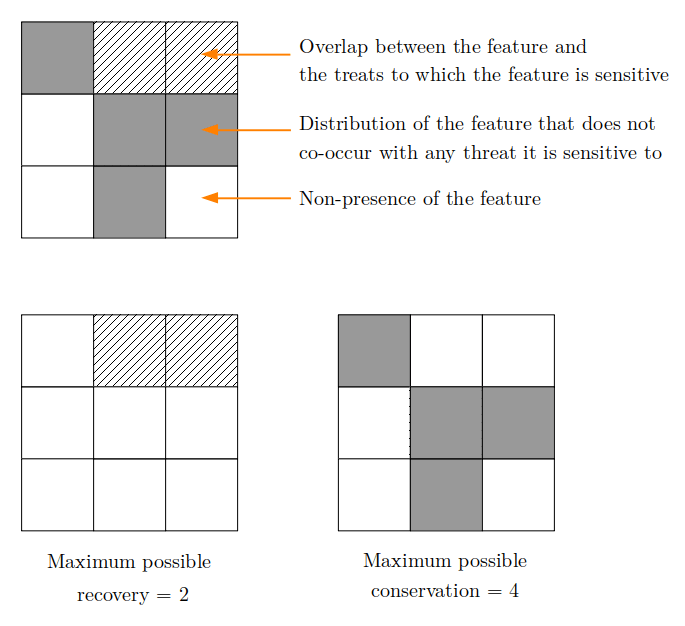
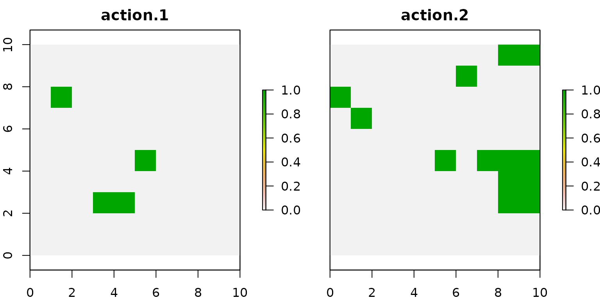
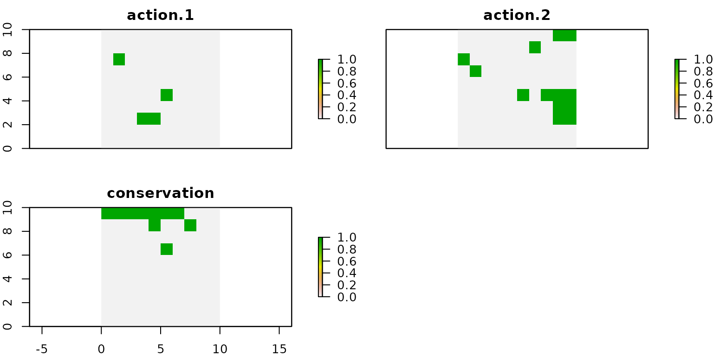
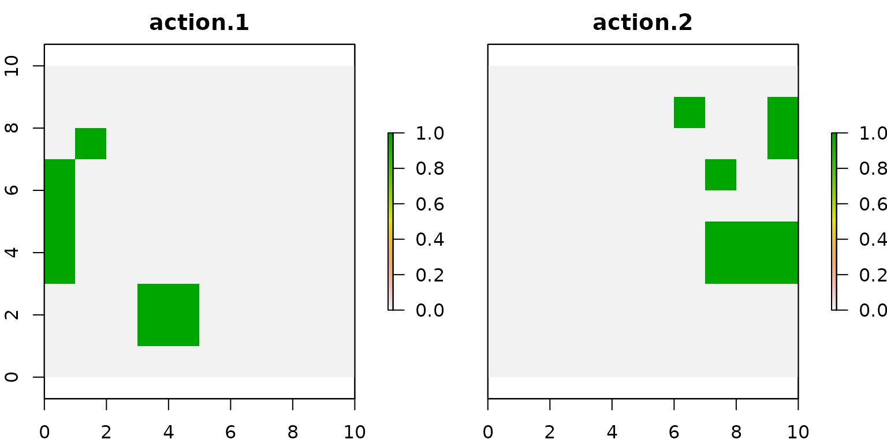
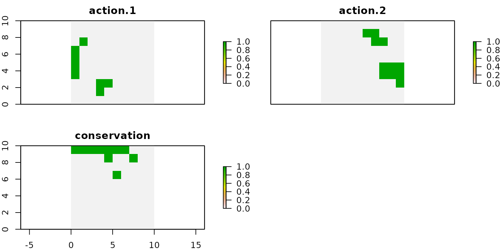

The `prioriactions` package allows to address to planning goals: **recovery** and **conservation**. In order to understand the difference between each of them, let us consider the following figures:

{width=60%}

According to the figure, for a conservation feature there are **two** planning units where it co-occurs with the threat it is sensitive to (and where, therefore, it can be impacted by the threat) and in **four** other units where the feature does not co-occur with the threat. Therefore, **recovery targets** could be achieved by prescribing management actions against the threat present in the two planning units where the feature co-occurs with that threat, while **conservation targets** could be achieved by selecting for conservation any of the planning units where the species does not co-occur with the threat. As we will show in this document, selecting planning units only for conservation purposes plays a crucial role in the conservation plan.

If we aim at minimizing the conservation costs (`minimize costs`), the `prioriactions` package allows to explicitly impose a target for both, the **recovery** and the **conservation** levels that we aim at achieving. Please note that, by the default, only the **recovery targets** is requested, given the main focus of `prioriactions` is on the prioritization of management actions against threats, while conservation targets are optional. There are other software, like [marxan](https://marxansolutions.org/), and packages, like [prioritizr](https://prioritizr.net/index.html), that already solve conservation only problems.
On the contrary, if we aim at maximizing the benefits (`maximize benefits`), we assume that the benefits are obtained only from **recovery** actions.

The remainder of this document is organized as follows. In Section 1 we present the results obtained when only imposing **recovery targets**. In Section 2 we present the results obtained when imposing **recovery targets** and **conservation targets**. In Section 3 we present the results obtained when considering **recovery targets** along with a connectivity optimization. Finally, in Section 4 we present the results obtained when considering **recovery targets** and **conservation targets** along with a connectivity optimization.

## 1) Model I: Only recovery targets

In order to analyze how planning decision behave when no **conservation target** is considered, we present some results using the example available in the [Get started](https://prioriactions.github.io/prioriactions/articles/prioriactions.html) vignette.


```r
# load package
library(prioriactions)

data(sim_boundary_data, sim_dist_features_data, sim_dist_threats_data,
     sim_features_data, sim_pu_data, sim_sensitivity_data, sim_threats_data)

#create raster
library(raster) 
r <- raster(ncol=10, nrow=10, xmn=0, xmx=10, ymn=0, ymx=10)
values(r) <- 0

# create data class using input data from prioriactions
b <- inputData(pu = sim_pu_data, 
               features = sim_features_data, 
               dist_features = sim_dist_features_data, 
               threats = sim_threats_data, 
               dist_threats = sim_dist_threats_data, 
               sensitivity = sim_sensitivity_data, 
               boundary = sim_boundary_data)

# print problem
print(b)
```
As explained the package description, we can use the `getPotentialBenefit()` function to know what is the maximum benefit that can be achieved for both types of planning objectives:


```r
# get potential benefit
getPotentialBenefit(b)
```

```
##   feature dist dist_threatened maximum.conservation.benefit maximum.recovery.benefit maximum.benefit
## 1       1   47              47                            0                       47              47
## 2       2   30              28                            2                       28              30
## 3       3   66              56                           10                       56              66
## 4       4   33              33                            0                       33              33
```

As we can observe, features 2 and 3 are present in 2 and 10 units, respectively, where no threat is present. Therefore, if select these units just for monitoring, they could contribute to achieving the **conservation** target. In order to to show the impact of including recovery requirements, we now present the results obtained when setting the value of `target_recovery` to 10. After setting these values, we solve the corresponding model. These steps are shown below.


```r
# setting the targets
features_data.base <- sim_features_data
features_data.base$target_recovery <- 10

# create conservation problem using data from prioriactions
b.base <- inputData(pu = sim_pu_data, 
               features = features_data.base, 
               dist_features = sim_dist_features_data, 
               threats = sim_threats_data, 
               dist_threats = sim_dist_threats_data, 
               sensitivity = sim_sensitivity_data, 
               boundary = sim_boundary_data)

# create optimization problem
c.base <- problem(b.base, model_type = "minimizeCosts")
```

```
## Warning: The blm argument was set to 0, so the boundary data has no effect
```

```
## Warning: Some blm_actions argument were set to 0, so the boundary data has no effect for these cases
```

```r
# solve optimization problem
d.base <- solve(c.base, solver = "gurobi", verbose = TRUE, output_file = FALSE, cores = 2)
```

```
## Gurobi Optimizer version 9.1.2 build v9.1.2rc0 (linux64)
## Thread count: 2 physical cores, 4 logical processors, using up to 2 threads
## Optimize a model with 284 rows, 396 columns and 785 nonzeros
## Model fingerprint: 0xe4778898
## Variable types: 176 continuous, 220 integer (220 binary)
## Coefficient statistics:
##   Matrix range     [5e-01, 2e+00]
##   Objective range  [1e+00, 1e+01]
##   Bounds range     [1e+00, 1e+00]
##   RHS range        [1e+01, 1e+01]
## Found heuristic solution: objective 964.0000000
## Found heuristic solution: objective 371.0000000
## Presolve removed 250 rows and 277 columns
## Presolve time: 0.00s
## Presolved: 34 rows, 119 columns, 237 nonzeros
## Variable types: 0 continuous, 119 integer (101 binary)
## 
## Root relaxation: objective 1.310000e+02, 30 iterations, 0.00 seconds
## 
##     Nodes    |    Current Node    |     Objective Bounds      |     Work
##  Expl Unexpl |  Obj  Depth IntInf | Incumbent    BestBd   Gap | It/Node Time
## 
##      0     0  131.00000    0    6  371.00000  131.00000  64.7%     -    0s
## H    0     0                     143.0000000  131.00000  8.39%     -    0s
## H    0     0                     142.0000000  131.00000  7.75%     -    0s
##      0     0  134.00000    0    4  142.00000  134.00000  5.63%     -    0s
## H    0     0                     138.0000000  134.00000  2.90%     -    0s
## H    0     0                     134.0000000  134.00000  0.00%     -    0s
##      0     0  134.00000    0    4  134.00000  134.00000  0.00%     -    0s
## 
## Cutting planes:
##   Gomory: 1
##   Cover: 5
## 
## Explored 1 nodes (39 simplex iterations) in 0.00 seconds
## Thread count was 2 (of 4 available processors)
## 
## Solution count 6: 134 138 142 ... 964
## 
## Optimal solution found (tolerance 0.00e+00)
## Best objective 1.340000000000e+02, best bound 1.340000000000e+02, gap 0.0000%
```

Once the corresponding optimization problem is solved, we can retrieve the spatial distribution of the recovery actions using the `getActions()` function. The results obtained for our test instance are shown below:


```r
# get actions from solution
actions.base <- getActions(d.base, format = "wide")

# plot actions
group_rasters <- raster::stack(r, r)
values(group_rasters[[1]]) <- actions.base$`1`
values(group_rasters[[2]]) <- actions.base$`2`
names(group_rasters) <- c("action 1", "action 2")

plot(group_rasters)
```



## 2) Model II: Recovery and conservation targets

In this section, we present the results obtained when only considering **conservation targets**. Note that the value of these targets are bounded by the maximum possible benefits that can be obtained according to the structure of the planning area. The corresponding value of this maximum possible benefits can be retrieved using the `getPotentialBenefit()` function. As we have already seen in the previous section, these values correspond to 0, 2, 10 and 0 respectively.Once the **conservation targets** values are defined, the corresponding optimization model is solved. These steps are shown below.


```r
# setting the targets
features_data.cons <- sim_features_data
features_data.cons$target_recovery <- 10
features_data.cons$target_conservation <- c(0, 2, 10, 0)

# create conservation problem using data from prioriactions
b.cons <- inputData(pu = sim_pu_data, 
               features = features_data.cons, 
               dist_features = sim_dist_features_data, 
               threats = sim_threats_data, 
               dist_threats = sim_dist_threats_data, 
               sensitivity = sim_sensitivity_data, 
               boundary = sim_boundary_data)

# create optimization problem
c.cons <- problem(b.cons, model_type = "minimizeCosts")
```

```
## Warning: The blm argument was set to 0, so the boundary data has no effect
```

```
## Warning: Some blm_actions argument were set to 0, so the boundary data has no effect for these cases
```

```r
# solve optimization problem
d.cons <- solve(c.cons, solver = "gurobi", verbose = TRUE, output_file = FALSE, cores = 2)
```

```
## Gurobi Optimizer version 9.1.2 build v9.1.2rc0 (linux64)
## Thread count: 2 physical cores, 4 logical processors, using up to 2 threads
## Optimize a model with 284 rows, 396 columns and 785 nonzeros
## Model fingerprint: 0xf6bb92ed
## Variable types: 176 continuous, 220 integer (220 binary)
## Coefficient statistics:
##   Matrix range     [5e-01, 2e+00]
##   Objective range  [1e+00, 1e+01]
##   Bounds range     [1e+00, 1e+00]
##   RHS range        [2e+00, 1e+01]
## Found heuristic solution: objective 964.0000000
## Found heuristic solution: objective 381.0000000
## Presolve removed 250 rows and 277 columns
## Presolve time: 0.00s
## Presolved: 34 rows, 119 columns, 237 nonzeros
## Variable types: 0 continuous, 119 integer (101 binary)
## 
## Root relaxation: objective 1.540000e+02, 30 iterations, 0.00 seconds
## 
##     Nodes    |    Current Node    |     Objective Bounds      |     Work
##  Expl Unexpl |  Obj  Depth IntInf | Incumbent    BestBd   Gap | It/Node Time
## 
##      0     0  154.00000    0    6  381.00000  154.00000  59.6%     -    0s
## H    0     0                     166.0000000  154.00000  7.23%     -    0s
## H    0     0                     165.0000000  154.00000  6.67%     -    0s
##      0     0  157.00000    0    4  165.00000  157.00000  4.85%     -    0s
## H    0     0                     161.0000000  157.00000  2.48%     -    0s
## H    0     0                     157.0000000  157.00000  0.00%     -    0s
##      0     0  157.00000    0    4  157.00000  157.00000  0.00%     -    0s
## 
## Cutting planes:
##   Gomory: 1
##   Cover: 5
## 
## Explored 1 nodes (39 simplex iterations) in 0.01 seconds
## Thread count was 2 (of 4 available processors)
## 
## Solution count 6: 157 161 165 ... 964
## 
## Optimal solution found (tolerance 0.00e+00)
## Best objective 1.570000000000e+02, best bound 1.570000000000e+02, gap 0.0000%
```

As can be seen from the log, the objective function value of the attained solution is 157. This value is 23 units larger than the value obtained for the same instance but without imposing conservation targets (the values was 134).  This difference is explained by the fact that we now impose the implementation of monitoring actions.


```r
# get actions from solution
actions.cons <- getActions(d.cons, format = "wide")

# plot actions
group_rasters <- raster::stack(r, r, r)
values(group_rasters[[1]]) <- actions.cons$`1`
values(group_rasters[[2]]) <- actions.cons$`2`
values(group_rasters[[3]]) <- actions.cons$`conservation`
names(group_rasters) <- c("action 1", "action 2", "conservation")

plot(group_rasters)
```



We can observe that, in this case, the units selected for **conservation** do not overlap with those selected for applying action 1 and action 2. When comparing this solution with the one shown in the model I, we observe that in both cases the spatial distribution of the **recovery** actions is the same.

## 3) Model III: Only recovery targets and connectivity

To demonstrate the influence of including connectivity constrains we will use the same inputs as above, but we will set the connectivity penalty factor (*blm*) to 100 in the `problem()` function. Next we will modify this parameter in the model that uses only **recovery targets**.


```r
# create optimization problem
c.base_conn <- problem(b.base, 
                  model_type = "minimizeCosts",
                  blm = 100)
```

```
## Warning: Some blm_actions argument were set to 0, so the boundary data has no effect for these cases
```

```r
# solve optimization problem
d.base_conn <- solve(c.base_conn, solver = "gurobi", verbose = TRUE, output_file = FALSE, cores = 2)
```

```
## Gurobi Optimizer version 9.1.2 build v9.1.2rc0 (linux64)
## Thread count: 2 physical cores, 4 logical processors, using up to 2 threads
## Optimize a model with 29984 rows, 10296 columns and 70085 nonzeros
## Model fingerprint: 0x0d6e31a0
## Variable types: 176 continuous, 10120 integer (10120 binary)
## Coefficient statistics:
##   Matrix range     [5e-01, 2e+00]
##   Objective range  [1e+00, 7e+04]
##   Bounds range     [1e+00, 1e+00]
##   RHS range        [1e+00, 1e+01]
## Found heuristic solution: objective 964.0000000
## Presolve removed 190 rows and 181 columns
## Presolve time: 0.22s
## Presolved: 29794 rows, 10115 columns, 69709 nonzeros
## Variable types: 0 continuous, 10115 integer (10110 binary)
## 
## Root relaxation: objective 2.573214e+02, 253 iterations, 0.09 seconds
## 
##     Nodes    |    Current Node    |     Objective Bounds      |     Work
##  Expl Unexpl |  Obj  Depth IntInf | Incumbent    BestBd   Gap | It/Node Time
## 
## *    0     0               0     547.0000000  547.00000  0.00%     -    0s
## 
## Explored 0 nodes (306 simplex iterations) in 0.43 seconds
## Thread count was 2 (of 4 available processors)
## 
## Solution count 2: 547 964 
## 
## Optimal solution found (tolerance 0.00e+00)
## Best objective 5.470000000163e+02, best bound 5.469999999816e+02, gap 0.0000%
```


```r
# get actions from solution
actions.base_conn <- getActions(d.base_conn, format = "wide")

# plot actions
group_rasters <- raster::stack(r, r)
values(group_rasters[[1]]) <- actions.base_conn$`1`
values(group_rasters[[2]]) <- actions.base_conn$`2`
names(group_rasters) <- c("action 1", "action 2")

plot(group_rasters)
```



We can notice that the selected actions are more connected compared to the solutions shown for the previous models.

## 4) Model IV: Recovery and conservation targets and connectivity

Same as above, we set the *blm* parameter to 100, but now using **conservation targets**.


```r
# create optimization problem
c.cons_conn <- problem(b.cons, 
                       model_type = "minimizeCosts",
                       blm = 100)
```

```
## Warning: Some blm_actions argument were set to 0, so the boundary data has no effect for these cases
```

```r
# solve optimization problem
d.cons_conn <- solve(c.cons_conn, solver = "gurobi", verbose = TRUE, output_file = FALSE, cores = 2)
```

```
## Gurobi Optimizer version 9.1.2 build v9.1.2rc0 (linux64)
## Thread count: 2 physical cores, 4 logical processors, using up to 2 threads
## Optimize a model with 29984 rows, 10296 columns and 70085 nonzeros
## Model fingerprint: 0x8ba6f640
## Variable types: 176 continuous, 10120 integer (10120 binary)
## Coefficient statistics:
##   Matrix range     [5e-01, 2e+00]
##   Objective range  [1e+00, 7e+04]
##   Bounds range     [1e+00, 1e+00]
##   RHS range        [1e+00, 1e+01]
## Found heuristic solution: objective 964.0000000
## Presolve removed 5860 rows and 2081 columns
## Presolve time: 0.21s
## Presolved: 24124 rows, 8215 columns, 56479 nonzeros
## Variable types: 0 continuous, 8215 integer (8210 binary)
## 
## Root relaxation: objective 5.470000e+02, 9 iterations, 0.01 seconds
## 
##     Nodes    |    Current Node    |     Objective Bounds      |     Work
##  Expl Unexpl |  Obj  Depth IntInf | Incumbent    BestBd   Gap | It/Node Time
## 
## *    0     0               0     547.0000000  547.00000  0.00%     -    0s
## 
## Explored 0 nodes (9 simplex iterations) in 0.28 seconds
## Thread count was 2 (of 4 available processors)
## 
## Solution count 2: 547 964 
## 
## Optimal solution found (tolerance 0.00e+00)
## Best objective 5.470000000163e+02, best bound 5.469999999524e+02, gap 0.0000%
```


```r
# get actions from solution
actions.cons_conn <- getActions(d.cons_conn, format = "wide")

# plot actions
group_rasters <- raster::stack(r, r, r)
values(group_rasters[[1]]) <- actions.cons_conn$`1`
values(group_rasters[[2]]) <- actions.cons_conn$`2`
values(group_rasters[[3]]) <- actions.cons_conn$`conservation`
names(group_rasters) <- c("action 1", "action 2", "conservation")

plot(group_rasters)
```



Note that in the last two models (those that incorporate connectivity requirements) the solutions differ. Because in both we have used the same parameters, it is inferred that the sites selected for the conservation of species affect in a certain way the selection of units for **recovery targets**, which is why it is very important to carefully think about the planning objectives, as they might lead to different solutions.

