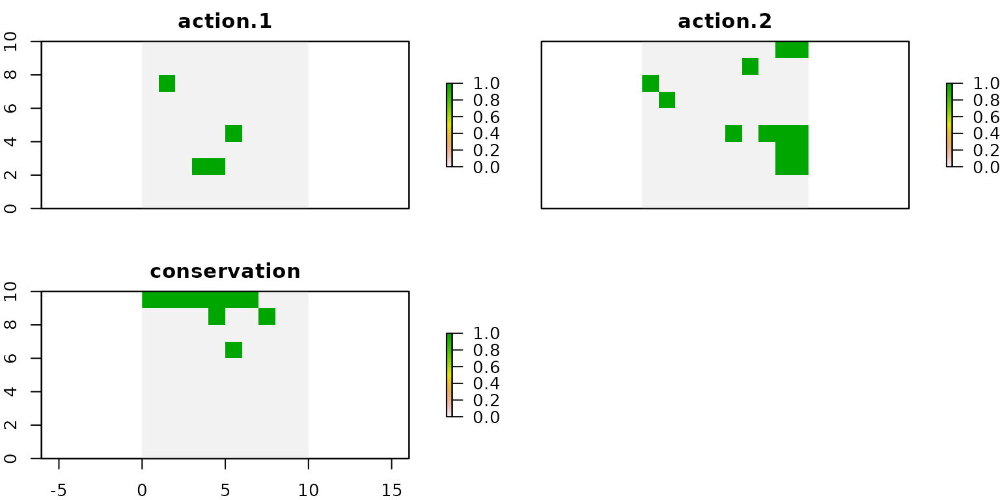

The `prioriactions` package allows you to work with two planning objectives: **recovery** and **conservation**. In order to understand the difference between each of them, the following diagram is presented:

{width=60%}

Here, as it can be distinguished, for a conservation feature there are **two** planning units in which it coincides with its threats (therefore, it is assumed that it is in danger) and in **four** other units where there is no occurrence between this feature and its threats. In order to obtain some kind of benefit from the first two, it is necessary to carry out **recovery** actions, while in the case of the other four, **conservation** actions. The incorporation of sites only for their conservation could **greatly influence** the result of planning, which is why we emphasize their importance.

From the point of the objective of the mathematical model, in the case of wanting to `minimize costs`, the `prioriactions` package incorporates it in one of its data inputs (features data) two columns to indicate separately the target to be reached by feature at the **recovery** and **conservation** level. It is being only the **recovery** a mandatory field. The latter due the objective of `prioriactions` package (as its name implies) is the prioritization of conservation actions and not the conservation planning focused on ecological reserves; for this, there is already software such as [prioritizr](https://prioritizr.net/index.html) or [marxan](https://marxansolutions.org/). While if we want to `maximize benefits`, it is assumed that benefits will come only from **recovery**.

## Model only with recovery targets

To see how planning decisions change whether or not to include conservation, we use the example used in the `Get started` vignette:


```r
# load package
library(prioriactions)

#create raster
library(raster) 
r <- raster(ncol=10, nrow=10, xmn=0, xmx=10, ymn=0, ymx=10)
values(r) <- 0

# create conservation problem using data from prioriactions
b <- inputData(pu = sim_pu_data, 
               features = sim_features_data, 
               dist_features = sim_dist_features_data, 
               threats = sim_threats_data, 
               dist_threats = sim_dist_threats_data, 
               sensitivity = sim_sensitivity_data, 
               boundary = sim_boundary_data)

# print problem
print(b)
```
As we already know, it is essential to use the `getPotentialBenefit()` function to know what is the maximum benefit that we can achieve for both types of planning objectives:


```r
# get potential benefit
getPotentialBenefit(b)
```

```
##   feature dist dist_threatened maximum.conservation.benefit maximum.recovery.benefit maximum.benefit
## 1       1   47              47                            0                       47              47
## 2       2   30              28                            2                       28              30
## 3       3   66              56                           10                       56              66
## 4       4   33              33                            0                       33              33
```
Here, we observe that features 2 and 3 have 2 and 10 units respectively where they are not threatened, so they would obtain **conservation** benefits just by selecting those sites for monitoring. Now, we modify the `recovery_targets` to 10 in order to make the comparison easier and solve the model.


```r
# setting the targets
features_data.base <- sim_features_data
features_data.base$target_recovery <- 10

# create conservation problem using data from prioriactions
b.base <- inputData(pu = sim_pu_data, 
               features = features_data.base, 
               dist_features = sim_dist_features_data, 
               threats = sim_threats_data, 
               dist_threats = sim_dist_threats_data, 
               sensitivity = sim_sensitivity_data, 
               boundary = sim_boundary_data)

# create optimization problem
c.base <- problem(b.base, model_type = "minimizeCosts")
```

```
## Warning: The blm argument was set to 0, so the boundary data has no effect
```

```
## Warning: Some blm_actions argument were set to 0, so the boundary data has no effect for these cases
```

```r
# solve optimization problem
d.base <- solve(c.base, solver = "gurobi", verbose = TRUE, output_file = FALSE)
```

```
## Gurobi Optimizer version 9.1.2 build v9.1.2rc0 (linux64)
## Thread count: 2 physical cores, 4 logical processors, using up to 2 threads
## Optimize a model with 460 rows, 572 columns and 1137 nonzeros
## Model fingerprint: 0xcafb96c4
## Variable types: 352 continuous, 220 integer (220 binary)
## Coefficient statistics:
##   Matrix range     [5e-01, 2e+00]
##   Objective range  [1e-01, 1e+01]
##   Bounds range     [1e+00, 1e+00]
##   RHS range        [1e+01, 1e+01]
## Found heuristic solution: objective 118.5000000
## Presolve removed 438 rows and 495 columns
## Presolve time: 0.00s
## Presolved: 22 rows, 77 columns, 169 nonzeros
## Found heuristic solution: objective 88.3000000
## Variable types: 0 continuous, 77 integer (63 binary)
## 
## Root relaxation: objective 6.370000e+01, 12 iterations, 0.00 seconds
## 
##     Nodes    |    Current Node    |     Objective Bounds      |     Work
##  Expl Unexpl |  Obj  Depth IntInf | Incumbent    BestBd   Gap | It/Node Time
## 
##      0     0   63.70000    0    4   88.30000   63.70000  27.9%     -    0s
## H    0     0                      63.9000000   63.70000  0.31%     -    0s
##      0     0   63.70000    0    4   63.90000   63.70000  0.31%     -    0s
## 
## Explored 1 nodes (12 simplex iterations) in 0.00 seconds
## Thread count was 2 (of 4 available processors)
## 
## Solution count 3: 63.9 88.3 118.5 
## 
## Optimal solution found (tolerance 0.00e+00)
## Best objective 6.390000000000e+01, best bound 6.390000000000e+01, gap 0.0000%
```
We look at the distribution of the actions using the `getActions()` function:


```r
# get actions from solution
actions.base <- getActions(d.base, format = "wide")

# plot actions
group_rasters <- raster::stack(r, r)
values(group_rasters[[1]]) <- actions.base$`1`
values(group_rasters[[2]]) <- actions.base$`2`
names(group_rasters) <- c("action 1", "action 2")

plot(group_rasters)
```


## Model with conservation targets

Now we execute another model including **conservation targets**, whose values are the maximum possible according to what is observed with the `getPotentialBenefit()` function:


```r
# setting the targets
features_data.cons <- sim_features_data
features_data.cons$target_recovery <- 10
features_data.cons$target_conservation <- c(0, 2, 10, 0)

# create conservation problem using data from prioriactions
b.cons <- inputData(pu = sim_pu_data, 
               features = features_data.cons, 
               dist_features = sim_dist_features_data, 
               threats = sim_threats_data, 
               dist_threats = sim_dist_threats_data, 
               sensitivity = sim_sensitivity_data, 
               boundary = sim_boundary_data)

# create optimization problem
c.cons <- problem(b.cons, model_type = "minimizeCosts")
```

```
## Warning: The blm argument was set to 0, so the boundary data has no effect
```

```
## Warning: Some blm_actions argument were set to 0, so the boundary data has no effect for these cases
```

```r
# solve optimization problem
d.cons <- solve(c.cons, solver = "gurobi", verbose = TRUE, output_file = FALSE)
```

```
## Gurobi Optimizer version 9.1.2 build v9.1.2rc0 (linux64)
## Thread count: 2 physical cores, 4 logical processors, using up to 2 threads
## Optimize a model with 460 rows, 572 columns and 1137 nonzeros
## Model fingerprint: 0xd0b23e20
## Variable types: 352 continuous, 220 integer (220 binary)
## Coefficient statistics:
##   Matrix range     [5e-01, 2e+00]
##   Objective range  [1e-01, 1e+01]
##   Bounds range     [1e+00, 1e+00]
##   RHS range        [2e+00, 1e+01]
## Found heuristic solution: objective 131.6000000
## Presolve removed 438 rows and 495 columns
## Presolve time: 0.00s
## Presolved: 22 rows, 77 columns, 169 nonzeros
## Found heuristic solution: objective 87.1000000
## Variable types: 0 continuous, 77 integer (63 binary)
## 
## Root relaxation: objective 6.470000e+01, 12 iterations, 0.00 seconds
## 
##     Nodes    |    Current Node    |     Objective Bounds      |     Work
##  Expl Unexpl |  Obj  Depth IntInf | Incumbent    BestBd   Gap | It/Node Time
## 
##      0     0   64.70000    0    4   87.10000   64.70000  25.7%     -    0s
## H    0     0                      64.9000000   64.70000  0.31%     -    0s
##      0     0   64.70000    0    4   64.90000   64.70000  0.31%     -    0s
## 
## Explored 1 nodes (12 simplex iterations) in 0.00 seconds
## Thread count was 2 (of 4 available processors)
## 
## Solution count 3: 64.9 87.1 131.6 
## 
## Optimal solution found (tolerance 0.00e+00)
## Best objective 6.490000000000e+01, best bound 6.490000000000e+01, gap 0.0000%
```
There is a difference in the objective value (costs) of 23 (157 - 134), which means the additional cost of including the units for their conservation within the planning (monitoring cost).


```r
# get actions from solution
actions.cons <- getActions(d.cons, format = "wide")

# plot actions
group_rasters <- raster::stack(r, r, r)
values(group_rasters[[1]]) <- actions.cons$`1`
values(group_rasters[[2]]) <- actions.cons$`2`
values(group_rasters[[3]]) <- actions.cons$`conservation`
names(group_rasters) <- c("action 1", "action 2", "conservation")

plot(group_rasters)
```


Note that the units selected for the conservation of species are mostly separated from the units selected to carry out conservation actions, indeed, none of them coincide. If we compare both plans, we see that the conservation actions are the same for both cases.


## Model only with recovery targets and connectivity request

It might be is interesting to know how these solutions change when more connectivity is required. For this we will use the same inputs as above, but we will set the connectivity penalty factor (*blm*) to 100. The latter is part of the `problem()` function. Next we will modify this parameter in the model that uses only **recovery targets**.


```r
# create optimization problem
c.base_conn <- problem(b.base, 
                  model_type = "minimizeCosts",
                  blm = 100)
```

```
## Warning: Some blm_actions argument were set to 0, so the boundary data has no effect for these cases
```

```r
# solve optimization problem
d.base_conn <- solve(c.base_conn, solver = "gurobi", verbose = TRUE, output_file = FALSE)
```

```
## Gurobi Optimizer version 9.1.2 build v9.1.2rc0 (linux64)
## Thread count: 2 physical cores, 4 logical processors, using up to 2 threads
## Optimize a model with 30160 rows, 10472 columns and 70437 nonzeros
## Model fingerprint: 0x70a545ee
## Variable types: 352 continuous, 10120 integer (10120 binary)
## Coefficient statistics:
##   Matrix range     [5e-01, 2e+00]
##   Objective range  [1e+00, 7e+04]
##   Bounds range     [1e+00, 1e+00]
##   RHS range        [1e+00, 1e+01]
## Presolve removed 366 rows and 357 columns
## Presolve time: 0.16s
## Presolved: 29794 rows, 10115 columns, 69709 nonzeros
## Variable types: 0 continuous, 10115 integer (10110 binary)
## Found heuristic solution: objective 535211.62707
## 
## Root relaxation: objective 7.200000e+01, 180 iterations, 0.04 seconds
## 
##     Nodes    |    Current Node    |     Objective Bounds      |     Work
##  Expl Unexpl |  Obj  Depth IntInf | Incumbent    BestBd   Gap | It/Node Time
## 
## *    0     0               0      72.0000000   72.00000  0.00%     -    0s
## 
## Explored 0 nodes (180 simplex iterations) in 0.29 seconds
## Thread count was 2 (of 4 available processors)
## 
## Solution count 2: 72 535212 
## 
## Optimal solution found (tolerance 0.00e+00)
## Best objective 7.199999996966e+01, best bound 7.199999996966e+01, gap 0.0000%
```


```r
# get actions from solution
actions.base_conn <- getActions(d.base_conn, format = "wide")

# plot actions
group_rasters <- raster::stack(r, r)
values(group_rasters[[1]]) <- actions.base_conn$`1`
values(group_rasters[[2]]) <- actions.base_conn$`2`
names(group_rasters) <- c("action 1", "action 2")

plot(group_rasters)
```


We can clearly notice that the selected actions are a degree more connected with respect to the solutions shown for the previous models.

## Model with conservation targets and connectivity request

Same as above, we set the *blm* parameter to 100, but now using **conservation targerts**.


```r
# create optimization problem
c.cons_conn <- problem(b.cons, 
                       model_type = "minimizeCosts",
                       blm = 100)
```

```
## Warning: Some blm_actions argument were set to 0, so the boundary data has no effect for these cases
```

```r
# solve optimization problem
d.cons_conn <- solve(c.cons_conn, solver = "gurobi", verbose = TRUE, output_file = FALSE)
```

```
## Gurobi Optimizer version 9.1.2 build v9.1.2rc0 (linux64)
## Thread count: 2 physical cores, 4 logical processors, using up to 2 threads
## Optimize a model with 30160 rows, 10472 columns and 70437 nonzeros
## Model fingerprint: 0x81fd47b2
## Variable types: 352 continuous, 10120 integer (10120 binary)
## Coefficient statistics:
##   Matrix range     [5e-01, 2e+00]
##   Objective range  [1e+00, 7e+04]
##   Bounds range     [1e+00, 1e+00]
##   RHS range        [1e+00, 1e+01]
## Presolve removed 6036 rows and 2257 columns
## Presolve time: 0.20s
## Presolved: 24124 rows, 8215 columns, 56479 nonzeros
## Variable types: 0 continuous, 8215 integer (8210 binary)
## Found heuristic solution: objective 109.0000000
## 
## Root relaxation: objective 7.200000e+01, 13 iterations, 0.01 seconds
## 
##     Nodes    |    Current Node    |     Objective Bounds      |     Work
##  Expl Unexpl |  Obj  Depth IntInf | Incumbent    BestBd   Gap | It/Node Time
## 
## *    0     0               0      72.0000000   72.00000  0.00%     -    0s
## 
## Explored 0 nodes (13 simplex iterations) in 0.28 seconds
## Thread count was 2 (of 4 available processors)
## 
## Solution count 2: 72 109 
## No other solutions better than 72
## 
## Optimal solution found (tolerance 0.00e+00)
## Best objective 7.199999996969e+01, best bound 7.199999996969e+01, gap 0.0000%
```


```r
# get actions from solution
actions.cons_conn <- getActions(d.cons_conn, format = "wide")

# plot actions
group_rasters <- raster::stack(r, r, r)
values(group_rasters[[1]]) <- actions.cons_conn$`1`
values(group_rasters[[2]]) <- actions.cons_conn$`2`
values(group_rasters[[3]]) <- actions.cons_conn$`conservation`
names(group_rasters) <- c("action 1", "action 2", "conservation")

plot(group_rasters)
```


Note that in the last two models (those that incorporate connectivity requirements) the solutions differ. Because in both we have used the same parameters, it is inferred that the sites selected for the conservation of species affect in a certain way the selection of conservation actions, which is why it is very important to know what the planning objective is because these may interfere in some way with the end result.

