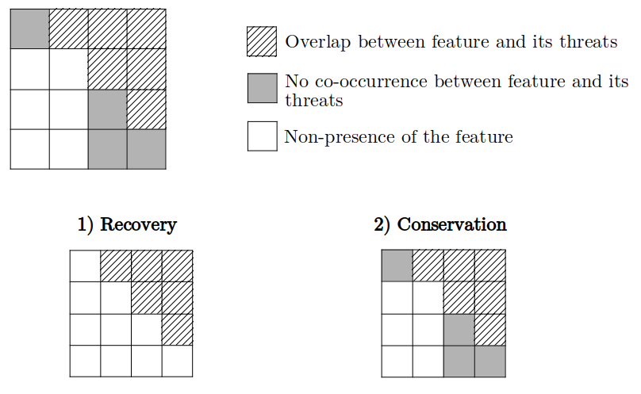

The `prioriactions` package is a new effort to bring exact modeling
methods from operations research (OR) to conservation decision-making.
Taking advantage of the benefits offered by these models over heuristics
models (find much cheaper solutions in a much shorter period of time)
[@beyer2016]. This helps to identify what actions to take against which threats to achieve ecological targets while minimizing the costs of the action or maximizing the benefits achieved given a certain available budget. The `prioriactions` package has the functionality of reading input data
formatted in a similar way to that of the widely used conservation
planning program called [Marxan](https://https://marxansolutions.org/)
[@watts2009].

## Overview

The `prioriactions` package uses two main types of functions: The
creation and solution functions of mathematical models; and the
functions to obtain information about the solution(s) (see
[references](https://prioriactions.github.io/prioriactions/reference/index.html)
section).

The creation and resolution of a mathematical model can follow two
forms: 1) the *extended* form (by steps); and 2) the *compressed* form:

1)  The *extended* form uses a simple three-step logic: the creation of
    a [conservation
    problem](https://prioriactions.github.io/prioriactions/reference/conservationProblem-class.html)
    object by the `problem()` function, the creation of an [optimization
    problem](https://prioriactions.github.io/prioriactions/reference/optimizationProblem-class.html)
    object by the `minimizeCosts()` or `maximizeBenefits()`
    functions and its
    [solution](https://prioriactions.github.io/prioriactions/reference/solution-class.html)
    by the `solve()` function.

2)  The *compressed* form allows with a single function called
    `prioriactions()` to compress the three steps presented in the
    *extended* form.

We recommend using the *extended* form most of the time. This allows us to verify that all the steps are
correct, and it can be helpful to check for errors without completely
rerunning everything again.

Note that optimization models can take significant time to create
(depending on how large the inputs are). The *extended* form allows to generate the [optimization
problem](https://prioriactions.github.io/prioriactions/reference/optimizationProblem-class.html)
object (following the first two steps) and then experiment with
different parameters for their resolution through the `solve()`
function. In this way, repetitive creation is avoided in the case of
use the compressed form.

The `prioriactions` package also allows working with two types of models, **recovery** models, and purely **conservation** models; the first, assume that there are only benefits when taking action against threats and there is no benefit when selecting planning units where the species are not threatened; on the contrary, a conservation model does assume benefits by selecting units without threats. The above is exemplified in the following diagram:

{width=70%}

The decision to work with any of these types must be informed through the `recovery` parameter of the `minimizeCosts()` and `maximizeBenefits()` functions. The calculation of the benefit for both cases is detailed in the [sensitivities](https://prioriactions.github.io/prioriactions/articles/sensitivities.html)
vignette.

## Workflow

The general workflow when working with `prioriactions` is:

1)  Call the `problem()` function to verify that the inputs have a
    correct structure.
2)  Call a mathematical modeling function. At the moment there are two
    types: `minimizeCosts()` and `maximizeBenefits()`. Both functions
    have a series of parameters that allow you to control different
    aspects of your model.
3)  Call the `solve()` function to solve the model created in the
    previous step.
4)  Get information about solutions with *get* prefix functions (e.g.
    `getActions()` or `getBenefit()`).
5)  To perform sensitivity analysis, repeat steps 2-4 modifying model or
    solver parameters. Or use functions with *eval* prefix for this
    purpose (e.g. `evalBudget()` or `evalTarget()`).

Note that the first three steps correspond to the *extended* way of
working. That is, it would only be a step if you work with the
`prioriactions()` function.

## Usage

Here we will introduce the use of the `prioriactions` package from
presenting the inputs data style to obtaining results. First, we will
load the `prioriactions` package.


```r
# load package
library(prioriactions)
```

The package inherits the input data from the marxan software, which is
widely known for conservation planning (more details in [marxan user
manual](https://marxansolutions.org/download/marxan-user-manual-2021/)).
The data contains information about the species/features of our case
study and spatial information about them. For this, the case study is
divided into multiple sites called *planning units* (PU). In turn,
information is provided on the representativeness values (*targets*)
to be obtained for each species/feature. And other filds such as the
cost associated with each PU. The package follows this data format and
incorporates information about the threats and their relationship with
those species/features.

All inputs in this package are in tabular format (i.e. `data.frame`). For more information on he mandatory fields in the input data,
please see the help page for the `problem()` function.

Below is a basic example of using `prioriactions`.

### Planning units data

First, we will load the **planning unit data** (`sim_pu_data`). This is
a `data.frame` that contains information about the PU ids, costs, and
status. The latter indicates if the PU can be part of the solution or
not. 


```r
# load planning unit data
data(sim_pu_data)

# print first six rows of data
head(sim_pu_data)
#>   id cost status
#> 1  1    2      0
#> 2  2    2      0
#> 3  3    2      0
#> 4  4    2      0
#> 5  5    2      0
#> 6  6    2      0
```

The example contains 100 planning units and with cost values ranging
from 1 to 10. A `RasterLayer`object can be used to present the spatial
information. Here, the planning units are represented as a raster (i.e.
a `RasterLayer` object) and each pixel corresponds to the spatial extent
of each panning unit. The pixel values correspond to the acquisition
costs of each planning unit.


```r
#plot planning unit costs
library(raster) 

r <- raster(ncol=10, nrow=10, xmn=0, xmx=10, ymn=0, ymx=10)
values(r) <- sim_pu_data$cost
plot(r)
```


### Features data

The second data to be entered correspond to **features**
(`sim_features_data` and `sim_dist_features_data`). The first one
provides information about the features such as its id and target
(mandatory to `minimizeCosts()`). And the second provides information on
the spatial distribution of these features.


```r
# load features data
data(sim_features_data, sim_dist_features_data)

# print first six rows of data
head(sim_features_data)
#>   id target     name
#> 1  1     11 feature1
#> 2  2     16 feature2
#> 3  3      8 feature3
#> 4  4      9 feature4
head(sim_dist_features_data)
#>     pu feature amount
#> 201  1       3      1
#> 202  2       3      1
#> 203  3       3      1
#> 204  4       3      1
#> 205  5       3      1
#> 206  6       3      1
```

To present the features, a `RasterStack` object (group of `RasterLayer`
objects) is used. The pixel values in each layer correspond to the
amount of suitable habitat available in a given planning unit. Note that
our planning unit raster layer and our conservation feature stack have
exactly the same spatial properties (i.e. resolution, extent, coordinate
reference system) so their pixels line up perfectly. In turn, we assume
binary values of amount (presence and absence). However, the amount
could contain continuous values (for example, relative to the area of
the PU).


```r
# load amount of features data
features <- reshape2::dcast(sim_dist_features_data, pu~feature,value.var = "amount", fill = 0)

# create stack layer
group_rasters <- raster::stack(r, r, r, r)
values(group_rasters[[1]]) <- features$`1`
values(group_rasters[[2]]) <- features$`2`
values(group_rasters[[3]]) <- features$`3`
values(group_rasters[[4]]) <- features$`4`

names(group_rasters) <- c("feature 1", "feature 2", "feature 3", "feature 4")
plot(group_rasters)
```


### Threats data

Finally, the new inputs compared to marxan are those related to
**threats**. (`sim_threats_data`, `sim_dist_threats_data` and
`sim_sensitivity_data`). The first one provides information about the
threats such as its id and name. The second provides information on the
spatial distribution of these threats and the last one indicates the
relationship between features and threats.


```r
# load threats data
data(sim_threats_data, sim_dist_threats_data, sim_sensitivity_data)

# print first six rows of data
head(sim_threats_data)
#>   id    name blm_actions
#> 1  1 threat1           0
#> 2  2 threat2           0
head(sim_dist_threats_data)
#>     pu threat amount cost status
#> 1    1      1      1    4      0
#> 101  1      2      1    3      0
#> 2    2      1      1    4      0
#> 102  2      2      1    2      0
#> 3    3      1      1    4      0
#> 103  3      2      1    2      0
head(sim_sensitivity_data)
#>   feature threat
#> 1       1      1
#> 2       2      1
#> 3       3      1
#> 4       4      1
#> 5       1      2
#> 6       2      2
```

Note that the `sim_dist_threats_data` file contains information on the
cost of taking action against a threat on a site, in addition to the
status that works in the same way as the status associated with PU's. In
this example, a binary amount of threats (presence/absence) is assumed.
However, this quantity can be continuous, which implies a more in-depth
analysis of the consequences for the features (see more details in the
[sensitivities](https://prioriactions.github.io/prioriactions/articles/sensitivities.html)
vignette).


```r
# load amount of threat data
threats <- reshape2::dcast(sim_dist_threats_data, pu~threat,value.var = "amount", fill = 0)

# create stack layer
group_rasters <- raster::stack(r, r)
values(group_rasters[[1]]) <- threats$`1`
values(group_rasters[[2]]) <- threats$`2`

names(group_rasters) <- c("threat 1", "threat 2")
plot(group_rasters)
```


### Boundary data

The **boundary** data (`sim_boundary_data`) provides information on the
spatial relationship between the PU's and they are presented in long
format. This input is not mandatory and is only necessary if you are
interested in obtaining more connected solutions.


```r
# load boundary data
data(sim_boundary_data)

# print first six rows of data
head(sim_boundary_data)
#>   id1 id2 boundary
#> 1   1   1        0
#> 2   2   1        1
#> 3   3   1        2
#> 4   4   1        3
#> 5   5   1        4
#> 6   6   1        5
```

### Step 1: Initialize the problem

After having loaded our planning unit and feature data, we will now
create the [conservation
problem](https://prioriactions.github.io/prioriactions/reference/conservationProblem-class.html)
object through the `problem()` function. With it you can check if all
the fields of the different inputs are correct.


```r
# create conservation problem
p <- problem(sim_pu_data, sim_features_data, sim_dist_features_data, sim_threats_data, sim_dist_threats_data, sim_sensitivity_data, sim_boundary_data)

# print problem
print(p)
#> Conservation Problem
#>   planning units: data.frame (100 units)
#>   unit costs:     min: 1, max: 10
#>   features:       feature1, feature2, feature3, feature4 (4 features)
#>   threats:        threat1, threat2 (2 threats)
#>   threat costs:   min: 1, max: 10
```

Note that once the problem is created, we can obtain information from
the object and thus know if the data was loaded correctly. For this, we
can use some functions that are inside the object (e.g
`getThreatsAmount()`).


```r
# get information about object
p$getThreatsAmount()
#> [1] 2
p$getPlanningUnitsAmount()
#> [1] 100
```

Furthermore, it is possible to observe the
[benefit](https://prioriactions.github.io/prioriactions/articles/sensitivities.html)
calculation before creating the mathematical model. Thus we can evaluate
different targets and avoid creating an infeasible model where the
targets exceed the benefit.


```r
# get benefit information
getBenefit(p)
#>   feature dist dist_threatened benefit.nothing benefit.recovery benefit.total
#> 1       1   47              47               0               47            47
#> 2       2   30              30               0               30            30
#> 3       3   66              66               0               66            66
#> 4       4   33              33               0               33            33
```

Note that the total distribution of the features (*dist*) and the
threatened distribution (*dist_threatened*) is reported. That is, some
features in some units could be benefited without carrying out
conservation actions on them (*benefit*.*nothing*). The inclusion of
these units in the solutions will depend on the **recovery** parameter
(TRUE or FALSE) that is part of the `minimizeCosts()` and
`maximizeBenefits()` function.

### Step 2: Create the mathematical model

The next step is create the [optimization
problem](https://prioriactions.github.io/prioriactions/reference/optimizationProblem-class.html)
object with those data. We currently have two types of models:
`minimizeCosts()` and `maximizeBenefits()`. The first one, minimize the
cost of the solution whilst ensuring that all targets are met. Instead,
the second maximizes the benefits achieved by the features using a
certain budget (all details on their respective reference pages).


```r
# create optimization problem
op <- minimizeCosts(p, recovery = TRUE)
#> Warning: The blm argument was set to 0, so the boundary data has no effect
#> Warning: Some blm_actions argument were set to 0, so the boundary data has no
#> effect for these cases

# print problem
print(op)
#> Optimization Problem
#>   model sense: minimization
#>   dimensions:  280, 589, 13.72 kB (nrow, ncol, size)
#>   variables:   589
```

Both functions have the parameter *recovery* = TRUE by default. This
important parameter indicates if your model will use cells (TRUE) or not
(FALSE) without actions as benefits for the features (therefore, the
units will count it in calculating the targets) only because there is no
interaction between threats and features.

Internally, the `minimizeCosts()` and `maximizeBenefits()` functions
have a presolve that identifies these problems and prevents you from
continuing to the next steps. In the case of not reaching the target
established for any feature, it is assumed that its new target will be
the maximum value of the associated benefit.

The two warnings indicate that there are no values for *blm* and
*blm_actions* (arguments to achieve greater connectivity in the
solution), and therefore the input boundary file will have no effect.

### Step 3: Solve the model

Finally, after creating the mathematical model, we can now solve it with
the `solve()` function. To solve our model, we need an optimization
engine. Currently, `prioriactions` have available two: *gurobi* (it
needs a license to work) and *rsymphony* (free to use). We highly
recommend using gurobi (for more information on how to obtain an
academic license
[here](https://prioritizr.net/articles/gurobi_installation.html)).


```r
# solve optimization problem
s <- solve(op, solver = "gurobi", verbose = TRUE, output_file = FALSE)
#> Gurobi Optimizer version 9.1.2 build v9.1.2rc0 (linux64)
#> Thread count: 2 physical cores, 4 logical processors, using up to 2 threads
#> Optimize a model with 280 rows, 589 columns and 822 nonzeros
#> Model fingerprint: 0x9475cbf3
#> Model has 176 general constraints
#> Variable types: 352 continuous, 237 integer (237 binary)
#> Coefficient statistics:
#>   Matrix range     [5e-01, 2e+00]
#>   Objective range  [1e+00, 1e+01]
#>   Bounds range     [1e+00, 1e+00]
#>   RHS range        [8e+00, 2e+01]
#> Found heuristic solution: objective 1002.0000000
#> Presolve added 289 rows and 635 columns
#> Presolve time: 0.00s
#> Presolved: 569 rows, 1224 columns, 2970 nonzeros
#> Presolved model has 176 SOS constraint(s)
#> Variable types: 1056 continuous, 168 integer (162 binary)
#> 
#> Root relaxation: objective 1.455000e+02, 186 iterations, 0.00 seconds
#> 
#>     Nodes    |    Current Node    |     Objective Bounds      |     Work
#>  Expl Unexpl |  Obj  Depth IntInf | Incumbent    BestBd   Gap | It/Node Time
#> 
#>      0     0  145.50000    0   12 1002.00000  145.50000  85.5%     -    0s
#> H    0     0                     973.0000000  145.50000  85.0%     -    0s
#>      0     0  148.00000    0    6  973.00000  148.00000  84.8%     -    0s
#> H    0     0                     162.0000000  148.00000  8.64%     -    0s
#>      0     0  149.00000    0    6  162.00000  149.00000  8.02%     -    0s
#> H    0     0                     152.0000000  149.00000  1.97%     -    0s
#>      0     0  149.50000    0    5  152.00000  149.50000  1.64%     -    0s
#> H    0     0                     150.0000000  149.50000  0.33%     -    0s
#> 
#> Explored 1 nodes (219 simplex iterations) in 0.05 seconds
#> Thread count was 2 (of 4 available processors)
#> 
#> Solution count 5: 150 152 162 ... 1002
#> 
#> Optimal solution found (tolerance 0.00e+00)
#> Best objective 1.500000000000e+02, best bound 1.500000000000e+02, gap 0.0000%
```

Note that the log is shown by default with relevant information about
the optimization process (*verbose* = TRUE). This information can be
important when evaluating how the process is being carried out. For
example, to check the solution's quality (*gaps*), the size of the
problem, or the cores being used. More information on how to read this
log in [MIP_logging
documentation](https://www.gurobi.com/documentation/9.1/refman/mip_logging.html).


```r
# plot solution object
print(s)
#> Solution overview
#>   name: sol
#>   objective value: 150
#>   gap:  0
#>   status:  Optimal solution (according to gap tolerance: 0)
#>   runtime: 0.05 sec
```

**These three steps can be shortened to just one with the
`prioriactions` function. This function inherits all the parameters of
the `problem()`, `minimizeCosts()`, `maximizeBenefits()` and `solve()`
functions:**


```r
# create a list with the data input
inputs <- list(sim_pu_data, sim_features_data, sim_dist_features_data, sim_threats_data, sim_dist_threats_data, sim_sensitivity_data, sim_boundary_data)

#execute prioriactions function
s2 <- prioriactions(data = inputs, name_model = "minimizeCosts", solver = "gurobi", verbose = TRUE, output_file = FALSE)
#> Warning: The blm argument was set to 0, so the boundary data has no effect
#> Warning: Some blm_actions argument were set to 0, so the boundary data has no
#> effect for these cases
#> Gurobi Optimizer version 9.1.2 build v9.1.2rc0 (linux64)
#> Thread count: 2 physical cores, 4 logical processors, using up to 2 threads
#> Optimize a model with 280 rows, 589 columns and 822 nonzeros
#> Model fingerprint: 0x9475cbf3
#> Model has 176 general constraints
#> Variable types: 352 continuous, 237 integer (237 binary)
#> Coefficient statistics:
#>   Matrix range     [5e-01, 2e+00]
#>   Objective range  [1e+00, 1e+01]
#>   Bounds range     [1e+00, 1e+00]
#>   RHS range        [8e+00, 2e+01]
#> Found heuristic solution: objective 1002.0000000
#> Presolve added 289 rows and 635 columns
#> Presolve time: 0.00s
#> Presolved: 569 rows, 1224 columns, 2970 nonzeros
#> Presolved model has 176 SOS constraint(s)
#> Variable types: 1056 continuous, 168 integer (162 binary)
#> 
#> Root relaxation: objective 1.455000e+02, 186 iterations, 0.00 seconds
#> 
#>     Nodes    |    Current Node    |     Objective Bounds      |     Work
#>  Expl Unexpl |  Obj  Depth IntInf | Incumbent    BestBd   Gap | It/Node Time
#> 
#>      0     0  145.50000    0   12 1002.00000  145.50000  85.5%     -    0s
#> H    0     0                     973.0000000  145.50000  85.0%     -    0s
#>      0     0  148.00000    0    6  973.00000  148.00000  84.8%     -    0s
#> H    0     0                     162.0000000  148.00000  8.64%     -    0s
#>      0     0  149.00000    0    6  162.00000  149.00000  8.02%     -    0s
#> H    0     0                     152.0000000  149.00000  1.97%     -    0s
#>      0     0  149.50000    0    5  152.00000  149.50000  1.64%     -    0s
#> H    0     0                     150.0000000  149.50000  0.33%     -    0s
#> 
#> Explored 1 nodes (219 simplex iterations) in 0.05 seconds
#> Thread count was 2 (of 4 available processors)
#> 
#> Solution count 5: 150 152 162 ... 1002
#> 
#> Optimal solution found (tolerance 0.00e+00)
#> Best objective 1.500000000000e+02, best bound 1.500000000000e+02, gap 0.0000%
```

### Getting information about solutions

We can get the solutions with `getActions()` and `getPlanningUnits()`.
`getActions()` shows what actions must be taken against which threats to
achieve the objective, which is to achieve the different representation
targets. Instead `getPlanningUnits()` shows in which PU's such efforts
were made.


```r
# get actions from solution
actions <- getActions(s, format = "wide")

# print first six rows of data
head(actions)
#>   pu 1 2
#> 1  1 0 0
#> 2  2 0 0
#> 3  3 0 0
#> 4  4 0 0
#> 5  5 0 0
#> 6  6 0 0

# plot actions
values(group_rasters[[1]]) <- actions$`1`
values(group_rasters[[2]]) <- actions$`2`
names(group_rasters) <- c("action 1", "action 2")

plot(group_rasters)
```


```r
# get planning units from solution
pu <- getPlanningUnits(s)

# plot planning units with actions inside
values(r) <- pu$solution

plot(r)
```


You can also obtain information about the total benefits achieved by
feature with the `getBenefit()` function and the benefit of features in
each site with the `getLocalBenefit()` function. More information on the
specific calculation of the benefit in the
[sensitivities](https://prioriactions.github.io/prioriactions/articles/sensitivities.html)
vignette.


```r
# get local benefits
local_benefits <- getLocalBenefit(s)
local_benefits <- reshape2::dcast(local_benefits, pu~feature,value.var = "local_benefit", fill = 0)

# plot local benefits
group_rasters <- raster::stack(r, r, r, r)
values(group_rasters[[1]]) <- local_benefits$`1`
values(group_rasters[[2]]) <- local_benefits$`2`
values(group_rasters[[3]]) <- local_benefits$`3`
values(group_rasters[[4]]) <- local_benefits$`4`

names(group_rasters) <- c("feature 1", "feature 2", "feature 3", "feature 4")
plot(group_rasters)
```


```r
# get benefit from solution
getBenefit(s)
#>   feature dist dist_threatened benefit.recovery benefit.recovery.sol
#> 1       1   47              47               47                   11
#> 2       2   30              30               30                   16
#> 3       3   66              66               66                   10
#> 4       4   33              33               33                    9
```

If you need more information about the solution, you can use other *get*
functions (e.g. `getGap()`, `getActionsConnectivity()`). More details in
the
[references](https://prioriactions.github.io/prioriactions/reference/index.html)
section.

### Sensitivity analysis of the results

You may be interested in evaluating different values of targets or
budgets and thus obtain more information for stakeholders (more than one
solution). We have implemented evaluation functions that allow different
parameters to be run in sequence for the same mathematical model. You
can do this by manually running the previous steps for the different
parameters (i.e., running the previous steps once by parameter).
However, the *eval* functions have two advantages over their
counterpart: 1) they are more efficient to create the models. This is
because the model is once created and then updated with the new
information; 2) the output is a
[portfolio](https://prioriactions.github.io/prioriactions/reference/portfolio-class.html)
object, which allows obtaining information about the group of solutions,
including, all *get* functions.

Now, we want to evaluate different levels of targets. For example, 20%,
30% and 40% of the maximum benefit per feature. For this, we use the
`evalTarget()` function:


```r

# Evaluate differents targets
port <- evalTarget(data = inputs, values = c(0.2, 0.3, 0.4), output_file = FALSE, time_limit = 10)
#> *********************************
#>  Iteration 1 of 3: Prop0.2
#> *********************************
#> Warning: The blm argument was set to 0, so the boundary data has no effect
#> Warning: Some blm_actions argument were set to 0, so the boundary data has no
#> effect for these cases
#> Gurobi Optimizer version 9.1.2 build v9.1.2rc0 (linux64)
#> Thread count: 2 physical cores, 4 logical processors, using up to 2 threads
#> Optimize a model with 280 rows, 589 columns and 822 nonzeros
#> Model fingerprint: 0x1021d135
#> Model has 176 general constraints
#> Variable types: 352 continuous, 237 integer (237 binary)
#> Coefficient statistics:
#>   Matrix range     [5e-01, 2e+00]
#>   Objective range  [1e+00, 1e+01]
#>   Bounds range     [1e+00, 1e+00]
#>   RHS range        [6e+00, 1e+01]
#> Found heuristic solution: objective 1002.0000000
#> Presolve added 289 rows and 635 columns
#> Presolve time: 0.00s
#> Presolved: 569 rows, 1224 columns, 2970 nonzeros
#> Presolved model has 176 SOS constraint(s)
#> Variable types: 1056 continuous, 168 integer (162 binary)
#> 
#> Root relaxation: objective 1.161000e+02, 190 iterations, 0.00 seconds
#> 
#>     Nodes    |    Current Node    |     Objective Bounds      |     Work
#>  Expl Unexpl |  Obj  Depth IntInf | Incumbent    BestBd   Gap | It/Node Time
#> 
#>      0     0  116.10000    0   36 1002.00000  116.10000  88.4%     -    0s
#> H    0     0                     989.0000000  116.10000  88.3%     -    0s
#>      0     0  124.40000    0   16  989.00000  124.40000  87.4%     -    0s
#> H    0     0                     144.0000000  124.40000  13.6%     -    0s
#>      0     0  124.40000    0   22  144.00000  124.40000  13.6%     -    0s
#>      0     0  124.46667    0   24  144.00000  124.46667  13.6%     -    0s
#> H    0     0                     133.0000000  124.46667  6.42%     -    0s
#>      0     0  124.46667    0   28  133.00000  124.46667  6.42%     -    0s
#>      0     0  124.48500    0   30  133.00000  124.48500  6.40%     -    0s
#>      0     0  124.80000    0   16  133.00000  124.80000  6.17%     -    0s
#>      0     0  125.20000    0   21  133.00000  125.20000  5.86%     -    0s
#>      0     0  125.60000    0   21  133.00000  125.60000  5.56%     -    0s
#>      0     0  125.60000    0   17  133.00000  125.60000  5.56%     -    0s
#>      0     0  125.60000    0    9  133.00000  125.60000  5.56%     -    0s
#>      0     0  125.60000    0   14  133.00000  125.60000  5.56%     -    0s
#>      0     0  125.60000    0   20  133.00000  125.60000  5.56%     -    0s
#>      0     0  125.60000    0   14  133.00000  125.60000  5.56%     -    0s
#>      0     0  125.60000    0   14  133.00000  125.60000  5.56%     -    0s
#>      0     2  125.60000    0   14  133.00000  125.60000  5.56%     -    0s
#>   1678   952  130.00000   38   10  133.00000  126.60000  4.81%   3.2    1s
#>   7504  4347 infeasible   62       133.00000  126.60000  4.81%   3.3    2s
#>  13830  7619  128.90000   32    9  133.00000  127.03158  4.49%   3.3    3s
#>  20299 10589 infeasible   40       133.00000  127.45164  4.17%   3.4    4s
#>  26679 13755     cutoff   43       133.00000  127.60000  4.06%   3.4    5s
#>  32510 16047  130.20000   42   14  133.00000  127.90000  3.83%   3.5    6s
#>  38480 18610  132.00000   47    3  133.00000  128.00000  3.76%   3.5    7s
#>  44620 21240  129.17875   36   16  133.00000  128.20000  3.61%   3.6    8s
#>  50379 23436  129.99999   21   17  133.00000  128.40000  3.46%   3.7    9s
#>  55605 25109  130.16435   31   14  133.00000  128.50000  3.38%   3.7   10s
#> 
#> Cutting planes:
#>   Gomory: 5
#>   Cover: 27
#>   MIR: 5
#>   Flow cover: 10
#>   Inf proof: 9
#> 
#> Explored 55811 nodes (208053 simplex iterations) in 10.00 seconds
#> Thread count was 2 (of 4 available processors)
#> 
#> Solution count 4: 133 144 989 1002 
#> 
#> Time limit reached
#> Best objective 1.330000000000e+02, best bound 1.290000000000e+02, gap 3.0075%
#> *********************************
#>  Iteration 2 of 3: Prop0.3
#> *********************************
#> Gurobi Optimizer version 9.1.2 build v9.1.2rc0 (linux64)
#> Thread count: 2 physical cores, 4 logical processors, using up to 2 threads
#> Optimize a model with 280 rows, 589 columns and 822 nonzeros
#> Model fingerprint: 0x9ac23276
#> Model has 176 general constraints
#> Variable types: 352 continuous, 237 integer (237 binary)
#> Coefficient statistics:
#>   Matrix range     [5e-01, 2e+00]
#>   Objective range  [1e+00, 1e+01]
#>   Bounds range     [1e+00, 1e+00]
#>   RHS range        [9e+00, 2e+01]
#> Found heuristic solution: objective 1002.0000000
#> Presolve added 289 rows and 635 columns
#> Presolve time: 0.00s
#> Presolved: 569 rows, 1224 columns, 2970 nonzeros
#> Presolved model has 176 SOS constraint(s)
#> Variable types: 1056 continuous, 168 integer (162 binary)
#> 
#> Root relaxation: objective 1.896000e+02, 224 iterations, 0.00 seconds
#> 
#>     Nodes    |    Current Node    |     Objective Bounds      |     Work
#>  Expl Unexpl |  Obj  Depth IntInf | Incumbent    BestBd   Gap | It/Node Time
#> 
#>      0     0  189.60000    0   40 1002.00000  189.60000  81.1%     -    0s
#> H    0     0                     957.0000000  189.60000  80.2%     -    0s
#>      0     0  198.52882    0   16  957.00000  198.52882  79.3%     -    0s
#> H    0     0                     208.0000000  198.52882  4.55%     -    0s
#>      0     0  198.52882    0   20  208.00000  198.52882  4.55%     -    0s
#> H    0     0                     205.0000000  198.52882  3.16%     -    0s
#>      0     0  198.52882    0   23  205.00000  198.52882  3.16%     -    0s
#>      0     0  198.57686    0   25  205.00000  198.57686  3.13%     -    0s
#>      0     0  198.57778    0   20  205.00000  198.57778  3.13%     -    0s
#>      0     0  198.66000    0   20  205.00000  198.66000  3.09%     -    0s
#>      0     0  198.75860    0   23  205.00000  198.75860  3.04%     -    0s
#>      0     0  198.80699    0   24  205.00000  198.80699  3.02%     -    0s
#>      0     0  198.89488    0   27  205.00000  198.89488  2.98%     -    0s
#>      0     0  198.93333    0   17  205.00000  198.93333  2.96%     -    0s
#>      0     0  198.93333    0   17  205.00000  198.93333  2.96%     -    0s
#>      0     0  199.16000    0   15  205.00000  199.16000  2.85%     -    0s
#>      0     0  199.16000    0   20  205.00000  199.16000  2.85%     -    0s
#>      0     0  199.20370    0   20  205.00000  199.20370  2.83%     -    0s
#>      0     0  199.20370    0   20  205.00000  199.20370  2.83%     -    0s
#>      0     0  199.20370    0   25  205.00000  199.20370  2.83%     -    0s
#>      0     0  199.20370    0   18  205.00000  199.20370  2.83%     -    0s
#>      0     2  199.20370    0   18  205.00000  199.20370  2.83%     -    0s
#>   2232   654  202.30526    9   27  205.00000  201.64034  1.64%   3.8    1s
#>   5087   597     cutoff   30       205.00000  202.01666  1.46%   4.0    2s
#>   8830   197 infeasible   26       205.00000  203.60000  0.68%   3.9    3s
#> 
#> Cutting planes:
#>   Gomory: 4
#>   Implied bound: 1
#>   MIR: 6
#>   Flow cover: 25
#>   Inf proof: 9
#> 
#> Explored 10318 nodes (39779 simplex iterations) in 3.25 seconds
#> Thread count was 2 (of 4 available processors)
#> 
#> Solution count 4: 205 208 957 1002 
#> 
#> Optimal solution found (tolerance 0.00e+00)
#> Warning: max constraint violation (2.8000e-02) exceeds tolerance
#> Warning: max general constraint violation (2.8000e-02) exceeds tolerance
#>          (model may be infeasible or unbounded - try turning presolve off)
#> Best objective 2.050000000000e+02, best bound 2.050000000000e+02, gap 0.0000%
#> *********************************
#>  Iteration 3 of 3: Prop0.4
#> *********************************
#> Gurobi Optimizer version 9.1.2 build v9.1.2rc0 (linux64)
#> Thread count: 2 physical cores, 4 logical processors, using up to 2 threads
#> Optimize a model with 280 rows, 589 columns and 822 nonzeros
#> Model fingerprint: 0xdcbe1adf
#> Model has 176 general constraints
#> Variable types: 352 continuous, 237 integer (237 binary)
#> Coefficient statistics:
#>   Matrix range     [5e-01, 2e+00]
#>   Objective range  [1e+00, 1e+01]
#>   Bounds range     [1e+00, 1e+00]
#>   RHS range        [1e+01, 3e+01]
#> Found heuristic solution: objective 1002.0000000
#> Presolve added 289 rows and 635 columns
#> Presolve time: 0.00s
#> Presolved: 569 rows, 1224 columns, 2970 nonzeros
#> Presolved model has 176 SOS constraint(s)
#> Variable types: 1056 continuous, 168 integer (162 binary)
#> 
#> Root relaxation: objective 2.716000e+02, 224 iterations, 0.00 seconds
#> 
#>     Nodes    |    Current Node    |     Objective Bounds      |     Work
#>  Expl Unexpl |  Obj  Depth IntInf | Incumbent    BestBd   Gap | It/Node Time
#> 
#>      0     0  271.60000    0   37 1002.00000  271.60000  72.9%     -    0s
#> H    0     0                     975.0000000  271.60000  72.1%     -    0s
#>      0     0  281.00000    0    7  975.00000  281.00000  71.2%     -    0s
#> H    0     0                     293.0000000  281.00000  4.10%     -    0s
#>      0     0  281.40000    0    9  293.00000  281.40000  3.96%     -    0s
#>      0     0  281.40000    0   18  293.00000  281.40000  3.96%     -    0s
#> H    0     0                     292.0000000  281.40000  3.63%     -    0s
#>      0     0  281.40000    0   18  292.00000  281.40000  3.63%     -    0s
#>      0     0  281.40000    0   19  292.00000  281.40000  3.63%     -    0s
#>      0     0  281.40000    0   19  292.00000  281.40000  3.63%     -    0s
#>      0     2  281.40000    0   19  292.00000  281.40000  3.63%     -    0s
#>   1970   951  285.20000   20   13  292.00000  283.09600  3.05%   3.8    1s
#>   7012  3961 infeasible   47       292.00000  283.40000  2.95%   3.3    2s
#>  12295  7259  285.63333   71   14  292.00000  283.95500  2.76%   3.2    3s
#>  18621 10984  286.50000   34   15  292.00000  284.00000  2.74%   3.2    4s
#>  24189 14258  286.80000   53   13  292.00000  284.13418  2.69%   3.3    5s
#>  29438 17228  290.20000   61    5  292.00000  284.20000  2.67%   3.4    6s
#>  34408 20001  284.70000   33   15  292.00000  284.40000  2.60%   3.5    7s
#>  39666 22959 infeasible   62       292.00000  284.40000  2.60%   3.5    8s
#>  44979 25883  289.80000   52    5  292.00000  284.56667  2.55%   3.5    9s
#>  49056 28032  285.60000   38   11  292.00000  284.60000  2.53%   3.5   10s
#> 
#> Cutting planes:
#>   Gomory: 9
#>   MIR: 4
#>   Flow cover: 25
#>   Inf proof: 3
#> 
#> Explored 49142 nodes (173673 simplex iterations) in 10.00 seconds
#> Thread count was 2 (of 4 available processors)
#> 
#> Solution count 4: 292 293 975 1002 
#> 
#> Time limit reached
#> Best objective 2.920000000000e+02, best bound 2.850000000000e+02, gap 2.3973%
```

Like the `prioriactions()` function, all *eval* functions inherit the
parameters of the `problem()`, `minimizeCosts()`, `maximizeBenefits()`
and `solve()` functions.

Note that two of the three solutions do not have a *gap* of 0%. This
means that it is not known with certainty that the solution found is
optimal (*gap* of 0%). However, it could be. For this example, we have
limited the run time to 10 seconds (`time_limit` = 10).


```r

# Get gap information of solutions inside portfolio
getGap(port)
#> [1] 3.0075 0.0000 2.3973
```

## References
