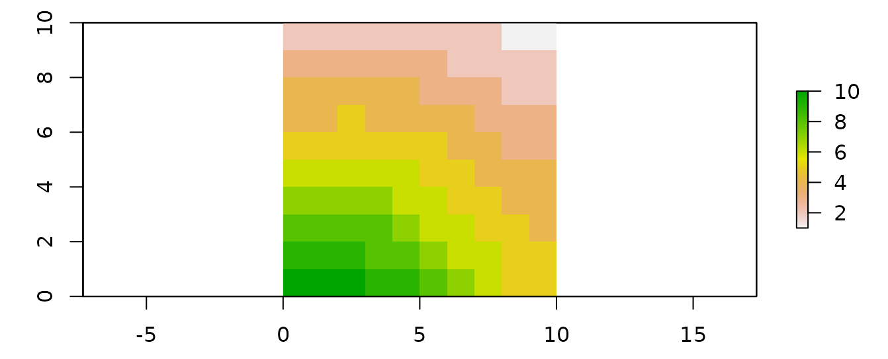
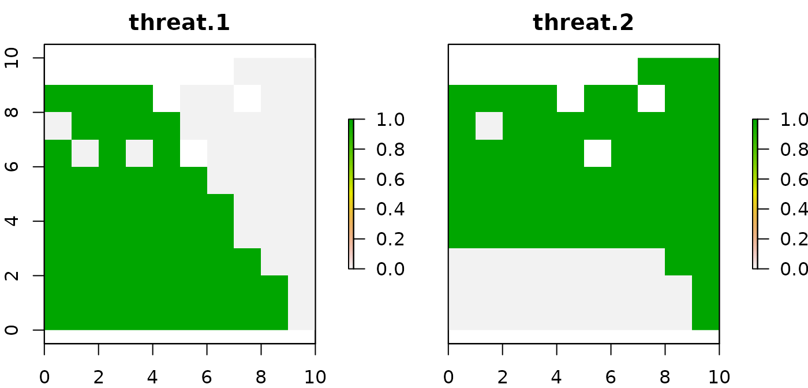

The `prioriactions` package is a new effort to bring exact modeling
methods from operations research (OR) to conservation decision-making.
Taking advantage of the benefits offered by these models over heuristics
models (find more efficient solutions in a much shorter period of time)
[@beyer2016]. `prioriactions` aims to identify what actions should be implemented against what threats to achieve certain planning objectives. These objectives are usually to minimize the costs of the actions by achieving recovery targets or to maximize the benefit reached using a certain available budget.
This package has the functionality of reading input data
formatted in a similar way to that of the widely used conservation
planning program [Marxan](https://marxansolutions.org/)
[@watts2009].

The prioritizations are generated using mathematical programming models and then solved employing optimizers (gurobi or rsymphony). Structurally, models comprise an objective function that is generally minimized or maximized and a series of constraints. The `prioriactions` package currently can deal with two types of models: cost minimization and benefit maximization—both with an internally defined structure.

In addition, an essential part of the model is made up of the variables; these generally define the decisions to be made concerning the input data of the model. This data includes spatial information on planning units, conservation features, threats to those features, and, if it is the case, the sensitivities of those features to those threats.

Decision-making about what action to implement and where is complex given many possible options (combinations of species, threats in space). In turn, there is little knowledge about the effectiveness of actions against threats and how these actions benefit or increase the probability of persistence of conservation characteristics. Concerning what was described above, the `prioriactions` package takes a series of assumptions:

* Threats can be binary (presence/absence) or continuous (with levels of intensity).
* Only one action available by threat.
* Actions are fully effective, that is, an action against a threat eliminates it completely.
* The probability of persistence of the features is proportional to the ratio between threats addressed vs all threats affecting a feature in a given place. More information on the calculation of the probability of persistence in different conditions is presented in the [sensitivities](https://prioriactions.github.io/prioriactions/articles/sensitivities.html) vignette.

Another essential aspect directly related to the probability of persistence of the features is the planning objectives that is independent of the objective function of the mathematical model. We define two types: if the aim is to **recover** threatened features ultimately or if the aim includes non-threatened features through their **conservation**. In simple terms, a conservation feature may be threatened in 80% of the planning units where it occurs, but it might not co-occur with threats in the remaining 20% of its distribution range. To address mixed prioritization exercises where both recovery and conservation objectives are pursued, we set two targets as inputs (set in the *features data*): the **recovery target**; where the user indicates how much proportion of that 80% is the one that he wants to solve through actions, and the **conservation target**; where it is established how much proportion of that 20% is the one to be incorporated. Because the primary objective of this package is to prioritise management actions against threats, a recovery target is mandatory, while conservation is optional. If the objective is to maximize benefits, it is assumed that it is required to maximize only the benefits related to recovery (prioritization of actions).
For more information about these types of planning objectives see the [planning objectives](https://prioriactions.github.io/prioriactions/articles/objectives.html)
vignette.

## Overview

The `prioriactions` package is characterized by using two main types of functions: The
creation and solve functions of mathematical models (through three-steps logic); and the
functions to obtain information about the objects created (e.g. `getActions()`). The first
group of functions is comprised of three clear steps:

1) **Input data validation**, using the `inputData()` function. This function returns a [data-class](https://prioriactions.github.io/prioriactions/reference/data-class.html) object that contains all the information about input data.

2) **Create mathematical model**, using the `problem()` function. This function returns a 
[optimizationProblem-class](https://prioriactions.github.io/prioriactions/reference/optimizationProblem-class.html) object that contains information related to the mathematical model created.

3) **Solve model**, using the `solve()` function. This function returns a [solution-class](https://prioriactions.github.io/prioriactions/reference/solution-class.html)
object that contains information related to the solution.

{width=95%}

These three steps can be summarized using a single function: the **`prioriactions()`** function. This allows the input data validation, the creation of the mathematical model and its resolution in a single step, returning a [solution-class](https://prioriactions.github.io/prioriactions/reference/solution-class.html) object that contains information related to the solution. We recommend the three step scheme due this allows us to verify that all the steps are correct, and it can be helpful to check for errors without completely
rerunning everything again. For example, note that [optimizationProblem-class](https://prioriactions.github.io/prioriactions/reference/optimizationProblem-class.html) object can take significant time to create
(depending on how large the inputs are). therefore, the stepwise scheme allows us to generate the [optimizationProblem-class](https://prioriactions.github.io/prioriactions/reference/optimizationProblem-class.html)
object (following the first two steps) and then experiment with different parameters for solving through the `solve()` function. 

## Workflow

The general workflow when working with `prioriactions` is:

1)  Call the `inputData()` function to verify that the inputs have a
    correct structure.
2)  Call the `problem()` function to create a mathematical model. This has
    a series of parameters that allow you to control different
    aspects of your model.
3)  Call the `solve()` function to solve the model created in the
    previous step.
4)  Get information about solutions with *get* prefix functions (e.g.
    `getActions()` or `getSolutionBenefit()`).

## Usage

Here we will introduce the use of the `prioriactions` package from
presenting the inputs data style to obtaining results. First, we will
load the `prioriactions` package.


```r
# load package
library(prioriactions)
```

The package inherits the input data from the marxan software, which is
widely known for conservation planning (more details in [marxan user
manual](https://marxansolutions.org/download/marxan-user-manual-2021/)).
The data contains information about the species/features of our case
study and spatial information about them. For this, the case study is
divided into multiple sites called *planning units* (PU). In turn,
information is provided on the representativeness values (*targets*)
to be obtained for each species/feature. And other filds such as the
cost associated with each PU. The package follows this data format and
incorporates information about the threats and their relationship with
those species/features.

All inputs in this package are in tabular format (i.e. `data.frame`). For more information on he mandatory fields in the input data,
please see the help page for the `inputData()` function.

Below you can find a basic example of using `prioriactions`.

### Planning units data

This is a `data.frame` that contains information about the PU ids, monitoring costs, and
status. *Monitoring cost* reflects the cost of monitoring a planning unit either if selected for recovery (e.g., monitoring presence of threats and their intensity) or conservation (e.g., monitoring to ensure that no threats are present and,therefore, only conservation might be needed). *Status* indicates if the PU must (locked in or out) be part of the solution or
not. 


```r
# load planning unit data from prioriactions
data(sim_pu_data)

# print first six rows of data
head(sim_pu_data)
```

```
##   id monitoring_cost status
## 1  1               2      0
## 2  2               2      0
## 3  3               2      0
## 4  4               2      0
## 5  5               2      0
## 6  6               2      0
```

The example contains 100 planning units, each with monitoring cost values ranging from 1 to 10 and all status of 0 (not locked). A `RasterLayer`object can be used to present this spatial
information. Here, the planning units are represented as a raster (i.e.
a `RasterLayer` object) and each pixel corresponds to the spatial extent
of each panning unit. Here, the pixel values correspond to the monitoring
costs of each planning unit.


```r
#plot monitoring costs
library(raster) 

r <- raster(ncol=10, nrow=10, xmn=0, xmx=10, ymn=0, ymx=10)
values(r) <- sim_pu_data$monitoring_cost
plot(r)
```



### Features data

There are two input data related to features; the first one
is a `data.frame` that contains information about the **features** such as its *id* and *targets*
(mandatory when minimizing costs). And the second is a `data.frame` that contains information on
the **spatial distribution of these features** across planning units. As mentioned above, this information can be either binary (presence-absence) or continuous (e.g., probability of occurrence of a feature in a planning unit, or the area of occupancy of a features in a planning unit).


```r
# load features data from prioriactions
data(sim_features_data, sim_dist_features_data)

# print first six rows of data
head(sim_features_data)
```

```
##   id target_recovery     name
## 1  1              11 feature1
## 2  2              16 feature2
## 3  3               8 feature3
## 4  4               9 feature4
```

```r
head(sim_dist_features_data)
```

```
##     pu feature amount
## 201  1       3      1
## 202  2       3      1
## 203  3       3      1
## 204  4       3      1
## 205  5       3      1
## 206  6       3      1
```

In the same way as planning units, a `RasterLayer`object can be used to present this spatial
information. The pixel values in each layer correspond to the
amount of suitable feature available in a given planning unit. Note that
our planning unit raster layer and our conservation feature stack have
exactly the same spatial properties (i.e. resolution, extent, coordinate
reference system) so their pixels line up perfectly. In this example, we assume
binary values of amount (presence and absence of features).


```r
# load amount of features data
features <- reshape2::dcast(sim_dist_features_data, 
                            pu~feature,
                            value.var = "amount", 
                            fill = 0)

# create stack layer
group_rasters <- raster::stack(r, r, r, r)
values(group_rasters[[1]]) <- features$`1`
values(group_rasters[[2]]) <- features$`2`
values(group_rasters[[3]]) <- features$`3`
values(group_rasters[[4]]) <- features$`4`

names(group_rasters) <- c("feature 1", "feature 2", "feature 3", "feature 4")
plot(group_rasters)
```


### Threats data

There are three input data related to threats. The first one provides information about the
**threats** such as their *id* and *name*. The second provides information on the
**spatial distribution of these threats** and the last one indicates which features is sensitive to what threat (**sensitivities** data).


```r
# load threats data from prioriactions
data(sim_threats_data, sim_dist_threats_data, sim_sensitivity_data)

# print first six rows of data
head(sim_threats_data)
```

```
##   id    name blm_actions
## 1  1 threat1           0
## 2  2 threat2           0
```

```r
head(sim_dist_threats_data)
```

```
##     pu threat amount action_cost status
## 108  8      2      1           2      0
## 109  9      2      1           2      0
## 110 10      2      1           2      0
## 11  11      1      1           3      0
## 111 11      2      1           4      0
## 12  12      1      1           3      0
```

```r
head(sim_sensitivity_data)
```

```
##   feature threat
## 1       1      1
## 2       2      1
## 3       3      1
## 4       4      1
## 5       1      2
## 6       2      2
```

Note that the `sim_dist_threats_data` file contains information on the
*cost* of implementing an action against a threat on a site, in addition to the *status* of a given action in a planning that works in the same way as the *status* associated with PU's. In
this example, a binary amount of threats (presence/absence) is assumed.
However, this amount can be continuous, which implies a more in-depth
analysis of the consequences for the features (see more details in the
[sensitivities](https://prioriactions.github.io/prioriactions/articles/sensitivities.html)
vignette).


```r
# load amount of threat data
threats <- reshape2::dcast(sim_dist_threats_data, 
                           pu~threat,
                           value.var = "amount", 
                           fill = 0)
threats <- tidyr::complete(threats, pu = 1:100)

# create stack layer
group_rasters <- raster::stack(r, r)
values(group_rasters[[1]]) <- threats$`1`
values(group_rasters[[2]]) <- threats$`2`

names(group_rasters) <- c("threat 1", "threat 2")
plot(group_rasters)
```



### Boundary data

Provides information on the
spatial relationship between PU and they are presented in long
format. This input is not mandatory and is only necessary if you are
interested in addressing connectivity.


```r
# load boundary data from prioriactions
data(sim_boundary_data)

# print first six rows of data
head(sim_boundary_data)
```

```
##   id1 id2 boundary
## 1   1   1        0
## 2   2   1        1
## 3   3   1        2
## 4   4   1        3
## 5   5   1        4
## 6   6   1        5
```

### Step 1: Initialize the problem

After having loaded our data, we will now
create the [data object](https://prioriactions.github.io/prioriactions/reference/data-class.html) through the `inputData()` function. With it you can check if all
the fields of the different inputs are correct.


```r
# create conservation problem
b <- inputData(pu = sim_pu_data, 
               features = sim_features_data, 
               dist_features = sim_dist_features_data, 
               threats = sim_threats_data, 
               dist_threats = sim_dist_threats_data, 
               sensitivity = sim_sensitivity_data, 
               boundary = sim_boundary_data)

# print problem
print(b)
```

```
## Data
##   planning units: data.frame (100 units)
##   monitoring costs:     min: 1, max: 10
##   features:       feature1, feature2, feature3, feature4 (4 features)
##   threats:        threat1, threat2 (2 threats)
##   action costs:   min: 1, max: 10
```

Note that once the problem is created, we can obtain information from
the object and thus know if the data was loaded correctly. For this, we
can use some functions that are inside the object (e.g
`getThreatsAmount()`).


```r
# get information about object
b$getThreatsAmount()
```

```
## [1] 2
```

```r
b$getPlanningUnitsAmount()
```

```
## [1] 100
```

These are only two of all the methods you can use to get quick information about your data. The others can be found along with [data-class](https://prioriactions.github.io/prioriactions/reference/data-class.html) information. 

Furthermore, it is advisable to determine the maximum benefit achievable for each conservation feature through the `getPotentialBenefit()` function. Since this process can be carried out before the creation of the mathematical model, it can help establish recovery and conservation targets if the objective of the mathematical model is to minimize costs.


```r
# get benefit information
getPotentialBenefit(b)
```

```
##   feature dist dist_threatened maximum.conservation.benefit maximum.recovery.benefit maximum.benefit
## 1       1   47              47                            0                       47              47
## 2       2   30              28                            2                       28              30
## 3       3   66              56                           10                       56              66
## 4       4   33              33                            0                       33              33
```

Note that the total distribution of the features (*dist*) and the
threatened distribution (*dist_threatened*) is reported. Also, we report the amount of each features where they co-occur with threats they are sensitive to (*maximum.recovery.benefit*) and where they do not co-occur with any threats they are sensitive to (*maximum.conservation.benefit*). The inclusion of
these last units in the solutions will depend on the **target_conservation** field in the input *feature data*.

### Step 2: Create the mathematical model

The next step is to create the [optimization
problem](https://prioriactions.github.io/prioriactions/reference/optimizationProblem-class.html)
object with those data. `prioriactions` allows  types of models:
`minimizeCosts` and `maximizeBenefits`. The first one, minimizes the
cost of the solution whilst ensuring that all targets are met. Instead,
the second maximizes the benefits achieved by the features subject to a
certain budget. The use of one or the other is set in the `type_model` parameter of the `problem()` function.


```r
# create optimization problem
c <- problem(b, model_type = "minimizeCosts")
```

```
## Warning: The blm argument was set to 0, so the boundary data has no effect
```

```
## Warning: Some blm_actions argument were set to 0, so the boundary data has no effect for these cases
```

```r
# print problem
print(c)
```

```
## Optimization Problem
##   model sense: minimization
##   dimensions:  284, 396, 12.632 kB (nrow, ncol, size)
##   variables:   396
```

Internally, the `problem()` function has a presolve that identifies these problems and prevents you from
continuing to the next steps. In case the target set for a given species is higher than the maximum achievable, the value will be internally replaced with the maximum achievable.

The two warnings indicate that there are no values for *blm* and
*blm_actions* (arguments to achieve greater connectivity in the
solution), and therefore the input boundary file will have no effect.

### Step 3: Solve the model

Finally, after creating the mathematical model, we can now solve it with
the `solve()` function. To solve our model, we need an optimizer. 
Currently, `prioriactions` have available two: *gurobi* (it
needs a license to work) and *rsymphony* (free to use). We highly
recommend using gurobi (for more information on how to obtain an
academic license
[here](https://prioritizr.net/articles/gurobi_installation_guide.html)).


```r
# solve optimization problem
d <- solve(c, solver = "gurobi", verbose = TRUE, output_file = FALSE, cores = 2)
```

```
## Gurobi Optimizer version 9.1.2 build v9.1.2rc0 (linux64)
## Thread count: 2 physical cores, 4 logical processors, using up to 2 threads
## Optimize a model with 284 rows, 396 columns and 785 nonzeros
## Model fingerprint: 0xc6718513
## Variable types: 176 continuous, 220 integer (220 binary)
## Coefficient statistics:
##   Matrix range     [5e-01, 2e+00]
##   Objective range  [1e+00, 1e+01]
##   Bounds range     [1e+00, 1e+00]
##   RHS range        [8e+00, 2e+01]
## Found heuristic solution: objective 964.0000000
## Found heuristic solution: objective 396.0000000
## Presolve removed 250 rows and 277 columns
## Presolve time: 0.00s
## Presolved: 34 rows, 119 columns, 237 nonzeros
## Variable types: 0 continuous, 119 integer (101 binary)
## 
## Root relaxation: objective 1.445000e+02, 22 iterations, 0.00 seconds
## 
##     Nodes    |    Current Node    |     Objective Bounds      |     Work
##  Expl Unexpl |  Obj  Depth IntInf | Incumbent    BestBd   Gap | It/Node Time
## 
##      0     0  144.50000    0    2  396.00000  144.50000  63.5%     -    0s
## H    0     0                     149.0000000  144.50000  3.02%     -    0s
## *    0     0               0     146.0000000  146.00000  0.00%     -    0s
## 
## Cutting planes:
##   Cover: 2
## 
## Explored 1 nodes (26 simplex iterations) in 0.00 seconds
## Thread count was 2 (of 4 available processors)
## 
## Solution count 4: 146 149 396 964 
## 
## Optimal solution found (tolerance 0.00e+00)
## Best objective 1.460000000000e+02, best bound 1.460000000000e+02, gap 0.0000%
```

Note that the log is shown by default with relevant information about
the optimization process (*verbose* = TRUE). This information can be
important when evaluating how the process is being carried out. For
example, to check the solution's quality (*gaps*), the size of the
problem, or the cores being used. More information on how to read this
log in [MIP_logging
documentation](https://www.gurobi.com/documentation/9.1/refman/mip_logging.html).

These three steps can be shortened to just one with the
`prioriactions()` function. This function inherits all the parameters of
the `inputData()`, `problem()`, and `solve()`
functions:


```r
# use prioriactions function
d2 <- prioriactions(pu = sim_pu_data, features = sim_features_data,
                    dist_features = sim_dist_features_data,
                    threats = sim_threats_data,
                    dist_threats = sim_dist_threats_data,
                    sensitivity = sim_sensitivity_data,
                    boundary = sim_boundary_data,
                    model_type = "minimizeCosts", 
                    solver = "gurobi", 
                    verbose = TRUE, 
                    output_file = FALSE,
                    cores = 2)
```

```
## Warning: The blm argument was set to 0, so the boundary data has no effect
```

```
## Warning: Some blm_actions argument were set to 0, so the boundary data has no effect for these cases
```

```
## Gurobi Optimizer version 9.1.2 build v9.1.2rc0 (linux64)
## Thread count: 2 physical cores, 4 logical processors, using up to 2 threads
## Optimize a model with 284 rows, 396 columns and 785 nonzeros
## Model fingerprint: 0xc6718513
## Variable types: 176 continuous, 220 integer (220 binary)
## Coefficient statistics:
##   Matrix range     [5e-01, 2e+00]
##   Objective range  [1e+00, 1e+01]
##   Bounds range     [1e+00, 1e+00]
##   RHS range        [8e+00, 2e+01]
## Found heuristic solution: objective 964.0000000
## Found heuristic solution: objective 396.0000000
## Presolve removed 250 rows and 277 columns
## Presolve time: 0.00s
## Presolved: 34 rows, 119 columns, 237 nonzeros
## Variable types: 0 continuous, 119 integer (101 binary)
## 
## Root relaxation: objective 1.445000e+02, 22 iterations, 0.00 seconds
## 
##     Nodes    |    Current Node    |     Objective Bounds      |     Work
##  Expl Unexpl |  Obj  Depth IntInf | Incumbent    BestBd   Gap | It/Node Time
## 
##      0     0  144.50000    0    2  396.00000  144.50000  63.5%     -    0s
## H    0     0                     149.0000000  144.50000  3.02%     -    0s
## *    0     0               0     146.0000000  146.00000  0.00%     -    0s
## 
## Cutting planes:
##   Cover: 2
## 
## Explored 1 nodes (26 simplex iterations) in 0.00 seconds
## Thread count was 2 (of 4 available processors)
## 
## Solution count 4: 146 149 396 964 
## 
## Optimal solution found (tolerance 0.00e+00)
## Best objective 1.460000000000e+02, best bound 1.460000000000e+02, gap 0.0000%
```

## Getting information about solutions

### `getActions()`

This function retrieves the distribution of actions for each threat across planning units, the set of planning units that have been selected for conservation in case a mix of recovery and conservation targets had been set, and the group of planning units selected for connectivity. In all cases selection of a particular planning unit for either of these objectives is indicated with a value of 1. Note that a planning unit could have been selected for example for the implementation of different actions, so multiple 1s could be found for a single planning unit.


```r
# get actions from solution
actions <- getActions(d, format = "wide")

# print first six rows of data
head(actions)
```

```
##   solution_name pu 1 2 conservation connectivity
## 1           sol  1 0 0            0            0
## 2           sol  2 0 0            0            0
## 3           sol  3 0 0            0            0
## 4           sol  4 0 0            0            0
## 5           sol  5 0 0            0            0
## 6           sol  6 0 0            0            0
```

Note that the `getActions()` function automatically assumes that the index of the action corresponds to the threat *id* (since there is an action per threat), in this case, 1 and 2 respectively.


```r
# plot actions
values(group_rasters[[1]]) <- actions$`1`
values(group_rasters[[2]]) <- actions$`2`
names(group_rasters) <- c("action 1", "action 2")

plot(group_rasters)
```


### `getSolutionBenefit()`

This function retrieves the benefits achieved by each feature. The output contains information on the benefit achieved by conservation (*benefit.conservation*), the benefit achieved by recovery (*benefit.recovery*) and the sum of both (*benefit.total*).


```r
# get benefits of solution
benefits <- getSolutionBenefit(d, type = "total")

# print first six rows of benefit data
head(benefits)
```

```
##   solution_name feature benefit.conservation benefit.recovery benefit.total
## 1           sol       1                    0               11            11
## 2           sol       2                    0               16            16
## 3           sol       3                    0               10            10
## 4           sol       4                    0                9             9
```
In this specific case, it can be seen that we have only obtained **recovery** benefits (for doing actions to abate threats) and not **conservation** of sites. This is specifically due to the fact that we have not set any conservation target. If we compare the benefits obtained concerning the established recovery targets, we see that for feature 3, we got more benefits than set as target (8). This is commonly achieved by incidental representation, where specific actions necessary to achieve the objective of a feature end up benefiting other features.

The `getSolutionBenefit()` function also allows to obtain all the benefits achieved from each planning unit using the *type* param:


```r
# get benefits of solution
local_benefits <- getSolutionBenefit(d, type = "local")

# plot local benefits
local_benefits <- reshape2::dcast(local_benefits, 
                                  pu~feature,
                                  value.var = "benefit.total", 
                                  fill = 0)

group_rasters <- raster::stack(r, r, r, r)
values(group_rasters[[1]]) <- local_benefits$`1`
values(group_rasters[[2]]) <- local_benefits$`2`
values(group_rasters[[3]]) <- local_benefits$`3`
values(group_rasters[[4]]) <- local_benefits$`4`

names(group_rasters) <- c("feature 1", "feature 2", "feature 3", "feature 4")
plot(group_rasters)
```


### `getCost()`

Function to obtain the costs for each of the actions prescribed in each planning unit, including monitoring actions.


```r
# get costs of solution
costs <- getCost(d)

# print the costs data
head(costs)
```

```
##   solution_name monitoring threat_1 threat_2
## 1           sol         61       20       65
```

### `getConnectivityPenalty()`

Function to the connectivity penalty of the solution, split by overall connectivity penalty among all planning units selected as part of the solution (regardless of what action has been prescribed), and connectivity penalties for each action individually (e.g., considering only the subset of planning units where a particular action has been prescribed). Note that in all cases the connectivity penalty shows the degree disaggregation of planning units in solutions, so high penalty values indicate solutions poorly connected.


```r
# get connectivity penalty of solution
conn <- getConnectivityPenalty(d)

# print the connectivity penalty data
head(conn)
```

```
##   solution_name    units threat_1 threat_2
## 1           sol 9042.102  917.544   4095.1
```

### `getPerformance()`

Function to obtain information about the solving process of the mathematical model. Four parameters of the solution are presented: the *objective value* that will depend on what type of model used (*minimizeCosts* or *maximizeBenefits*); the *gap*, which indicates the quality of the solution; the *solving time* and *status*, which indicates the status of the solution (whether it is optimal or not).


```r
# get performance of solution
perf <- getPerformance(d)

# print the performance data
head(perf)
```

```
##   solution_name objective_value gap solving_time                                           status
## 1           sol             146   0        0.004 Optimal solution (according to gap tolerance: 0)
```

More details of these functions in the
[references](https://prioriactions.github.io/prioriactions/reference/index.html) section.

## Sensitivity analyses on *blm*, *budget* and *target* parameters

You may be interested in evaluating different values of targets or
budgets. We have implemented evaluation functions that allow different
parameters to be run in sequence for the same mathematical model. You
can do this by manually running the previous steps for the different
parameters (i.e., running the previous steps once by parameter, such as different targets, budgets or blm values).
However, the *eval* functions have two advantages: 1) they are more efficient at creating the models. This is
because the model needs to be build only once and then updated with the new
information; 2) the output is a
[portfolio](https://prioriactions.github.io/prioriactions/reference/portfolio-class.html)
object, which allows obtaining information about the group of solutions,
including, all *get* functions related with all solution objects simultaneously.

Now, we want to evaluate different levels of targets. For example, 20%,
30% and 40% of the maximum benefit per feature. For this, we use the
`evalTarget()` function:


```r
# evaluate differents targets
port <- evalTarget(pu = sim_pu_data, features = sim_features_data,
                   dist_features = sim_dist_features_data,
                   threats = sim_threats_data,
                   dist_threats = sim_dist_threats_data,
                   sensitivity = sim_sensitivity_data,
                   boundary = sim_boundary_data,
                   values = c(0.2, 0.3, 0.4), 
                   output_file = FALSE)
```

```
## *********************************
##  Iteration 1 of 3: Prop0.2
## *********************************
```

```
## Warning: The blm argument was set to 0, so the boundary data has no effect
```

```
## Warning: Some blm_actions argument were set to 0, so the boundary data has no effect for these cases
```

```
## Gurobi Optimizer version 9.1.2 build v9.1.2rc0 (linux64)
## Thread count: 2 physical cores, 4 logical processors, using up to 2 threads
## Optimize a model with 284 rows, 396 columns and 785 nonzeros
## Model fingerprint: 0x61c57d26
## Variable types: 176 continuous, 220 integer (220 binary)
## Coefficient statistics:
##   Matrix range     [5e-01, 2e+00]
##   Objective range  [1e+00, 1e+01]
##   Bounds range     [1e+00, 1e+00]
##   RHS range        [4e-01, 1e+01]
## Found heuristic solution: objective 964.0000000
## Found heuristic solution: objective 311.0000000
## Presolve removed 250 rows and 277 columns
## Presolve time: 0.00s
## Presolved: 34 rows, 119 columns, 237 nonzeros
## Found heuristic solution: objective 169.0000000
## Variable types: 0 continuous, 119 integer (101 binary)
## 
## Root relaxation: objective 1.155000e+02, 30 iterations, 0.00 seconds
## 
##     Nodes    |    Current Node    |     Objective Bounds      |     Work
##  Expl Unexpl |  Obj  Depth IntInf | Incumbent    BestBd   Gap | It/Node Time
## 
##      0     0  115.50000    0    6  169.00000  115.50000  31.7%     -    0s
## H    0     0                     132.0000000  115.50000  12.5%     -    0s
## H    0     0                     128.0000000  115.50000  9.77%     -    0s
## H    0     0                     127.0000000  115.50000  9.06%     -    0s
##      0     0  118.50000    0    3  127.00000  118.50000  6.69%     -    0s
## H    0     0                     125.0000000  118.50000  5.20%     -    0s
## *    0     0               0     120.0000000  120.00000  0.00%     -    0s
## 
## Cutting planes:
##   Gomory: 2
##   Cover: 8
##   MIR: 1
## 
## Explored 1 nodes (42 simplex iterations) in 0.00 seconds
## Thread count was 2 (of 4 available processors)
## 
## Solution count 8: 120 125 127 ... 964
## 
## Optimal solution found (tolerance 0.00e+00)
## Best objective 1.200000000000e+02, best bound 1.200000000000e+02, gap 0.0000%
```

```
## *********************************
##  Iteration 2 of 3: Prop0.3
## *********************************
```

```
## Warning: The blm argument was set to 0, so the boundary data has no effect

## Warning: Some blm_actions argument were set to 0, so the boundary data has no effect for these cases
```

```
## Gurobi Optimizer version 9.1.2 build v9.1.2rc0 (linux64)
## Thread count: 2 physical cores, 4 logical processors, using up to 2 threads
## Optimize a model with 284 rows, 396 columns and 785 nonzeros
## Model fingerprint: 0xd3db0e90
## Variable types: 176 continuous, 220 integer (220 binary)
## Coefficient statistics:
##   Matrix range     [5e-01, 2e+00]
##   Objective range  [1e+00, 1e+01]
##   Bounds range     [1e+00, 1e+00]
##   RHS range        [6e-01, 2e+01]
## Found heuristic solution: objective 964.0000000
## Found heuristic solution: objective 445.0000000
## Presolve removed 250 rows and 277 columns
## Presolve time: 0.00s
## Presolved: 34 rows, 119 columns, 237 nonzeros
## Found heuristic solution: objective 241.0000000
## Variable types: 0 continuous, 119 integer (101 binary)
## 
## Root relaxation: objective 1.865000e+02, 34 iterations, 0.00 seconds
## 
##     Nodes    |    Current Node    |     Objective Bounds      |     Work
##  Expl Unexpl |  Obj  Depth IntInf | Incumbent    BestBd   Gap | It/Node Time
## 
##      0     0  186.50000    0    8  241.00000  186.50000  22.6%     -    0s
## H    0     0                     205.0000000  186.50000  9.02%     -    0s
##      0     0  193.00000    0    2  205.00000  193.00000  5.85%     -    0s
## H    0     0                     197.0000000  193.00000  2.03%     -    0s
##      0     0  195.50000    0    3  197.00000  195.50000  0.76%     -    0s
## *    0     0               0     196.0000000  196.00000  0.00%     -    0s
## 
## Cutting planes:
##   Gomory: 2
##   Cover: 7
##   MIR: 1
##   Relax-and-lift: 1
## 
## Explored 1 nodes (52 simplex iterations) in 0.00 seconds
## Thread count was 2 (of 4 available processors)
## 
## Solution count 6: 196 197 205 ... 964
## 
## Optimal solution found (tolerance 0.00e+00)
## Best objective 1.960000000000e+02, best bound 1.960000000000e+02, gap 0.0000%
```

```
## *********************************
##  Iteration 3 of 3: Prop0.4
## *********************************
```

```
## Warning: The blm argument was set to 0, so the boundary data has no effect

## Warning: Some blm_actions argument were set to 0, so the boundary data has no effect for these cases
```

```
## Gurobi Optimizer version 9.1.2 build v9.1.2rc0 (linux64)
## Thread count: 2 physical cores, 4 logical processors, using up to 2 threads
## Optimize a model with 284 rows, 396 columns and 785 nonzeros
## Model fingerprint: 0xa62c2e48
## Variable types: 176 continuous, 220 integer (220 binary)
## Coefficient statistics:
##   Matrix range     [5e-01, 2e+00]
##   Objective range  [1e+00, 1e+01]
##   Bounds range     [1e+00, 1e+00]
##   RHS range        [8e-01, 2e+01]
## Found heuristic solution: objective 964.0000000
## Found heuristic solution: objective 564.0000000
## Presolve removed 250 rows and 277 columns
## Presolve time: 0.00s
## Presolved: 34 rows, 119 columns, 237 nonzeros
## Found heuristic solution: objective 317.0000000
## Variable types: 0 continuous, 119 integer (101 binary)
## 
## Root relaxation: objective 2.670000e+02, 43 iterations, 0.00 seconds
## 
##     Nodes    |    Current Node    |     Objective Bounds      |     Work
##  Expl Unexpl |  Obj  Depth IntInf | Incumbent    BestBd   Gap | It/Node Time
## 
##      0     0  267.00000    0   10  317.00000  267.00000  15.8%     -    0s
## H    0     0                     290.0000000  267.00000  7.93%     -    0s
## H    0     0                     284.0000000  267.00000  5.99%     -    0s
##      0     0  276.50000    0    6  284.00000  276.50000  2.64%     -    0s
## H    0     0                     279.0000000  276.50000  0.90%     -    0s
##      0     0  276.50000    0    3  279.00000  276.50000  0.90%     -    0s
## H    0     0                     278.0000000  276.50000  0.54%     -    0s
##      0     0     cutoff    0       278.00000  278.00000  0.00%     -    0s
## 
## Explored 1 nodes (68 simplex iterations) in 0.01 seconds
## Thread count was 2 (of 4 available processors)
## 
## Solution count 7: 278 279 284 ... 964
## 
## Optimal solution found (tolerance 0.00e+00)
## Best objective 2.780000000000e+02, best bound 2.780000000000e+02, gap 0.0000%
```

Like the `prioriactions()` function, all *eval* functions inherit the
parameters of the `inputData()`, `problem()`, and `solve()` functions.


```r
# get cost of solutions inside portfolio
getCost(port)
```

```
##   solution_name monitoring threat_1 threat_2
## 1       Prop0.2         63       10       47
## 2       Prop0.3         98       26       72
## 3       Prop0.4        141       48       89
```

```r
getConnectivityPenalty(port)
```

```
##   solution_name     units threat_1 threat_2
## 1       Prop0.2  8123.805   904.68 3229.636
## 2       Prop0.3 11334.252 1760.095 4431.999
## 3       Prop0.4 12726.708 2336.171 4739.123
```

Note that increasing the target per feature naturally increases the number of actions to be taken to achieve it and therefore the associated cost. This, in turn, increases the connectivity values between conservation actions.

## References
