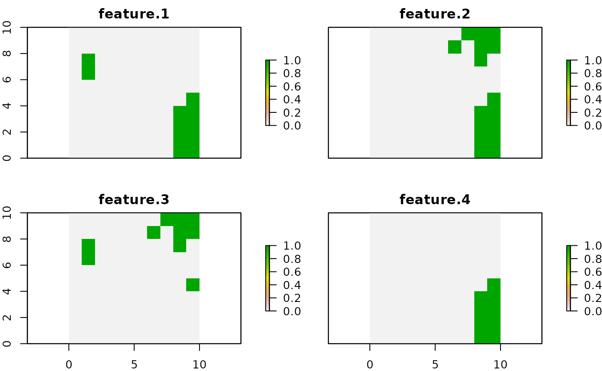

The `prioriactions` package is a new effort to bring exact modeling
methods from operations research (OR) to conservation decision-making.
Taking advantage of the benefits offered by these models over heuristics
models (find much cheaper solutions in a much shorter period of time)
[@beyer2016]. This helps to identify what actions to take against which threats to achieve ecological targets while minimizing the costs of the action or maximizing the benefits achieved given a certain available budget. The `prioriactions` package has the functionality of reading input data
formatted in a similar way to that of the widely used conservation
planning program called [Marxan](https://marxansolutions.org/)
[@watts2009].

This package is designed to assist in planning conservation actions. Specifically, the prioritizations are generated using mathematical programming models and then solved employing optimizers (gurobi or rsymphony). Structurally, models comprise an objective function that is generally minimized or maximized and a series of constraints. The `prioriactions` package currently can create two types of models: cost minimization and benefit maximization—both with an internally defined structure.

In addition, an essential part of the model is made up of the variables; these generally define the decisions to be made concerning the input data of the model. This data includes spatial information on planning units, conservation features, threats to those features, and, if it is the case, the sensitivities of those features to those threats.

One of the complexities when optimizing conservation actions is the little knowledge about the effectiveness of actions against threats and how these actions benefit or increase the probability of persistence of conservation features. If it is complex to know these behaviors for a single pair of feature threats, it is even more so if multiple features and multiple threats are considered overlapping each other in space, and even more, if we assume that these features have different sensitivities to threats. Concerning what was described above, the `prioriactions` package takes a series of assumptions:

* Threats can be binary (presence/absence) or continuous (with levels of intensity).
* There is only one action per threat.
* Actions are fully effective, that is, an action against a threat eliminates it completely.
* The probability of persistence of the features is proportional to the number of actions you take with respect to the total number of actions available. More information on the calculation of the probability of persistence in different conditions is presented in the [benefits](https://prioriactions.github.io/prioriactions/articles/sensitivities.html) vignette.

Another essential aspect directly related to the probability of persistence of the features is the planning objectives that is independent of the objective function of the mathematical model. We define two types: if the aim is to **recover** threatened features ultimately or if the aim includes non-threatened features through their **conservation**. In simple terms, a conservation feature may be threatened in 80% of the planning units where it is established, but in the other 20%, it is not threatened. What do we do with that 20%? Can it be part of the conservation plan? What if these units help establish a more connected management plan? To solve this problem, we set two targets as inputs (set in the *features data*): the **recovery target**; where the user indicates how much proportion of that 80% is the one that he wants to solve through actions, and the **conservation target**; where it is revealed how much proportion of that 20% is the one to be incorporated. Because the package prioritizes conservation actions against threats, a recovery target is mandatory, while conservation is optional. If the objective is to maximize benefits, it is assumed that it is required to maximize only the benefits related to recovery (prioritization of actions).
For more information about these types of planning objectives see the [planning objectives](https://prioriactions.github.io/prioriactions/articles/objectives.html)
vignette.

## Overview

The `prioriactions` package is characterized by using two main types of functions: The
creation and solve functions of mathematical models (through three-steps logic); and the
functions to obtain information about the objects created (e.g. `getActions()`). The first
group of functions is comprised of three clear steps:

1) **Input data validation**, using the `inputData()` function. This function return a [conservationProblem-class](https://prioriactions.github.io/prioriactions/reference/conservationProblem-class.html) object that contains all the information about data.

2) **Create mathematical model**, using the `problem()` function. This function return a 
[optimizationProblem-class](https://prioriactions.github.io/prioriactions/reference/optimizationProblem-class.html) object that contains information related to the mathematical model created.

3) **solve model**, using the `solve()` function. This function return a [solution-class](https://prioriactions.github.io/prioriactions/reference/solution-class.html)
object that contains information related to the solution.

{width=95%}

These three concrete steps can be summarized into one using the `prioriactions()` function. However, we recommend the three step scheme due this allows us to verify that all the steps are correct, and it can be helpful to check for errors without completely
rerunning everything again. For example, note that [optimizationProblem-class](https://prioriactions.github.io/prioriactions/reference/optimizationProblem-class.html) object can take significant time to create
(depending on how large the inputs are). therefore, the stepwise scheme allows us to generate the [optimizationProblem-class](https://prioriactions.github.io/prioriactions/reference/optimizationProblem-class.html)
object (following the first two steps) and then experiment with different parameters for solving through the `solve()` function. 

## Workflow

The general workflow when working with `prioriactions` is:

1)  Call the `inputData()` function to verify that the inputs have a
    correct structure.
2)  Call the `problem()` function to create a mathematical model. This has
    a series of parameters that allow you to control different
    aspects of your model.
3)  Call the `solve()` function to solve the model created in the
    previous step.
4)  Get information about solutions with *get* prefix functions (e.g.
    `getActions()` or `getSolutionBenefit()`).

## Usage

Here we will introduce the use of the `prioriactions` package from
presenting the inputs data style to obtaining results. First, we will
load the `prioriactions` package.


```r
# load package
library(prioriactions)
```

The package inherits the input data from the marxan software, which is
widely known for conservation planning (more details in [marxan user
manual](https://marxansolutions.org/download/marxan-user-manual-2021/)).
The data contains information about the species/features of our case
study and spatial information about them. For this, the case study is
divided into multiple sites called *planning units* (PU). In turn,
information is provided on the representativeness values (*targets*)
to be obtained for each species/feature. And other filds such as the
cost associated with each PU. The package follows this data format and
incorporates information about the threats and their relationship with
those species/features.

All inputs in this package are in tabular format (i.e. `data.frame`). For more information on he mandatory fields in the input data,
please see the help page for the `inputData()` function.

Below is a basic example of using `prioriactions`.

### Planning units data

First, we will load the **planning unit data** (`sim_pu_data`). This is
a `data.frame` that contains information about the PU ids, monitoring costs, and
status. Monitoring costs indicate how much it costs to select a planning unit to monitor if it is selected for reasons of recovery (taking action on it) or conservation. While status indicates if the PU can be part of the solution or
not. 


```r
# load planning unit data
data(sim_pu_data)

# print first six rows of data
head(sim_pu_data)
#>   id monitoring_cost status
#> 1  1               2      0
#> 2  2               2      0
#> 3  3               2      0
#> 4  4               2      0
#> 5  5               2      0
#> 6  6               2      0
```

The example contains 100 planning units, each with monitoring cost values ranging from 1 to 10 and all status of 0 (not locked). A `RasterLayer`object can be used to present this spatial
information. Here, the planning units are represented as a raster (i.e.
a `RasterLayer` object) and each pixel corresponds to the spatial extent
of each panning unit. Here, the pixel values correspond to the monitoring
costs of each planning unit.


```r
#plot monitoring costs
library(raster) 

r <- raster(ncol=10, nrow=10, xmn=0, xmx=10, ymn=0, ymx=10)
values(r) <- sim_pu_data$monitoring_cost
plot(r)
```


### Features data

The second data to be entered correspond to **features**
(`sim_features_data` and `sim_dist_features_data`). The first one
provides information about the features such as its id and targets
(mandatory to minimize of costs). And the second provides information on
the spatial distribution of these features.


```r
# load features data
data(sim_features_data, sim_dist_features_data)

# print first six rows of data
head(sim_features_data)
#>   id target_recovery     name
#> 1  1              11 feature1
#> 2  2              16 feature2
#> 3  3               8 feature3
#> 4  4               9 feature4
head(sim_dist_features_data)
#>     pu feature amount
#> 201  1       3      1
#> 202  2       3      1
#> 203  3       3      1
#> 204  4       3      1
#> 205  5       3      1
#> 206  6       3      1
```

To present the features, a `RasterStack` object (group of `RasterLayer`
objects) is used. The pixel values in each layer correspond to the
amount of suitable feature available in a given planning unit. Note that
our planning unit raster layer and our conservation feature stack have
exactly the same spatial properties (i.e. resolution, extent, coordinate
reference system) so their pixels line up perfectly. In turn, we assume
binary values of amount (presence and absence of features). However, the amount
could contain continuous values (for example, relative to the area of
the PU).


```r
# load amount of features data
features <- reshape2::dcast(sim_dist_features_data, pu~feature,value.var = "amount", fill = 0)

# create stack layer
group_rasters <- raster::stack(r, r, r, r)
values(group_rasters[[1]]) <- features$`1`
values(group_rasters[[2]]) <- features$`2`
values(group_rasters[[3]]) <- features$`3`
values(group_rasters[[4]]) <- features$`4`

names(group_rasters) <- c("feature 1", "feature 2", "feature 3", "feature 4")
plot(group_rasters)
```


### Threats data

Finally, there are inputs related to **threats**. (`sim_threats_data`, `sim_dist_threats_data` and
`sim_sensitivity_data`). The first one provides information about the
threats such as its id and name. The second provides information on the
spatial distribution of these threats and the last one indicates which features is sensitive with what threat.


```r
# load threats data
data(sim_threats_data, sim_dist_threats_data, sim_sensitivity_data)

# print first six rows of data
head(sim_threats_data)
#>   id    name blm_actions
#> 1  1 threat1           0
#> 2  2 threat2           0
head(sim_dist_threats_data)
#>     pu threat amount action_cost status
#> 108  8      2      1           2      0
#> 109  9      2      1           2      0
#> 110 10      2      1           2      0
#> 11  11      1      1           3      0
#> 111 11      2      1           4      0
#> 12  12      1      1           3      0
head(sim_sensitivity_data)
#>   feature threat
#> 1       1      1
#> 2       2      1
#> 3       3      1
#> 4       4      1
#> 5       1      2
#> 6       2      2
```

Note that the `sim_dist_threats_data` file contains information on the
cost of taking action against a threat on a site, in addition to the
status that works in the same way as the status associated with PU's. In
this example, a binary amount of threats (presence/absence) is assumed.
However, this quantity can be continuous, which implies a more in-depth
analysis of the consequences for the features (see more details in the
[sensitivities](https://prioriactions.github.io/prioriactions/articles/sensitivities.html)
vignette).


```r
# load amount of threat data
threats <- reshape2::dcast(sim_dist_threats_data, pu~threat,value.var = "amount", fill = 0)
threats <- tidyr::complete(threats, pu = 1:100)

# create stack layer
group_rasters <- raster::stack(r, r)
values(group_rasters[[1]]) <- threats$`1`
values(group_rasters[[2]]) <- threats$`2`

names(group_rasters) <- c("threat 1", "threat 2")
plot(group_rasters)
```


### Boundary data

The **boundary** data (`sim_boundary_data`) provides information on the
spatial relationship between the PU's and they are presented in long
format. This input is not mandatory and is only necessary if you are
interested in obtaining more connected solutions.


```r
# load boundary data
data(sim_boundary_data)

# print first six rows of data
head(sim_boundary_data)
#>   id1 id2 boundary
#> 1   1   1        0
#> 2   2   1        1
#> 3   3   1        2
#> 4   4   1        3
#> 5   5   1        4
#> 6   6   1        5
```

### Step 1: Initialize the problem

After having loaded our data, we will now
create the [conservation
problem](https://prioriactions.github.io/prioriactions/reference/conservationProblem-class.html)
object through the `inputData()` function. With it you can check if all
the fields of the different inputs are correct.


```r
# create conservation problem
b <- inputData(pu = sim_pu_data, 
               features = sim_features_data, 
               dist_features = sim_dist_features_data, 
               threats = sim_threats_data, 
               dist_threats = sim_dist_threats_data, 
               sensitivity = sim_sensitivity_data, 
               boundary = sim_boundary_data)

# print problem
print(b)
#> Conservation Problem
#>   planning units: data.frame (100 units)
#>   monitoring costs:     min: 1, max: 10
#>   features:       feature1, feature2, feature3, feature4 (4 features)
#>   threats:        threat1, threat2 (2 threats)
#>   action costs:   min: 1, max: 10
```

Note that once the problem is created, we can obtain information from
the object and thus know if the data was loaded correctly. For this, we
can use some functions that are inside the object (e.g
`getThreatsAmount()`).


```r
# get information about object
b$getThreatsAmount()
#> [1] 2
b$getPlanningUnitsAmount()
#> [1] 100
```

These are only two of all the methods you can use to get quick information about your data. The others can be found along with [conservationProblem-class](https://prioriactions.github.io/prioriactions/reference/conservationProblem-class.html) information. 

Furthermore, it is advisable to determine the maximum benefit to be obtained for each conservation feature through the `getPotentialBenefit()` function. Since this process can be carried out before the creation of the mathematical model, it can help establish recovery and conservation targets if the objective of the mathematical model is to minimize costs. In addition, this avoids creating an infeasible model where the targets exceed the benefit. 


```r
# get benefit information
getPotentialBenefit(b)
#>   feature dist dist_threatened maximum.conservation.benefit maximum.recovery.benefit
#> 1       1   47              47                            0                       47
#> 2       2   30              28                            2                       28
#> 3       3   66              56                           10                       56
#> 4       4   33              33                            0                       33
#>   maximum.benefit
#> 1              47
#> 2              30
#> 3              66
#> 4              33
```

Note that the total distribution of the features (*dist*) and the
threatened distribution (*dist_threatened*) is reported. That is, some
features in some units could be benefited without carrying out
conservation actions on them (*conservation.benefit*). The inclusion of
these units in the solutions will depend on the **target_conservation** field
in the input *feature data*.

### Step 2: Create the mathematical model

The next step is create the [optimization
problem](https://prioriactions.github.io/prioriactions/reference/optimizationProblem-class.html)
object with those data. We currently have two types of models:
`minimizeCosts` and `maximizeBenefits`. The first one, minimize the
cost of the solution whilst ensuring that all targets are met. Instead,
the second maximizes the benefits achieved by the features using a
certain budget. The use of one or the other is set in the `type_model` parameter of the `problem()` function.


```r
# create optimization problem
c <- problem(b, model_type = "minimizeCosts")
#> Warning: The blm argument was set to 0, so the boundary data has no effect
#> Warning: Some blm_actions argument were set to 0, so the boundary data has no effect for these
#> cases

# print problem
print(c)
#> Optimization Problem
#>   model sense: minimization
#>   dimensions:  460, 572, 19.528 kB (nrow, ncol, size)
#>   variables:   572
```

Internally, the `problem()` function has a presolve that identifies these problems and prevents you from
continuing to the next steps. In the case of not reaching the target
established for any feature, it is assumed that its new target will be
the maximum value of the associated benefit.

The two warnings indicate that there are no values for *blm* and
*blm_actions* (arguments to achieve greater connectivity in the
solution), and therefore the input boundary file will have no effect.

### Step 3: Solve the model

Finally, after creating the mathematical model, we can now solve it with
the `solve()` function. To solve our model, we need an optimizer. 
Currently, `prioriactions` have available two: *gurobi* (it
needs a license to work) and *rsymphony* (free to use). We highly
recommend using gurobi (for more information on how to obtain an
academic license
[here](https://prioritizr.net/articles/gurobi_installation.html)).


```r
# solve optimization problem
d <- solve(c, solver = "gurobi", verbose = TRUE, output_file = FALSE)
#> Gurobi Optimizer version 9.1.2 build v9.1.2rc0 (linux64)
#> Thread count: 2 physical cores, 4 logical processors, using up to 2 threads
#> Optimize a model with 460 rows, 572 columns and 1137 nonzeros
#> Model fingerprint: 0x994b3e28
#> Variable types: 352 continuous, 220 integer (220 binary)
#> Coefficient statistics:
#>   Matrix range     [5e-01, 2e+00]
#>   Objective range  [1e+00, 1e+01]
#>   Bounds range     [1e+00, 1e+00]
#>   RHS range        [8e+00, 2e+01]
#> Found heuristic solution: objective 277.0000000
#> Presolve removed 426 rows and 453 columns
#> Presolve time: 0.00s
#> Presolved: 34 rows, 119 columns, 237 nonzeros
#> Variable types: 0 continuous, 119 integer (101 binary)
#> 
#> Root relaxation: objective 1.445000e+02, 22 iterations, 0.00 seconds
#> 
#>     Nodes    |    Current Node    |     Objective Bounds      |     Work
#>  Expl Unexpl |  Obj  Depth IntInf | Incumbent    BestBd   Gap | It/Node Time
#> 
#>      0     0  144.50000    0    2  277.00000  144.50000  47.8%     -    0s
#> H    0     0                     149.0000000  144.50000  3.02%     -    0s
#> *    0     0               0     146.0000000  146.00000  0.00%     -    0s
#> 
#> Cutting planes:
#>   Cover: 2
#> 
#> Explored 1 nodes (26 simplex iterations) in 0.00 seconds
#> Thread count was 2 (of 4 available processors)
#> 
#> Solution count 3: 146 149 277 
#> 
#> Optimal solution found (tolerance 0.00e+00)
#> Best objective 1.460000000000e+02, best bound 1.460000000000e+02, gap 0.0000%
```

Note that the log is shown by default with relevant information about
the optimization process (*verbose* = TRUE). This information can be
important when evaluating how the process is being carried out. For
example, to check the solution's quality (*gaps*), the size of the
problem, or the cores being used. More information on how to read this
log in [MIP_logging
documentation](https://www.gurobi.com/documentation/9.1/refman/mip_logging.html).


```r
# plot solution object
print(d)
#> Solution overview
#>   name: sol
#>   objective value: 146
#>   gap:  0
#>   status:  Optimal solution (according to gap tolerance: 0)
#>   runtime: 0.004 sec
```

These three steps can be shortened to just one with the
`prioriactions()` function. This function inherits all the parameters of
the `inputData()`, `problem()`, and `solve()`
functions:


```r
# use prioriactions function
d2 <- prioriactions(pu = sim_pu_data, features = sim_features_data,
                    dist_features = sim_dist_features_data,
                    threats = sim_threats_data,
                    dist_threats = sim_dist_threats_data,
                    sensitivity = sim_sensitivity_data,
                    boundary = sim_boundary_data,
                    model_type = "minimizeCosts", 
                    solver = "gurobi", 
                    verbose = TRUE, 
                    output_file = FALSE)
#> Warning: The blm argument was set to 0, so the boundary data has no effect
#> Warning: Some blm_actions argument were set to 0, so the boundary data has no effect for these
#> cases
#> Gurobi Optimizer version 9.1.2 build v9.1.2rc0 (linux64)
#> Thread count: 2 physical cores, 4 logical processors, using up to 2 threads
#> Optimize a model with 460 rows, 572 columns and 1137 nonzeros
#> Model fingerprint: 0x994b3e28
#> Variable types: 352 continuous, 220 integer (220 binary)
#> Coefficient statistics:
#>   Matrix range     [5e-01, 2e+00]
#>   Objective range  [1e+00, 1e+01]
#>   Bounds range     [1e+00, 1e+00]
#>   RHS range        [8e+00, 2e+01]
#> Found heuristic solution: objective 277.0000000
#> Presolve removed 426 rows and 453 columns
#> Presolve time: 0.00s
#> Presolved: 34 rows, 119 columns, 237 nonzeros
#> Variable types: 0 continuous, 119 integer (101 binary)
#> 
#> Root relaxation: objective 1.445000e+02, 22 iterations, 0.00 seconds
#> 
#>     Nodes    |    Current Node    |     Objective Bounds      |     Work
#>  Expl Unexpl |  Obj  Depth IntInf | Incumbent    BestBd   Gap | It/Node Time
#> 
#>      0     0  144.50000    0    2  277.00000  144.50000  47.8%     -    0s
#> H    0     0                     149.0000000  144.50000  3.02%     -    0s
#> *    0     0               0     146.0000000  146.00000  0.00%     -    0s
#> 
#> Cutting planes:
#>   Cover: 2
#> 
#> Explored 1 nodes (26 simplex iterations) in 0.00 seconds
#> Thread count was 2 (of 4 available processors)
#> 
#> Solution count 3: 146 149 277 
#> 
#> Optimal solution found (tolerance 0.00e+00)
#> Best objective 1.460000000000e+02, best bound 1.460000000000e+02, gap 0.0000%
```

### Getting information about solutions

We can get the solutions with `getActions()`.
This function shows what actions must be taken against which threats to
achieve the objective, which is to achieve the different representation
targets. In turn, it shows with a one which sites are selected only for conservation (in the case of having conservation targets) or zero in contrary case; the same form with a one which sites are selected only for connectivity (without taking action on them) or zero in contrary case.


```r
# get actions from solution
actions <- getActions(d, format = "wide")

# print first six rows of data
head(actions)
#>   solution_name pu 1 2 conservation connectivity
#> 1           sol  1 0 0            0            0
#> 2           sol  2 0 0            0            0
#> 3           sol  3 0 0            0            0
#> 4           sol  4 0 0            0            0
#> 5           sol  5 0 0            0            0
#> 6           sol  6 0 0            0            0
```

Note that the `getActions()` function automatically assumes that the index of the action corresponds to the threat *id* (since there is an action per threat), in this case, 1 and 2 respectively.


```r
# plot actions
values(group_rasters[[1]]) <- actions$`1`
values(group_rasters[[2]]) <- actions$`2`
names(group_rasters) <- c("action 1", "action 2")

plot(group_rasters)
```


You can also obtain information about the benefits achieved by
feature with the `getSolutionBenefit()` function. 


```r
# get benefits of solution
benefits <- getSolutionBenefit(d, type = "total")

# print first six rows of benefit data
head(benefits)
#>   solution_name feature benefit.conservation benefit.recovery benefit.total
#> 1           sol       1                    0               11            11
#> 2           sol       2                    0               16            16
#> 3           sol       3                    0               10            10
#> 4           sol       4                    0                9             9
```
Here, it can be seen that we have only obtained **recovery** benefits (for doing actions to abate threats) and not **conservation** of sites. This is specifically due to the fact that we have not set any conservation target. If we compare the benefits obtained concerning the established recovery targets, we see that for feature 3, we got more benefits than expected (8). This is commonly achieved by complementary, where specific actions necessary to achieve the objective of a feature end up benefiting other features.

The `getSolutionBenefit()` function also allows to obtain all the benefits achieved from each planning unit:


```r
# get benefits of solution
local_benefits <- getSolutionBenefit(d, type = "local")

# plot local benefits
local_benefits <- reshape2::dcast(local_benefits, pu~feature,value.var = "benefit.total", fill = 0)

group_rasters <- raster::stack(r, r, r, r)
values(group_rasters[[1]]) <- local_benefits$`1`
values(group_rasters[[2]]) <- local_benefits$`2`
values(group_rasters[[3]]) <- local_benefits$`3`
values(group_rasters[[4]]) <- local_benefits$`4`

names(group_rasters) <- c("feature 1", "feature 2", "feature 3", "feature 4")
plot(group_rasters)
```


There are three other functions that can be used to obtain some measure of the solution found: `getCost()` function to obtain the costs for each of the actions such as monitoring, `getConnectivityPenalty()` function to calculate the connectivity of the actions, and `getPerformance()` to obtain information about the solving process of the mathematical model. More details in
the
[references](https://prioriactions.github.io/prioriactions/reference/index.html)
section.

### Sensitivity analysis of the results

You may be interested in evaluating different values of targets or
budgets and thus obtain more information for stakeholders (more than one
solution). We have implemented evaluation functions that allow different
parameters to be run in sequence for the same mathematical model. You
can do this by manually running the previous steps for the different
parameters (i.e., running the previous steps once by parameter).
However, the *eval* functions have two advantages over their
counterpart: 1) they are more efficient to create the models. This is
because the model is once created and then updated with the new
information; 2) the output is a
[portfolio](https://prioriactions.github.io/prioriactions/reference/portfolio-class.html)
object, which allows obtaining information about the group of solutions,
including, all *get* functions related with solutions objects.

Now, we want to evaluate different levels of targets. For example, 20%,
30% and 40% of the maximum benefit per feature. For this, we use the
`evalTarget()` function:


```r

# evaluate differents targets
port <- evalTarget(pu = sim_pu_data, features = sim_features_data,
                   dist_features = sim_dist_features_data,
                   threats = sim_threats_data,
                   dist_threats = sim_dist_threats_data,
                   sensitivity = sim_sensitivity_data,
                   boundary = sim_boundary_data,
                   values = c(0.2, 0.3, 0.4), 
                   output_file = FALSE, 
                   time_limit = 10)
#> *********************************
#>  Iteration 1 of 3: Prop0.2
#> *********************************
#> Warning: The blm argument was set to 0, so the boundary data has no effect
#> Warning: Some blm_actions argument were set to 0, so the boundary data has no effect for these
#> cases
#> Gurobi Optimizer version 9.1.2 build v9.1.2rc0 (linux64)
#> Thread count: 2 physical cores, 4 logical processors, using up to 2 threads
#> Optimize a model with 460 rows, 572 columns and 1137 nonzeros
#> Model fingerprint: 0xd1a9ed8d
#> Variable types: 352 continuous, 220 integer (220 binary)
#> Coefficient statistics:
#>   Matrix range     [5e-01, 2e+00]
#>   Objective range  [1e+00, 1e+01]
#>   Bounds range     [1e+00, 1e+00]
#>   RHS range        [4e-01, 1e+01]
#> Found heuristic solution: objective 201.0000000
#> Presolve removed 426 rows and 453 columns
#> Presolve time: 0.00s
#> Presolved: 34 rows, 119 columns, 237 nonzeros
#> Found heuristic solution: objective 172.0000000
#> Variable types: 0 continuous, 119 integer (101 binary)
#> 
#> Root relaxation: objective 1.155000e+02, 30 iterations, 0.00 seconds
#> 
#>     Nodes    |    Current Node    |     Objective Bounds      |     Work
#>  Expl Unexpl |  Obj  Depth IntInf | Incumbent    BestBd   Gap | It/Node Time
#> 
#>      0     0  115.50000    0    6  172.00000  115.50000  32.8%     -    0s
#> H    0     0                     134.0000000  115.50000  13.8%     -    0s
#> H    0     0                     129.0000000  115.50000  10.5%     -    0s
#>      0     0  118.50000    0    3  129.00000  118.50000  8.14%     -    0s
#> H    0     0                     125.0000000  118.50000  5.20%     -    0s
#> H    0     0                     123.0000000  118.50000  3.66%     -    0s
#> *    0     0               0     120.0000000  120.00000  0.00%     -    0s
#> 
#> Cutting planes:
#>   Gomory: 2
#>   Cover: 8
#>   MIR: 1
#> 
#> Explored 1 nodes (42 simplex iterations) in 0.01 seconds
#> Thread count was 2 (of 4 available processors)
#> 
#> Solution count 7: 120 123 125 ... 201
#> 
#> Optimal solution found (tolerance 0.00e+00)
#> Best objective 1.200000000000e+02, best bound 1.200000000000e+02, gap 0.0000%
#> *********************************
#>  Iteration 2 of 3: Prop0.3
#> *********************************
#> Gurobi Optimizer version 9.1.2 build v9.1.2rc0 (linux64)
#> Thread count: 2 physical cores, 4 logical processors, using up to 2 threads
#> Optimize a model with 460 rows, 572 columns and 1137 nonzeros
#> Model fingerprint: 0xed38e16c
#> Variable types: 352 continuous, 220 integer (220 binary)
#> Coefficient statistics:
#>   Matrix range     [5e-01, 2e+00]
#>   Objective range  [1e+00, 1e+01]
#>   Bounds range     [1e+00, 1e+00]
#>   RHS range        [6e-01, 2e+01]
#> Found heuristic solution: objective 302.0000000
#> Presolve removed 426 rows and 453 columns
#> Presolve time: 0.00s
#> Presolved: 34 rows, 119 columns, 237 nonzeros
#> Found heuristic solution: objective 271.0000000
#> Variable types: 0 continuous, 119 integer (101 binary)
#> 
#> Root relaxation: objective 1.865000e+02, 44 iterations, 0.00 seconds
#> 
#>     Nodes    |    Current Node    |     Objective Bounds      |     Work
#>  Expl Unexpl |  Obj  Depth IntInf | Incumbent    BestBd   Gap | It/Node Time
#> 
#>      0     0  186.50000    0    8  271.00000  186.50000  31.2%     -    0s
#> H    0     0                     205.0000000  186.50000  9.02%     -    0s
#> H    0     0                     199.0000000  186.50000  6.28%     -    0s
#>      0     0  194.50000    0    3  199.00000  194.50000  2.26%     -    0s
#>      0     0  195.00000    0    3  199.00000  195.00000  2.01%     -    0s
#> H    0     0                     196.0000000  195.00000  0.51%     -    0s
#> 
#> Cutting planes:
#>   Gomory: 2
#>   Cover: 10
#> 
#> Explored 1 nodes (78 simplex iterations) in 0.01 seconds
#> Thread count was 2 (of 4 available processors)
#> 
#> Solution count 5: 196 199 205 ... 302
#> 
#> Optimal solution found (tolerance 0.00e+00)
#> Best objective 1.960000000000e+02, best bound 1.960000000000e+02, gap 0.0000%
#> *********************************
#>  Iteration 3 of 3: Prop0.4
#> *********************************
#> Gurobi Optimizer version 9.1.2 build v9.1.2rc0 (linux64)
#> Thread count: 2 physical cores, 4 logical processors, using up to 2 threads
#> Optimize a model with 460 rows, 572 columns and 1137 nonzeros
#> Model fingerprint: 0x102d2bd9
#> Variable types: 352 continuous, 220 integer (220 binary)
#> Coefficient statistics:
#>   Matrix range     [5e-01, 2e+00]
#>   Objective range  [1e+00, 1e+01]
#>   Bounds range     [1e+00, 1e+00]
#>   RHS range        [8e-01, 2e+01]
#> Found heuristic solution: objective 395.0000000
#> Presolve removed 426 rows and 453 columns
#> Presolve time: 0.00s
#> Presolved: 34 rows, 119 columns, 237 nonzeros
#> Found heuristic solution: objective 354.0000000
#> Variable types: 0 continuous, 119 integer (101 binary)
#> 
#> Root relaxation: objective 2.670000e+02, 40 iterations, 0.00 seconds
#> 
#>     Nodes    |    Current Node    |     Objective Bounds      |     Work
#>  Expl Unexpl |  Obj  Depth IntInf | Incumbent    BestBd   Gap | It/Node Time
#> 
#>      0     0  267.00000    0   10  354.00000  267.00000  24.6%     -    0s
#> H    0     0                     298.0000000  267.00000  10.4%     -    0s
#> H    0     0                     295.0000000  267.00000  9.49%     -    0s
#> H    0     0                     287.0000000  267.00000  6.97%     -    0s
#>      0     0  276.50000    0    2  287.00000  276.50000  3.66%     -    0s
#>      0     0  276.50000    0    3  287.00000  276.50000  3.66%     -    0s
#> H    0     0                     278.0000000  276.50000  0.54%     -    0s
#>      0     0 infeasible    0       278.00000  278.00000  0.00%     -    0s
#> 
#> Cutting planes:
#>   Gomory: 1
#>   Cover: 10
#>   MIR: 3
#>   Zero half: 1
#> 
#> Explored 1 nodes (65 simplex iterations) in 0.01 seconds
#> Thread count was 2 (of 4 available processors)
#> 
#> Solution count 6: 278 287 295 ... 395
#> 
#> Optimal solution found (tolerance 0.00e+00)
#> Best objective 2.780000000000e+02, best bound 2.780000000000e+02, gap 0.0000%
```

Like the `prioriactions()` function, all *eval* functions inherit the
parameters of the `inputData()`, `problem()`, and `solve()` functions.


```r

# get cost of solutions inside portfolio
getCost(port)
#>   solution_name monitoring threat_1 threat_2
#> 1       Prop0.2         63       10       47
#> 2       Prop0.3         99       26       71
#> 3       Prop0.4        139       50       89
getConnectivityPenalty(port)
#>   solution_name     units threat_1 threat_2
#> 1       Prop0.2  8057.611  904.691  3229.66
#> 2       Prop0.3 11224.228 1760.113 4375.366
#> 3       Prop0.4 12728.999 2362.241 4711.007
```

Note that increasing the target per feature naturally increases the number of actions to be taken to achieve it and therefore the associated cost. This, in turn, increases the connectivity values between conservation actions.

## References
