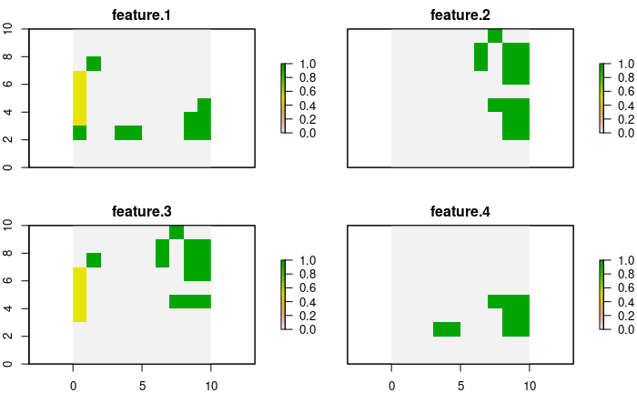

The expected **benefit** of carrying out conservation actions in the face of threats has been the subject of study due to its importance when deciding on management policies. Works like [@chadés2014], [@carwardine2012] or [@carwardine2018] they help to measure the individual benefits involved in different management strategies through expert prediction. However, it is assumed that there are no interactions in the strategies due to the complexity of determining the resulting benefits.

For its part, `prioriactions` uses as a reference [@cattarino2015] work, that assumes that the benefit for each species, at each site, depends on the number of threats, which affect the species at the site, and which had been abated, divided by the total number of threats affecting the species at the site. This is an approximation that assumes a series of assumptions:

-   Threats are binary (presence/absence)

-   There is only one action per threat.

-   Actions are fully effective, that is, an action against a threat eliminates it completely.

-   All features are equally sensitive to threats.

-   The **probability of persistence** of the features is proportional to the number of actions you take with respect to the total number of actions available.

The expected **probability of persistence (**$p$**)** of a feature in an unit can be expressed mathematically for a set of planning units $I$ indexed by $i$, a set of threats $K$ indexed by $k$ and a set of features $S$ indexed by $s$ as:

$$
p_{is} = \frac{\sum_{k \in K_i \cap K_s} {x_{ik}}}{|K_i \cap K_s|}
$$

Here, $x_{ik}$ is the decisions variable that specify whether action to abate the threat $k$ in the planning unit $i$ has been selected (1) or not (0), $K_i$ is the set of all threats that exists in $i$ and $K_s$ is the set of all threats the feature $s$ is sensitive. While the **benefit** obtained is determined as the multiplication between this probability $p_{is}$ with the amount of feature $s$ in planning unit $i$ ($r_{is}$):

$$
b_{is} = p_{is} r_{is}
$$

Note that $|K_i \cap K_s|$ indicates the intersection between these two sets, that is, the threats that exist on the site $i$ and that, in turn, the features $s$ is sensitive. In the case that said the intersection is zero, this means that feature $s$ does not coexist with any of its threats, and thus its **probability of persistence** is 1. The participation of this **benefit** in the contribution of the target will depend exclusively on the planning objective (if `recovery` or not). More information about this important point in [objectives](https://prioriactions.github.io/prioriactions/articles/objectives.html) vignette.

## Probability of persistence not proportional

As we have seen, the **probability of persistence** is calculated initially as a *linear* relationship of the actions carried out concerning the possible actions to face the threats of a feature on a site. However, this relationship could underestimate the real probability value. In turn, there is nothing to prevent many sites from being selected with little **probability of persistence** to achieve the proposed targets. For this reason, we have incorporated different non-linear **curves (**$v$**)** as exponents to the original expression of $p$:

$$
b_{is} = p_{is}^v r_{is}
$$

Thus, with $v$ as the type of **curve** or exponent, three options are possible: 1 = linear, 2 = quadratic, or 3 = cubic. The effect will be greater the higher the value of the parameter. In turn, the higher it is, the more complexity is added to the resolution of the resulting model. This **curve** parameter is built into `prioriactions` within the `problem()` function. Let's see an example.

To make the comparison more apparent, we lowered the monitoring costs for all planning units to 0.1.


```r
# load the prioriactions package
library(prioriactions)

# set monitoring costs in 0.1
sim_pu_data$monitoring_cost <- 0.1

# evaluate input data
b <- inputData(pu = sim_pu_data, 
               features = sim_features_data, 
               dist_features = sim_dist_features_data, 
               threats = sim_threats_data, 
               dist_threats = sim_dist_threats_data, 
               sensitivity = sim_sensitivity_data, 
               boundary = sim_boundary_data)

# create the mathematic model
c <- problem(b, 
             model_type = "minimizeCosts")
```

```
## Warning: The blm argument was set to 0, so the boundary data has no effect
```

```
## Warning: Some blm_actions argument were set to 0, so the boundary data has no effect for these cases
```

```r
# solve the model
d <- solve(c, 
           solver = "gurobi", 
           verbose = TRUE, 
           output_file = FALSE)
```

```
## Gurobi Optimizer version 9.1.2 build v9.1.2rc0 (linux64)
## Thread count: 2 physical cores, 4 logical processors, using up to 2 threads
## Optimize a model with 460 rows, 572 columns and 1137 nonzeros
## Model fingerprint: 0xad6e69a7
## Variable types: 352 continuous, 220 integer (220 binary)
## Coefficient statistics:
##   Matrix range     [5e-01, 2e+00]
##   Objective range  [1e-01, 1e+01]
##   Bounds range     [1e+00, 1e+00]
##   RHS range        [8e+00, 2e+01]
## Found heuristic solution: objective 138.9000000
## Presolve removed 426 rows and 460 columns
## Presolve time: 0.00s
## Presolved: 34 rows, 112 columns, 225 nonzeros
## Variable types: 0 continuous, 112 integer (92 binary)
## 
## Root relaxation: objective 7.320000e+01, 10 iterations, 0.00 seconds
## 
##     Nodes    |    Current Node    |     Objective Bounds      |     Work
##  Expl Unexpl |  Obj  Depth IntInf | Incumbent    BestBd   Gap | It/Node Time
## 
##      0     0   73.20000    0    4  138.90000   73.20000  47.3%     -    0s
## H    0     0                      73.4000000   73.20000  0.27%     -    0s
##      0     0   73.20000    0    4   73.40000   73.20000  0.27%     -    0s
## 
## Explored 1 nodes (10 simplex iterations) in 0.00 seconds
## Thread count was 2 (of 4 available processors)
## 
## Solution count 2: 73.4 138.9 
## 
## Optimal solution found (tolerance 0.00e+00)
## Best objective 7.340000000000e+01, best bound 7.340000000000e+01, gap 0.0000%
```

We obtain a total cost of 73.4, divided into 2.4 for monitoring, 17 in actions against threat 1 and another 54 in actions against threat 2. Given by the `getCost()` function.


```r
getCost(d)
```

```
##   solution_name monitoring threat_1 threat_2
## 1           sol        2.4       17       54
```

Now, when we use a parameter of `curve = 3` we obtain a total cost of 75.2, which is 1.8 greater than the previous solution.


```r
c.curve <- problem(b, 
                   model_type = "minimizeCosts", 
                   curve = 3)
```

```
## Warning: The blm argument was set to 0, so the boundary data has no effect
```

```
## Warning: Some blm_actions argument were set to 0, so the boundary data has no effect for these cases
```

```r
d.curve <- solve(c.curve, 
                 solver = "gurobi", 
                 verbose = TRUE, 
                 output_file = FALSE)
```

```
## Gurobi Optimizer version 9.1.2 build v9.1.2rc0 (linux64)
## Thread count: 2 physical cores, 4 logical processors, using up to 2 threads
## Optimize a model with 460 rows, 748 columns and 1137 nonzeros
## Model fingerprint: 0x76fb161b
## Model has 176 general constraints
## Variable types: 528 continuous, 220 integer (220 binary)
## Coefficient statistics:
##   Matrix range     [5e-01, 2e+00]
##   Objective range  [1e-01, 1e+01]
##   Bounds range     [1e+00, 1e+00]
##   RHS range        [8e+00, 2e+01]
## Presolve added 66 rows and 381 columns
## Presolve time: 0.01s
## Presolved: 526 rows, 1129 columns, 2749 nonzeros
## Presolved model has 164 SOS constraint(s)
## Variable types: 984 continuous, 145 integer (140 binary)
## 
## Root relaxation: objective 7.320000e+01, 165 iterations, 0.00 seconds
## 
##     Nodes    |    Current Node    |     Objective Bounds      |     Work
##  Expl Unexpl |  Obj  Depth IntInf | Incumbent    BestBd   Gap | It/Node Time
## 
##      0     0   73.20000    0   12          -   73.20000      -     -    0s
##      0     0   73.40000    0    8          -   73.40000      -     -    0s
##      0     0   73.40000    0    8          -   73.40000      -     -    0s
## H    0     0                      76.2000000   73.40000  3.67%     -    0s
## *    0     0               0      75.2000000   75.20000  0.00%     -    0s
## 
## Explored 1 nodes (383 simplex iterations) in 0.05 seconds
## Thread count was 2 (of 4 available processors)
## 
## Solution count 2: 75.2 76.2 
## 
## Optimal solution found (tolerance 0.00e+00)
## Best objective 7.520000000000e+01, best bound 7.520000000000e+01, gap 0.0000%
```

If we look at the disaggregated costs, we see that there are fewer units where actions are carried out (therefore, less spending on monitoring) and in turn, more spending on actions against threat 1. Which suggests that more actions are being carried out in less sites.


```r
getCost(d.curve)
```

```
##   solution_name monitoring threat_1 threat_2
## 1           sol        2.2       19       54
```

To see it clearly, the distribution of **benefits** or **probability of persistence** (because $r_{is} = 1$ for this example) for both cases is presented in a spatial way.


```r
# get benefits of solution
local_benefits <- getSolutionBenefit(d, type = "local")

# plot local benefits
local_benefits <- reshape2::dcast(local_benefits, pu~feature,value.var = "benefit.total", fill = 0)

#loead raster package
library(raster) 

r <- raster(ncol=10, nrow=10, xmn=0, xmx=10, ymn=0, ymx=10)
values(r) <- 0

group_rasters <- raster::stack(r, r, r, r)
values(group_rasters[[1]]) <- local_benefits$`1`
values(group_rasters[[2]]) <- local_benefits$`2`
values(group_rasters[[3]]) <- local_benefits$`3`
values(group_rasters[[4]]) <- local_benefits$`4`

names(group_rasters) <- c("feature 1", "feature 2", "feature 3", "feature 4")
plot(group_rasters)
```




```r
# get benefits of solution
local_benefits.curve <- getSolutionBenefit(d.curve, type = "local")

# plot local benefits
local_benefits.curve <- reshape2::dcast(local_benefits.curve, pu~feature,value.var = "benefit.total", fill = 0)

values(group_rasters[[1]]) <- local_benefits.curve$`1`
values(group_rasters[[2]]) <- local_benefits.curve$`2`
values(group_rasters[[3]]) <- local_benefits.curve$`3`
values(group_rasters[[4]]) <- local_benefits.curve$`4`

plot(group_rasters)
```


As we can see, for the base case, features 1 and 3 add to the total benefit sites where their **probability of persistence** is 0.5. Whereas when we use `curve = 3`, all the sites that contribute to reaching the target have a probability value of 1. This effect will be more evident when there are more threats in the planning exercise.

## Continuous intensities of threats

So far we have worked with two important premises: 1) that threats exist or not (presence/absence) and 2) that all features are equally sensitive to threats. To make these assumptions more flexible, we introduce the possibility of entering **threat intensities** (in the same way that we use $r_{is}$ for features) and, likewise, the relationship of these intensities with the **probability of persistence** of the features (through **response curves**). These response curves can be *fitted* by a piece-wise function by means four parameters within the `sensitivities` input data, where:

-   *a* : minimum intensity of the threat at which the features probability of persistence starts to decline.

-   *b* : value of intensity of the threat over which the feature has a probability of persistence of 0.

-   *c* : minimum probability of persistence of a features when a threat reaches its maximum intensity value.

-   *d* : maximum probability of persistence of a features in absence of a given threat.


Where the greater the intensity of the threat, there is a lower **probability of persistence** of the feature. Thus, with the definition of these four parameters mentioned above, different response curves can be *fitted*:


The latter are examples of the curves that could be fitted with these parameters; however, the user could use these parameters to fit any other curve.

Note that each of the curves is a relationship between a feature and a particular threat, but what happens to the **probability of persistence** of a feature when it coexists with more than one of its threats?. When the threat intensities are **binary**, we use the average of these probabilities:

$$
p_{is} = \frac{\sum_{k \in K_i \cap K_s} {p_{isk}}}{|K_i \cap K_s|}
$$

or,

$$
p_{is} = \frac{\sum_{k \in K_i \cap K_s} {x_{ik}}}{|K_i \cap K_s|}
$$

Where, $p_{isk}$ is the **probability of persistence** of feature $s$ with respect to threat $k$ in unit $i$ (individual probability). Here, it is observed that the probability $p_{isk}$ is 1 whenever an action against that threat is carried out, and 0 otherwise. We can generalize the above using **weights**, that is:

$$
p_{is} = \gamma_{isk} p_{isk}
$$

With $\sum_{k \in |K_i \cap K_s|}\gamma_{isk} = 1$ and $\gamma_{isk} = \gamma_{isk'} \forall k, k' \in |K_i \cap K_s|$.

However, when the intensities of the threats are **continuous**, we are faced with a situation; the **probability of persistence** of a feature concerning one of its threats could be different from zero even if no actions are taken on it (depending on the type of **response curve**). This implies that doing nothing (no actions) in a unit could mean a degree of **conservation benefit**.

### Using fixed weights

The problem with fixed values of weights in calculating the resulting **probability of persistence** is that it can be underestimated. To make sure of this we focus on a planning unit and a specific feature. This feature coexists with two of its threats on that site, whose **response curves** have been fitted as follows:


Note the feature is sensitive to any intensity of threat-1, while for threat-2, it begins to be sensitive from an intensity of 0.8. In turn, the intensities of both threats are marked on that site, being 10 and 0.99 respectively. In turn, the individual probabilities ($p_{isk}$) associated with these intensities are shown.

If no action were taken against these threats and maintaining fixed weights in the calculation of the **probability of persistence**, we would have:

$$
p_{is} = \gamma_{isk} p_{isk}
$$

$$
p_{is} = 0.9 \gamma_{is1}  + 0.03\gamma_{is2}
$$

$$
p_{is} = 0.9 \frac{1}{2} + 0.03\frac{1}{2} = 0.465
$$

Thus, the resulting probability is 0.465. However, it seems to be high, especially if it is taken into account that the **probability of persistence** of the feature to threat-2.

### Using variables weights

One way to overcome this problem is to make the values of the weights variable, denoting more importance to the potentially worst probabilities, that is:

$$
\gamma_{isk} = \frac{1 - p_{isk}(x_{ik} = 0)}{\sum_{k \in |K_i \cap K_s|} 1 - p_{isk}(x_{ik} = 0)}
$$

Where $p_{isk}(x_{ik} = 0)$ indicates the individual probability of persistence of the feature if no action is taken against the respective threat; therefore, a higher value shows less importance in the calculation of the **probability of persistence** of the feature (lower value of the weight). In turn, because the condition $\sum_{k \in |K_i \cap K_s|}\gamma_{isk} = 1$ must be met, it is assumed that the denominator is the sum of all these values individually.

If we go back to our example, we can evaluate again the **probability of persistence** of the feature if no action is taken:

$$
p_{is} = \gamma_{isk} p_{isk}
$$

$$
p_{is} = 0.9\frac{1 - p_{is1}(x_{i1} = 0)}{1 - p_{is1}(x_{i1} = 0) + 1 - p_{is2}(x_{i2} = 0)}  + 0.03\frac{1 - p_{is1}(x_{i1} = 0)}{1 - p_{is1}(x_{i1} = 0) + 1 - p_{is2}(x_{i2} = 0)} 
$$

$$
p_{is} = 0.9\frac{1 - 0.9}{1 - 0.9 + 1 - 0.03}  + 0.03\frac{1 - 0.03}{1 - 0.9 + 1 - 0.03} 
$$

$$
p_{is} = 0.9\frac{0.1}{1.07}  + 0.03\frac{0.97}{1.07} = 0.111
$$

Note that a persistence probability of 0.111 is obtained, much more reasonable than the previous 0.465.

## References
