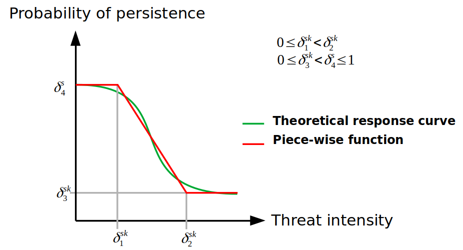
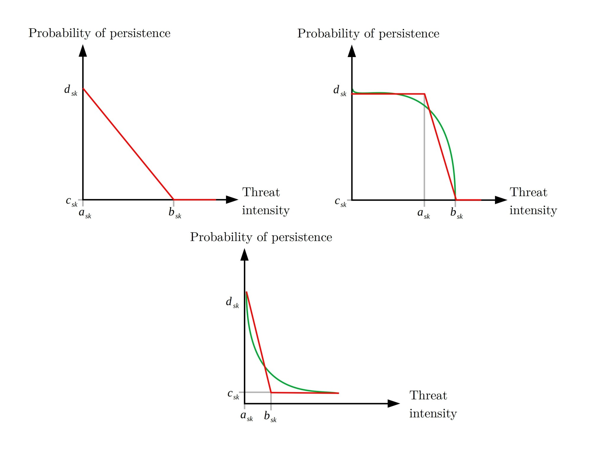

A key characteristic of `prioriactions` is that it allows to calculate an approximation of the **benefit** obtained by carrying out conservation actions. This approximation is based on the following assumptions [@cattarino2015][@salgado-rojas2020]:

-   Threats can be binary (presence/absence) or continuous (with levels of intensity).

-   There is only one action per threat.

-   Actions are fully effective, that is, an action against a threat eliminates it completely.

-   The **probability of persistence** of the features is proportional to the number of actions that are prescribed with respect to the total number of actions that would be needed to abate all threats that affect a given species in a given site.

Thus, the expected **benefit** ($b$) of a feature in an unit can be expressed mathematically for a set of planning units $I$ indexed by $i$, a set of threats $K$ indexed by $k$ and a set of features $S$ indexed by $s$ as:

$$
b_{is} = p_{is} r_{is}
$$ Where $p_is$ is the probability of persistence of the feature ($s$) in a planning unit $i$ and $r_is$ is the amount of that feature $s$ in said unit $i$. `prioriactions` package focuses on the net benefit obtained after the application of actions, therefore, this probability of persistence is calculated with respect to the base situation, that is, when it does not take any action against threats.

The remainder of this document is organized as follows. In Section 1 we present how `prioriactions` calculates the benefits when the threats are discrete (presence/absence), and in Section 2 we present how `prioriactions` calculates the benefits when the threats have continuous intensities.

## 1) Calculating benefits when threats are discrete (presence/absence)

In order to calculate the **benefit** obtained for a features in a planning unit when all threats have binary intensities (presence / absence), we define the probability of persistence as:

$$
p_{is} = \frac{\sum_{k \in K_i \cap K_s} {x_{ik}}}{|K_i \cap K_s|}
$$ Where, $x_{ik}$ is a decision variable that specifies whether an action to abate the threat $k$ in the planning unit $i$ has been selected (1) or not (0), $K_i$ is the set of all threats that exists in $i$ and $K_s$ is the set of all threats the feature $s$ is sensitive to.

Note that $|K_i \cap K_s|$ indicates the intersection between these two sets, that is, the threats that exist on the site $i$ and that, in turn, the features $s$ is sensitive to. In the case when the intersection is zero, which means that feature $s$ does not coexist with any of its threats in $i$, its **probability of persistence** is 1.

Considers that there are two planning objectives (`recovery` and `conservation`), so if a feature does not coexist with any of its threats (as in the previous case), its **benefit** contributes to achieving the **conservation target** (in the case of exist). Otherwise, the **benefits** contribute to the **recovery target**. More information about this point can be found in [objectives](https://prioriactions.github.io/prioriactions/articles/objectives.html) vignette.

### Not proportional probability of persistence

As we have seen, the **probability of persistence** is calculated initially as a *linear* relationship of the actions carried out concerning the possible actions to face the threats of a feature on a site. However, this relationship assumes that all threats contribute equally to the probability of persistence of the features. This approach to estimating **probabilities of persistence** could also overestimate the benefit of addressing threats (e.g., if two threats are present, one of them more impacting than the other, but only one of them -the less impacting- was addressed). For this reason, `prioriactions` incorporates different non-linear **curves (**$v$**)** as exponents to the original expression of $p$:

$$
b_{is} = p_{is}^v r_{is}
$$ Thus, with $v$ as the type of **curve** or exponent, three options are possible: 1 = linear, 2 = quadratic, or 3 = cubic. The effect will be greater the higher the value of the parameter. In turn, the higher it is, the more complexity is added to the resolution of the resulting model and, for example, more likely it is to get solutions where all or almost all threats affecting a given features in a given site have been addressed. This **curve** parameter is built into `prioriactions` within the `problem()` function. Let's see an example.

To show the difference between both models of **benefit** calculation when working with binary intensities, we use two different curves (linear and cubic) employing the example available in the [Get started](https://prioriactions.github.io/prioriactions/articles/prioriactions.html) vignette.


```r
# load the prioriactions package
library(prioriactions)

data(sim_boundary_data, sim_dist_features_data, sim_dist_threats_data,
     sim_features_data, sim_pu_data, sim_sensitivity_data, sim_threats_data)

# set monitoring costs to 0.1
sim_pu_data$monitoring_cost <- 0.1

# set recovery_targets to 15% of maximum
sim_features_data$target_recovery <- 0.15 * c(47, 28, 56, 33)

# evaluate input data
b.binary_base <- inputData(pu = sim_pu_data, 
                           features = sim_features_data, 
                           dist_features = sim_dist_features_data, 
                           threats = sim_threats_data, 
                           dist_threats = sim_dist_threats_data, 
                           sensitivity = sim_sensitivity_data, 
                           boundary = sim_boundary_data)

# create the mathematic model
c.binary_base <- problem(b.binary_base, 
                         model_type = "minimizeCosts")
```

```
## Warning: The blm argument was set to 0, so the boundary data has no effect
```

```
## Warning: Some blm_actions argument were set to 0, so the boundary data has no effect for these cases
```

```r
# solve the model
d.binary_base <- solve(c.binary_base, 
                       solver = "gurobi", 
                       verbose = TRUE, 
                       output_file = FALSE,
                       cores = 2)
```

```
## Gurobi Optimizer version 9.1.2 build v9.1.2rc0 (linux64)
## Thread count: 2 physical cores, 4 logical processors, using up to 2 threads
## Optimize a model with 284 rows, 396 columns and 785 nonzeros
## Model fingerprint: 0xda1a7bc4
## Variable types: 176 continuous, 220 integer (220 binary)
## Coefficient statistics:
##   Matrix range     [5e-01, 2e+00]
##   Objective range  [1e-01, 1e+01]
##   Bounds range     [1e+00, 1e+00]
##   RHS range        [4e+00, 8e+00]
## Found heuristic solution: objective 489.0000000
## Found heuristic solution: objective 146.6000000
## Presolve removed 262 rows and 319 columns
## Presolve time: 0.00s
## Presolved: 22 rows, 77 columns, 169 nonzeros
## Found heuristic solution: objective 50.6000000
## Variable types: 0 continuous, 77 integer (63 binary)
## 
## Root relaxation: objective 3.415000e+01, 14 iterations, 0.00 seconds
## 
##     Nodes    |    Current Node    |     Objective Bounds      |     Work
##  Expl Unexpl |  Obj  Depth IntInf | Incumbent    BestBd   Gap | It/Node Time
## 
##      0     0   34.15000    0    5   50.60000   34.15000  32.5%     -    0s
## H    0     0                      35.3000000   34.15000  3.26%     -    0s
## *    0     0               0      34.4000000   34.40000  0.00%     -    0s
## 
## Cutting planes:
##   Gomory: 1
##   Cover: 4
##   MIR: 2
## 
## Explored 1 nodes (22 simplex iterations) in 0.00 seconds
## Thread count was 2 (of 4 available processors)
## 
## Solution count 5: 34.4 35.3 50.6 ... 489
## 
## Optimal solution found (tolerance 0.00e+00)
## Best objective 3.440000000000e+01, best bound 3.440000000000e+01, gap 0.0000%
```

By using `getCost()` we can explore the total cost of the solution and split into actions. We obtain a total cost of 34.4, divided into 1.4 for monitoring, 14 in actions to abated the threat 1 and another 19 in actions to abated the threat 2.


```r
getCost(d.binary_base)
```

```
##   solution_name monitoring threat_1 threat_2
## 1           sol        1.4       14       19
```

Now by the `getSolutionBenefit()` function, we can obtain how the benefits are distributed for the different features. Notice that we use the `type = "local"` argument to obtain the benefits per unit and feature.


```r
# get benefits of solution
local_benefits <- getSolutionBenefit(d.binary_base, type = "local")

# plot local benefits
local_benefits <- reshape2::dcast(local_benefits, pu~feature,value.var = "benefit.total", fill = 0)

#loead raster package
library(raster) 

r <- raster(ncol=10, nrow=10, xmn=0, xmx=10, ymn=0, ymx=10)
values(r) <- 0

group_rasters <- raster::stack(r, r, r, r)
values(group_rasters[[1]]) <- local_benefits$`1`
values(group_rasters[[2]]) <- local_benefits$`2`
values(group_rasters[[3]]) <- local_benefits$`3`
values(group_rasters[[4]]) <- local_benefits$`4`

names(group_rasters) <- c("feature 1", "feature 2", "feature 3", "feature 4")
plot(group_rasters)
```


The second model use a parameter of `curve = 3` in its construction, and therefore, the calculate of probability of persistence is not proportional.


```r
c.binary_curve <- problem(b.binary_base, 
                   model_type = "minimizeCosts", 
                   curve = 3)
```

```
## Warning: The blm argument was set to 0, so the boundary data has no effect
```

```
## Warning: Some blm_actions argument were set to 0, so the boundary data has no effect for these cases
```

```r
d.binary_curve <- solve(c.binary_curve, 
                 solver = "gurobi", 
                 verbose = TRUE, 
                 output_file = FALSE,
                 cores = 2)
```

```
## Gurobi Optimizer version 9.1.2 build v9.1.2rc0 (linux64)
## Thread count: 2 physical cores, 4 logical processors, using up to 2 threads
## Optimize a model with 284 rows, 572 columns and 785 nonzeros
## Model fingerprint: 0x6afe5081
## Model has 176 general constraints
## Variable types: 352 continuous, 220 integer (220 binary)
## Coefficient statistics:
##   Matrix range     [5e-01, 2e+00]
##   Objective range  [1e-01, 1e+01]
##   Bounds range     [1e+00, 1e+00]
##   RHS range        [4e+00, 8e+00]
## Found heuristic solution: objective 489.0000000
## Presolve added 242 rows and 557 columns
## Presolve time: 0.01s
## Presolved: 526 rows, 1129 columns, 2749 nonzeros
## Presolved model has 164 SOS constraint(s)
## Found heuristic solution: objective 488.0000000
## Variable types: 984 continuous, 145 integer (140 binary)
## 
## Root relaxation: objective 3.285500e+01, 308 iterations, 0.00 seconds
## 
##     Nodes    |    Current Node    |     Objective Bounds      |     Work
##  Expl Unexpl |  Obj  Depth IntInf | Incumbent    BestBd   Gap | It/Node Time
## 
##      0     0   32.85500    0   22  488.00000   32.85500  93.3%     -    0s
## H    0     0                     457.6000000   32.85500  92.8%     -    0s
##      0     0   33.07500    0   19  457.60000   33.07500  92.8%     -    0s
## H    0     0                      51.5000000   33.07500  35.8%     -    0s
##      0     0   33.11500    0   20   51.50000   33.11500  35.7%     -    0s
##      0     0   33.12490    0   32   51.50000   33.12490  35.7%     -    0s
##      0     0   33.13125    0   34   51.50000   33.13125  35.7%     -    0s
## H    0     0                      41.3000000   33.13125  19.8%     -    0s
##      0     0   33.13333    0   27   41.30000   33.13333  19.8%     -    0s
##      0     0   33.13333    0   27   41.30000   33.13333  19.8%     -    0s
##      0     0   33.23750    0   28   41.30000   33.23750  19.5%     -    0s
##      0     0   33.24750    0   18   41.30000   33.24750  19.5%     -    0s
##      0     0   33.24750    0   17   41.30000   33.24750  19.5%     -    0s
##      0     0   33.24750    0   22   41.30000   33.24750  19.5%     -    0s
##      0     0   33.24750    0   22   41.30000   33.24750  19.5%     -    0s
##      0     2   33.26000    0   22   41.30000   33.26000  19.5%     -    0s
## H  109    80                      39.3000000   35.47635  9.73%   3.6    0s
##  37059  1687   38.81870   55    4   39.30000   38.81870  1.22%   2.8    5s
## 
## Cutting planes:
##   Gomory: 1
##   MIR: 2
##   Flow cover: 2
## 
## Explored 48097 nodes (128726 simplex iterations) in 5.95 seconds
## Thread count was 2 (of 4 available processors)
## 
## Solution count 6: 39.3 41.3 51.5 ... 489
## 
## Optimal solution found (tolerance 0.00e+00)
## Warning: max constraint violation (1.1895e-02) exceeds tolerance
## Warning: max general constraint violation (1.1895e-02) exceeds tolerance
##          (model may be infeasible or unbounded - try turning presolve off)
## Best objective 3.930000000000e+01, best bound 3.930000000000e+01, gap 0.0000%
```

Note that we obtain a total cost of 39.3, i.e. a higher cost than the when we use a linear curve. By using `getCost()`, we see that there are fewer units where actions are carried out, which suggests that more actions are being carried out in less sites.


```r
getCost(d.binary_curve)
```

```
##   solution_name monitoring threat_1 threat_2
## 1           sol        1.3       14       24
```

In the same way as in the previous model, using the `getSolutionBenefit()` function, we can obtain how the benefits are distributed for the different features:


```r
# get benefits of solution
local_benefits.curve <- getSolutionBenefit(d.binary_curve, type = "local")

# plot local benefits
local_benefits.curve <- reshape2::dcast(local_benefits.curve, pu~feature,value.var = "benefit.total", fill = 0)

values(group_rasters[[1]]) <- local_benefits.curve$`1`
values(group_rasters[[2]]) <- local_benefits.curve$`2`
values(group_rasters[[3]]) <- local_benefits.curve$`3`
values(group_rasters[[4]]) <- local_benefits.curve$`4`

plot(group_rasters)
```


As we can see, for the base case, features 1 and 3 add to the total benefit sites where their **probability of persistence** is 0.5. Whereas when we use `curve = 3`, all but one site that contribute to reaching the target have a probability value of 1. This effect will be more evident when there are more threats in the planning exercise.

## 2) Calculating benefits when threats are continuous

So far we have worked with two important premises: 1) that threats exist or not (presence/absence) and 2) that all features are equally sensitive to threats. To make these assumptions more flexible, we introduce the possibility of using **threat intensities** (in the same way that we use $r_{is}$ for features) and, the relationship of these intensities with the **probability of persistence** of the features (through **response curves**). These response curves can be *fitted* by a piece-wise function by means of four parameters within the `sensitivities` input data, where:

-   *a* : minimum intensity of the threat at which the features probability of persistence starts to decline.

-   *b* : value of intensity of the threat over which the feature has a probability of persistence of 0.

-   *c* : minimum probability of persistence of a features when a threat reaches its maximum intensity value.

-   *d* : maximum probability of persistence of a features in absence of a given threat.

{width="60%"}

Where the greater the intensity of the threat, lower **probability of persistence** of the feature. Thus, with the definition of these four parameters mentioned above, different response curves can be *fitted*:



The latter are examples of the curves that could be fitted with these parameters; that can be customized by users according to their needs by using the four parameters detailed above. Note that each of the curves is a relationship between a feature and a particular threat, but what happens to the **probability of persistence** of a feature when it coexists with more than one threats?.

We can define the **probability of persistence** of feature $s$ in the unit $i$ as a measure of the individual **probability of persistence** of feature $s$ with respect to threat $k$ in unit $i$ ($p_{isk}$), i.e.:

$$
p_{is} = \sum_{k \in K_i \cap K_s}\gamma_{isk} p_{isk}
$$

With $\sum_{k \in |K_i \cap K_s|}\gamma_{isk} = 1$ and $\gamma_{isk} = \gamma_{isk'} \forall k, k' \in |K_i \cap K_s|$.

The `prioriactions` package internally calculates the values of $\gamma_{isk}$ reflecting the relative importance of each threat (considering its potential danger) when calculating the probability of persistence of each feature.

Note the **probability of persistence** of a feature could be different from zero even if no actions are taken on it (depending on the type of **response curve**). This implies that doing nothing (no actions) in a unit could lead to, although small, benefits. These benefits are not considered to raise the targets regardless of the planning objective.

Finally, the **probability of persistence** resulting can be calculated by:

$$
p_{is} = \frac{{\sum_{k \in K_i \cap K_s: a_{sk} <= h_{ik} <= b_{sk}} \frac{x_{ik} (h_{ik} - a_{sk})(d_{sk} - c_{sk})}{b_{sk} - a_{sk}} 
(1 - \frac{c_{sk}(h_{ik} - a_{sk}) - d_{sk}(h_{ik} - b_{sk})}{b_{sk} - a_{sk}}+ \sum_{k \in K_i \cap K_s: h_{ik} > b_{sk}} x_{ik}(1- c_{sk})(d_{sk} - c_{sk})}}{ 
{\sum_{k \in K_i \cap K_s: h_{ik} < a_{sk}}  1 - d_{sk}} + \sum_{k \in K_i \cap K_s: a_{sk} <= h_{ik} <= b_{sk}} 1 - \frac{c_{sk}(h_{ik} - a_{sk}) - d_{sk}(h_{ik} - b_{sk})}{b_{sk} - a_{sk}}+ \sum_{k in K_i \cap K_s: h_{ik} > b_{sk}} 1 - c_{sk}}
$$ Where $h_{ik}$ is the intensity of the threat $k$ in the unit $i$.

### Example with continuous intensities of threats

In order to demonstrate the use of the package when we have continuous values of intensities, we use the same example considered for the models with binary threat intensities. Note that both examples will not be compared due to differences in potential benefits and therefore in the targets used. Also, we assume that we only have information about the sensitivity of feature 1 to both threats, whose **response curves** have been fitted as follow:


Note the feature is sensitive to any intensity of threat-1, while this is less sensitive to threat 2, as its **probability of persistence** remains invariant until the threat reaches high intensity values.

First, we add the parameters $a$, $b$ to the input of sensitivities, leaving the measures that we do not know as `NA`. `pioriractions` is responsible for assuming them by their **default** values; for example, for parameter $a$, it is considered that the values not provided as 0, for $b$, the value will be the maximum intensity of said threat in the case of study, $c$ will be 0 and $d$ 1. In addition, we simulate the intensity of threats continuously using the `runif()` function; values between 0 and 150 for threat 1 and values between 0 and 1 for threat 2.


```r
# set a,b,c and d parameters
sim_sensitivity_data$a = c(0, NA, NA, NA, 0.8, NA, NA, NA)
sim_sensitivity_data$b = c(150, NA, NA, NA, 1, NA, NA, NA)
sim_sensitivity_data$c = 0.0
sim_sensitivity_data$d = c(1, NA, NA, NA, 0.6, NA, NA, NA)

# set continuous intensities
set.seed(1)

sim_dist_threats_data$amount[sim_dist_threats_data$threat == 1] <- round(runif(n = 57, 0, 123), 2)
sim_dist_threats_data$amount[sim_dist_threats_data$threat == 2] <- round(runif(n = 63, 0, 1), 2)

# evaluate input data
b.continuous <- inputData(pu = sim_pu_data, 
                           features = sim_features_data, 
                           dist_features = sim_dist_features_data, 
                           threats = sim_threats_data, 
                           dist_threats = sim_dist_threats_data, 
                           sensitivity = sim_sensitivity_data, 
                           boundary = sim_boundary_data)

# set the target of recovery to 15%
max <- getPotentialBenefit(b.continuous)
sim_features_data$target_recovery <- 0.15 * max$maximum.recovery.benefit

# evaluate input data
b.continuous <- inputData(pu = sim_pu_data, 
                           features = sim_features_data, 
                           dist_features = sim_dist_features_data, 
                           threats = sim_threats_data, 
                           dist_threats = sim_dist_threats_data, 
                           sensitivity = sim_sensitivity_data, 
                           boundary = sim_boundary_data)

# create the mathematic model
c.continuous <- problem(b.continuous, 
                         model_type = "minimizeCosts")
```

```
## Warning: The blm argument was set to 0, so the boundary data has no effect
```

```
## Warning: Some blm_actions argument were set to 0, so the boundary data has no effect for these cases
```

```r
# solve the model
d.continuous <- solve(c.continuous, 
                       solver = "gurobi", 
                       verbose = TRUE, 
                       output_file = FALSE,
                       cores = 2)
```

```
## Gurobi Optimizer version 9.1.2 build v9.1.2rc0 (linux64)
## Thread count: 2 physical cores, 4 logical processors, using up to 2 threads
## Optimize a model with 284 rows, 396 columns and 766 nonzeros
## Model fingerprint: 0xfea67198
## Variable types: 176 continuous, 220 integer (220 binary)
## Coefficient statistics:
##   Matrix range     [2e-04, 2e+00]
##   Objective range  [1e-01, 1e+01]
##   Bounds range     [1e+00, 1e+00]
##   RHS range        [2e+00, 5e+00]
## Found heuristic solution: objective 153.7000000
## Presolve removed 250 rows and 248 columns
## Presolve time: 0.00s
## Presolved: 34 rows, 148 columns, 278 nonzeros
## Found heuristic solution: objective 42.4000000
## Variable types: 0 continuous, 148 integer (146 binary)
## 
## Root relaxation: objective 2.011896e+01, 17 iterations, 0.00 seconds
## 
##     Nodes    |    Current Node    |     Objective Bounds      |     Work
##  Expl Unexpl |  Obj  Depth IntInf | Incumbent    BestBd   Gap | It/Node Time
## 
##      0     0   20.11896    0    9   42.40000   20.11896  52.5%     -    0s
## H    0     0                      29.1000000   20.11896  30.9%     -    0s
## H    0     0                      21.9000000   20.11896  8.13%     -    0s
## H    0     0                      21.8000000   20.11896  7.71%     -    0s
##      0     0   20.82302    0    3   21.80000   20.82302  4.48%     -    0s
##      0     0   20.91403    0    3   21.80000   20.91403  4.06%     -    0s
##      0     0   21.21879    0    4   21.80000   21.21879  2.67%     -    0s
##      0     0   21.47599    0    5   21.80000   21.47599  1.49%     -    0s
##      0     0   21.53170    0    5   21.80000   21.53170  1.23%     -    0s
##      0     0   21.54367    0    6   21.80000   21.54367  1.18%     -    0s
##      0     0   21.58911    0    6   21.80000   21.58911  0.97%     -    0s
##      0     0   21.59162    0    7   21.80000   21.59162  0.96%     -    0s
##      0     0   21.59578    0    8   21.80000   21.59578  0.94%     -    0s
##      0     0   21.61294    0    8   21.80000   21.61294  0.86%     -    0s
##      0     0     cutoff    0        21.80000   21.80000  0.00%     -    0s
## 
## Cutting planes:
##   Gomory: 2
##   Cover: 3
##   MIR: 1
##   StrongCG: 2
##   RLT: 1
## 
## Explored 1 nodes (56 simplex iterations) in 0.01 seconds
## Thread count was 2 (of 4 available processors)
## 
## Solution count 5: 21.8 21.9 29.1 ... 153.7
## 
## Optimal solution found (tolerance 0.00e+00)
## Best objective 2.180000000000e+01, best bound 2.180000000000e+01, gap 0.0000%
```

Note that the maximum benefits to be achieved have changed due to the presence of intensities in the threats and the sensitivity curves (with respect to the base model). We can use `getPotentialBenefit()` to explore the difference between these benefits:


```r
# get potential benefits
getPotentialBenefit(b.continuous)
```

```
##   feature dist dist_threatened maximum.conservation.benefit maximum.recovery.benefit maximum.benefit
## 1       1   47              47                            0                  13.7781         13.7781
## 2       2   30              28                            2                  14.6788         16.6788
## 3       3   66              56                           10                  32.9739         42.9739
## 4       4   33              33                            0                  15.9912         15.9912
```

Now by the `getSolutionBenefit()` function, we can obtain how the benefits are distributed for the different features. Notice that we use the `type = "local"` argument to obtain the benefits per unit and feature.


```r
# get benefits of solution
local_benefits.continuous<- getSolutionBenefit(d.continuous, type = "local")

# plot local benefits
local_benefits.continuous <- reshape2::dcast(local_benefits.continuous, pu~feature,value.var = "benefit.total", fill = 0)

values(group_rasters[[1]]) <- local_benefits.continuous$`1`
values(group_rasters[[2]]) <- local_benefits.continuous$`2`
values(group_rasters[[3]]) <- local_benefits.continuous$`3`
values(group_rasters[[4]]) <- local_benefits.continuous$`4`

plot(group_rasters)
```


Note that the selected sites differ to a greater extent from those chosen in the base model with binary threat intensities. From the above, the effect that can bring with the use of sensitivities and intensities of continuous threats on the management of conservation actions is extracted.

## References
